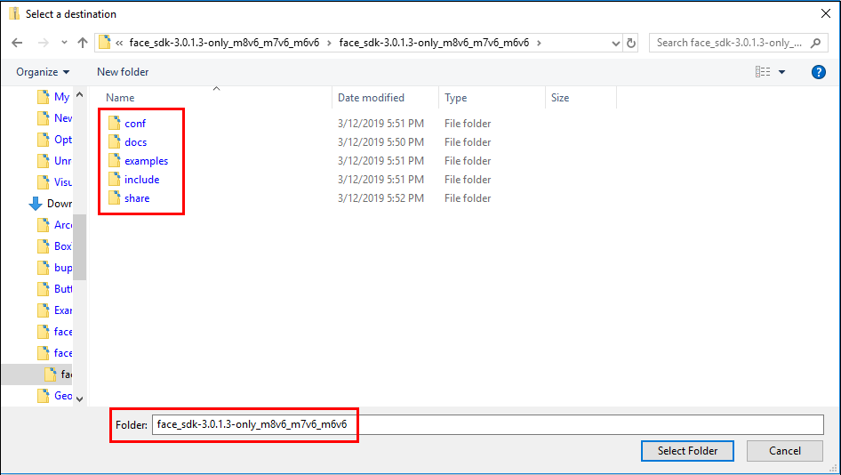

<p align="center">
<a href="https://face.3divi.com"></a>
</p>

<div align="center">English | <a href="doc/ru/README.md">Русский</a></div>

# Overview

**3DiVi Face SDK** is a set of software components (code libraries) for building face recognition solutions of any complexity – from a simple app to portals like Azure Face API or AWS Rekognition.

Face SDK supports the following features:
* [Face detection and tracking](doc/en/development/face_capturing.md) on images and videos
* [Face recognition](doc/en/development/face_identification.md) on images and videos
* [Face estimation](doc/en/development/face_estimation.md)(gender, age, emotions, liveness) on images and videos
* [Video stream processing](doc/en/development/video_stream_processing.md)  – face detection, tracking and recognition in video streams

# Supported platforms and API

Currently, the following platforms and architectures are supported:

* Windows (x86 32-bit, x86 64-bit)
* Linux (x86 32-bit, x86 64-bit, ARM 32-bit, ARM 64-bit)
* Android (ARM 32-bit, ARM 64-bit)
* iOS (ARM 64-bit)

Face SDK provides the following APIs:

* C++ API (for Windows, Linux, Android, iOS)
* Java wrapper (for Windows, Linux, Android)
* C# wrapper (for Windows, Linux)

# Introduction to Face SDK

  * [Components](doc/en/components.md) – essential information about the components included in Face SDK
  * [Use Cases](doc/en/use_cases.md) – diagrams that show possible use cases and connection between the components
  * [Samples](doc/en/samples) – sample programs in C++/C#/Java that show you the features of Face SDK
  * [Tutorials](doc/en/tutorials) – step-by-step tutorials on face detection, recognition, and estimation of age, gender, and emotions
  * [Licenses](doc/en/licenses.md) – information about different types of licenses, activation and locking of a license
  * [Performance Parameters](doc/en/performance_parameters.md) – CPU and memory usage, identification quality (FAR/FRR)

# Face SDK Trial 

To get started with Face SDK, download free [Face SDK Trial](https://face.3divi.com/products/face_sdk/face_sdk_trial).  

_**Note**_: The Trial license is not supported on iOS. Please contact us at face@3divi.com to get the free trial for iOS._

To remove trial limitations, you need to purchase *Face SDK license* and *Developer Pack* that is a great tool for developers interested in integrating SDK into their project with less efforts and less expense. For a small flat fee you get a sufficient number of development licenses, free test licenses, and also an Advanced Support which includes a priority chat channel with our senior developers. You can license any set of [Components](doc/en/components.md) depending on your use case.  

Contact us at face@3divi.com if you have any questions.

# Getting Started

1. Get free [Face SDK Trial](https://face.3divi.com/products/face_sdk/face_sdk_trial) or [purchase the Face SDK license](https://face.3divi.com/pricing).
2. Clone or download this repository.
3. Download the Face SDK runtime using Git LFS:
```
$ git lfs install
$ git lfs pull
```
4. Extract one of the archives with the runtime depending on your platform: `windows_x86_64.zip`, `windows_x86_32.zip`, `linux_x86_64.tar.xz`, `linux_x86_32.tar.xz`, `linux_armhf_32.tar.xz`, `linux_aarch64.tar.xz`, `android_arm_32.tar.xz`, `android_arm_64.tar.xz`, `ios_arm_64.tar.xz`.  
When extracting the archive, specify the path to the Face SDK root – the folders *bin* and *lib* should be located at the same level with the folders *conf, docs, examples, include,* and *share*.

<p align="center">
<br>
<b>Extraction path – root folder of the Face SDK distribution</b><br>
</p>

5. Copy the Face SDK License (`3divi_face_sdk.lic`) to the `license` folder
6. To explore the features of Face SDK, check out our [samples](doc/en/samples) that will show you how to work with C ++, Java, and C # API.

# Development 

* [Connecting Face SDK to Your Project](doc/en/development/connect_facesdk.md) – learn how to add and use the libfacerec library in your project
* [Video Stream Processing](doc/en/development/video_stream_processing.md) – face tracking, creation of templates, face recognition, estimation of age, gender, and emotions, short-time identification
* [Face Capturing](doc/en/development/face_capturing.md) – custom face tracking, getting information about faces, anthropometric points, face cropping 
* [Face Estimation](doc/en/development/face_estimation.md) – custom estimation of age, gender, emotion, and liveness (2D/3D)
* [Face Identification](doc/en/development/face_identification.md) – custom face identification, identification methods
* [Error Handling](doc/en/development/error_handling.md) – error handling in C++/C#/Java
* [Memory Management](doc/en/development/memory_management.md) – memory management in C++/C#/Java
* [Guidelines for Cameras](doc/en/guidelines_for_cameras.md) – camera positioning and shooting, recommended cameras
* [Face SDK Cross-Platform API. Latest Doxygen Output](http://download.3divi.com/facesdk/0d88ba7c-9a5d-45cd-897a-406fb1fca2d4/latest_docs/english/annotated.html) 

# How can I propose changes to Face SDK? 

If you've noticed a bug in our software or you'd like to propose a new feature to Face SDK, you can create an issue and our developers will take a look at your request. To do this: 
1. Go to the **Issues** tab and click **New issue**. 
2. Name your issue and describe it in detail.
3. When you're finished, click **Submit new issue**.

We're always looking forward to your feedback! 

[Learn more about issues on GitHub](https://docs.github.com/en/github/managing-your-work-on-github/creating-an-issue). 

# How can I propose changes to Face SDK documentation?

1. Fork this repository by clicking **Fork** in the top right corner of the page. 
2. In a forked repository, make changes to a file and click **Commit changes**. 
3. After making all changes, you'll see the message *"This branch is ... commits ahead of 3DiVi:master."* at the top of the forked repository. Click **Compare** to view the changes (don't forget to select the repositories and branches). 
4. If everything is correct and you're ready to propose changes, click **Create pull request**. 
5. Name your pull request and describe your changes. Then, click **Create Pull Request** once again. 

[Learn more about pull requests on GitHub](https://docs.github.com/en/github/collaborating-with-issues-and-pull-requests/creating-a-pull-request).  

# Open Source Licenses

* [OpenSSL](doc/open_source_licenses/openssl.txt) (https://www.openssl.org)
* [Crypto++](doc/open_source_licenses/crypto%2B%2B.txt) (https://www.cryptopp.com)
* [Boost](doc/open_source_licenses/boost.txt) (http://www.boost.org)
* [OpenCV](doc/open_source_licenses/opencv.txt) (http://opencv.org)

<div align="center">© All Rights Reserved. <a href="https://3divi.com/">3DiVi Inc.</a></div>
<div align="center"><a href="mailto: face@3divi.com">face@3divi.com</a></div>
