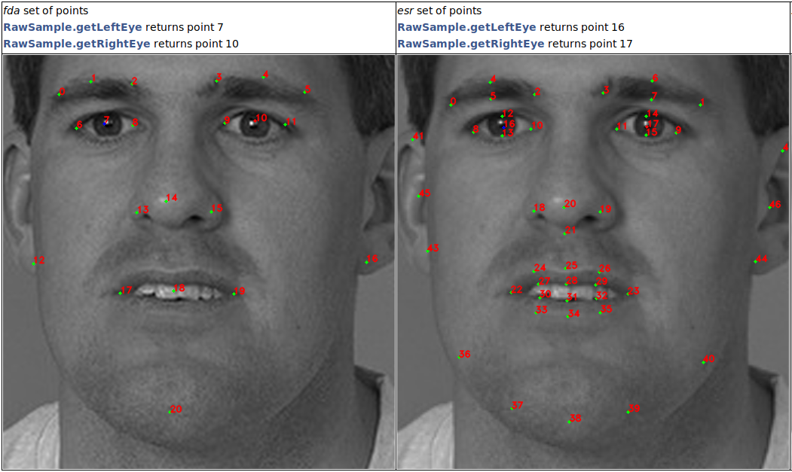
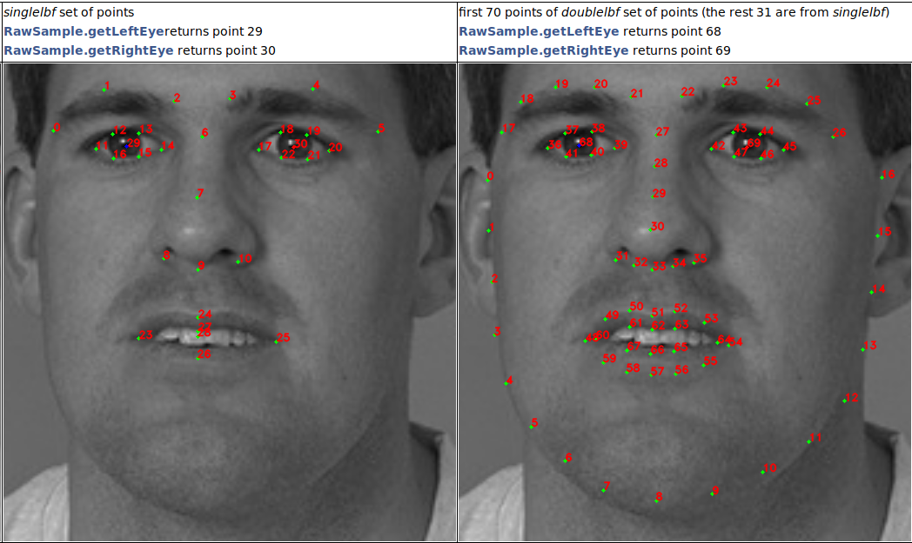

# Face Capturing

## Capturer Class Reference

To capture faces, you should create a `Capturer` object using `FacerecService.createCapturer`, passing the path to the configuration file or the `FacerecService.Config` object. If you pass the path to the configuration file, the default settings will be used. By using `FacerecService.Config` you can override any numerical option inside the config file. Also, some parameters can be changed in the existing `Capturer` object with the `Capturer.setParameter` method.

Example 1: 

**C++**: ```pbio::Capturer::Ptr capturer = service->createCapturer("common_capturer4.xml");```  
**C#**: ```Capturer capturer = service.createCapturer("common_capturer4_lbf.xml");```  
**Java**: ```final Capturer capturer = service.createCapturer(service.new Config("common_capturer4_lbf.xml"));```  

Example 2: 

**C++**

<details>
  <summary>Click to expand</summary>

```cpp
pbio::FacerecService::Config capturer_config("common_capturer4.xml");
capturer_config.overrideParameter("min_size", 200);
pbio::Capturer::Ptr capturer = service->createCapturer(capturer_config);
```
</details>

**C#**

<details>
  <summary>Click to expand</summary>

```cs
FacerecService.Config capturerConfig = new FacerecService.Config("common_capturer4_lbf.xml");
capturerConfig.overrideParameter("min_size", 200);
Capturer capturer = service.createCapturer(capturerConfig);
```
</details>

**Java**

<details>
  <summary>Click to expand</summary>

```java
FacerecService.Config capturerConfig = service.new Config("common_capturer4_lbf.xml");
capturerConfig.overrideParameter("min_size", 200);
final Capturer capturer = service.createCapturer(capturerConfig);
```
</details>

Example 3:

**C++**

<details>
  <summary>Click to expand</summary>

```cpp
pbio::Capturer::Ptr capturer = service->createCapturer("common_capturer4.xml");
capturer->setParameter("min_size", 200);
capturer->setParameter("max_size", 800);
// capturer->capture(...);
// ...
capturer->setParameter("min_size", 100);
capturer->setParameter("max_size", 400);
// capturer->capture(...);
```
</details>

**C#**

<details>
  <summary>Click to expand</summary>

```cs
Capturer capturer = service.createCapturer("common_capturer4_lbf.xml");
capturer.setParameter("min_size", 200);
capturer.setParameter("max_size", 800);
// capturer.capturer(...);
// ...
capturer.setParameter("min_size", 100);
capturer.setParameter("max_size", 400);
// capturer.capture(...);
```
</details>

**Java**

<details>
  <summary>Click to expand</summary>

```java
Capturer capturer = service.createCapturer(service.new Config("common_capturer4_lbf.xml"));
capturer.setParameter("min_size", 200);
capturer.setParameter("max_size", 800);
// capturer.capturer(...);
// ...
capturer.setParameter("min_size", 100);
capturer.setParameter("max_size", 400);
// capturer.capture(...);
```
</details>

The type and characteristics of the capturer depend on the configuration file or the `FacerecService.Config` object passed to the `FacerecService.createCapturer` member function.

We recommend you to use the following configuration files:

* `common_capturer4_fda.xml` – our own frontal face detector, which works much better than the detectors from open source libraries, such as OpenCV or Dlib
* `common_video_capturer_fda.xml` – our own frontal face video tracker, works only with colored images

_**Note:** We recommend you to use `VideoWorker` for face tracking on video streams. When `VideoWorker` is created with `matching_thread=0` and `processing_thread=0`, then the standard [Face Detector license](../components.md) is used._

The used sets of anthropometric points (see [Anthropometric Points](#anthropometric-points)):

|config file|points set|
|-----------|----------|
|common_capturer4_fda.xml |fda|
|common_video_capturer_fda.xml|fda|

When a capturer is created, you can use it to detect / track faces. There are two ways to pass an image to the detector:

* pass the data of the **decoded** image to the method `Capturer.capture`(`RawImage image`), using the `RawImage` class (see [Samples](../samples))
* pass the data of the **encoded** image in JPG, PNG, TIF or BPM format to the method `Capturer.capture(byte[] data`)

In both cases, the result is the vector of detected / tracked faces (`RawSample` is the object storing the captured face).

For a tracker, you can also call the `Capturer.resetHistory` method to start tracking on a new video sequence.

### RawSample Class Reference

With `RawSample` you can:

* get track id (`RawSample.getID`) – only if the sample was captured from a tracker
* get a face rectangle (`RawSample.getRectangle`), angles (`RawSample.getAngles`), left / right eyes (`RawSample.getLeftEye` / `RawSample.getRightEye`, see [Anthropometric Points](#anthropometric-points)), anthropometric points (`RawSample.getLandmarks`, see [Anthropometric Points](#anthropometric-points)) – only if the face is frontal (i.e captured with frontal detector / tracker)
* crop the face (see [Face Cropping](#face-cropping))
* downscale an internal face image to suitable size (`RawSample.downscaleToPreferredSize`)
* serialize an object in a binary stream (`RawSample.save` or `RawSample.saveWithoutImage`), you can deserialize it later using `FacerecService.loadRawSample` or `FacerecService.loadRawSampleWithoutImage`
* pass the estimates of the age, gender, quality and liveness to the methods (see [Face Estimation](face_estimation.md))
* provide it to `Recognizer.processing` for template creating (see [Face Identification](face_identification.md), [test_identify](../samples/cpp/test_identify.md))

### Anthropometric Points

_**Note:** Learn how to display anthropometric points and head rotation angles [in our tutorial](../tutorials/displaying_anthropometric_points_and_head_rotation_angles.md)._

There are four sets of anthropometric points: *esr*, *singlelbf*, *doublelbf*, and *fda*.

* The *esr* set is our first set that was the only set available in previous SDK versions. The *esr* set contains 47 points.
* The *singlelbf* and *doublelbf* sets are new. They provide higher accuracy, so we recommend you to use detectors with one of these sets. The *singlelbf* set contains 31 points. The *doublelbf* set contains 101 points. Actually, the *doublebf* set consists of two concatenated sets – the last 31 points of *doublelbf* duplicate the *singlelbf* set (in the same order).
* The *fda* set is the newest. In contrast to the previous sets, it provides high accuracy in a wide range of facial angles (up to the full profile). However, recognition algorithms still require face samples to be close to frontal. The *fda* set contains 21 points.

<p align="center">
<br>
</p>

<p align="center">
<br>
</p>

### Capturers Timing Characteristics (for 1 GHz 1 Core)

<table border="1" style="border-collapse:collapse;center">
<tr>                <th rowspan=2> config file                                         </th>    <th colspan=6>capture time (ms) </th> </tr>
<tr>                                                                                            <th>640x480, 1 face</th> <th>640x480, 4 faces</th> <th>1280x720, 1 face</th> <th>1280x720, 4 faces</th> <th>1920x1080, 1 face</th> <th>1920x1080, 4 faces</th>  </tr>
<tr align="center"> <td align="left"> common_capturer4_fda.xml                              </td>    <td>55            </td> <td>140             </td> <td>150             </td> <td>260              </td> <td>300             </td> <td>530              </td>  </tr>
<tr align="center"> <td align="left"> common_video_capturer_fda.xml                             </td>    <td>40            </td> <td>80             </td> <td>40             </td> <td>80              </td> <td>50             </td> <td>90              </td>  </tr>
</table>

_**Note:** Actual capture time may vary depending on the image content._

### Capturers Angles Ranges

|config file|roll|yaw|pitch|
|-----------|----|---|-----|
|common_capturer4_fda.xml|[-30; 30]|[-60; 60]|[60; 60]|
|common_video_capturer_fda.xml|[-30; 30]|[-60; 60]|[60; 60]|

### Face Cropping

To crop the face, you can call the `RawSample.cutFaceImage` method. The image of a cropped face will be saved in a provided binary stream encoded in a specified format. See all available cropping types in `RawSample.FaceCutType`.

To preview the cropping, call the `RawSample.getFaceCutRectangle` method by specifying the cropping type. As a result, you will have four points – the corners of the rectangle that will be used for cropping.

See the example of usage in [Samples](../samples).
