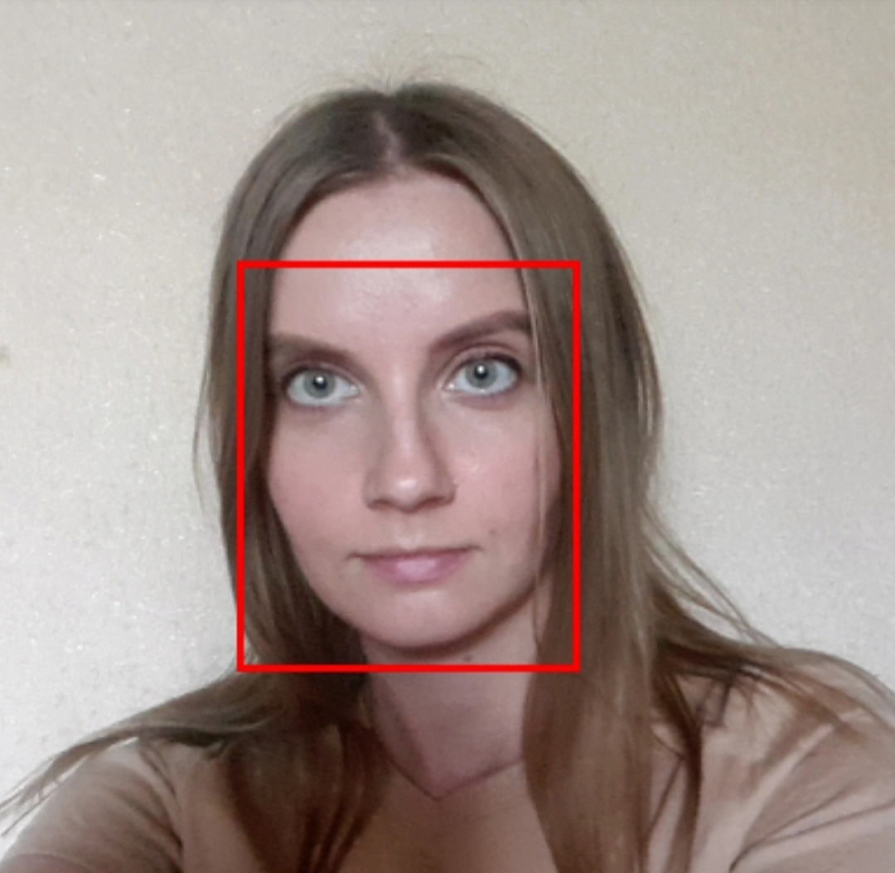
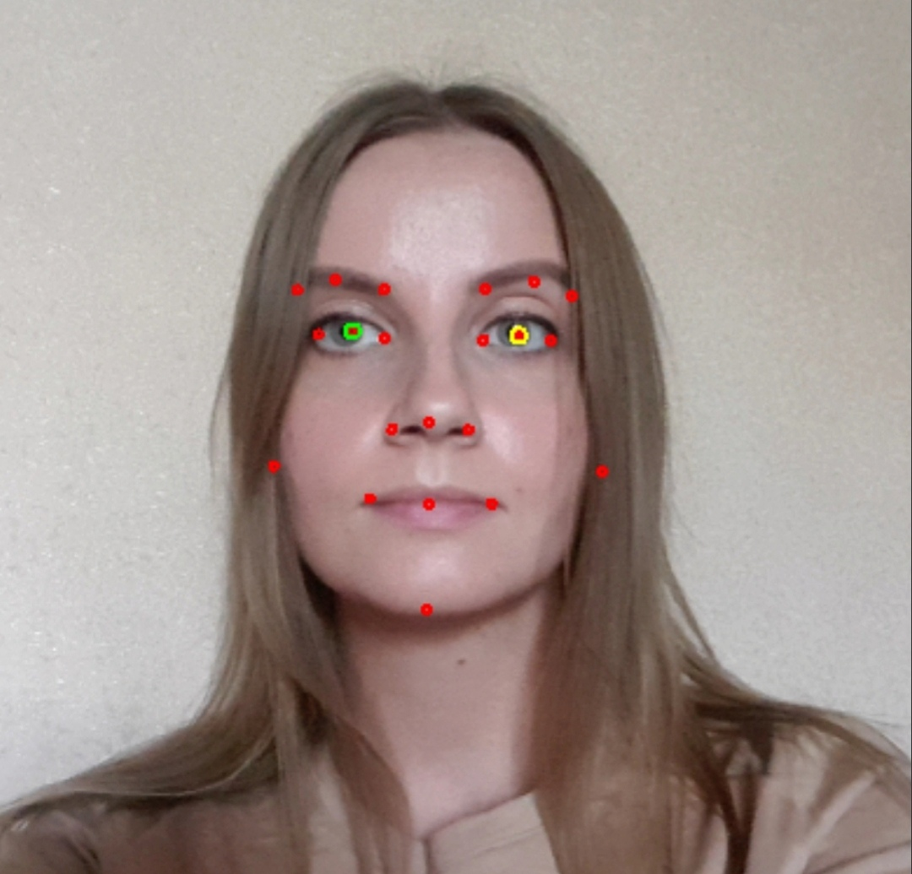
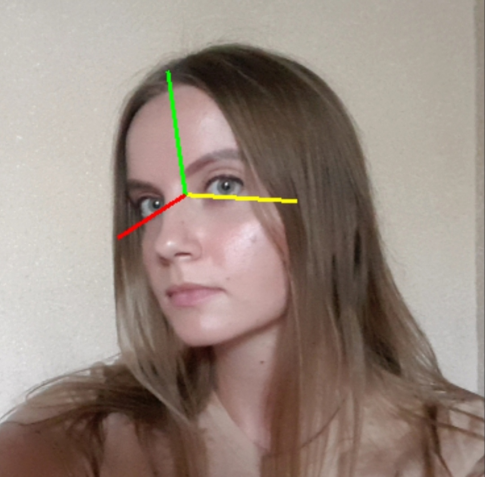
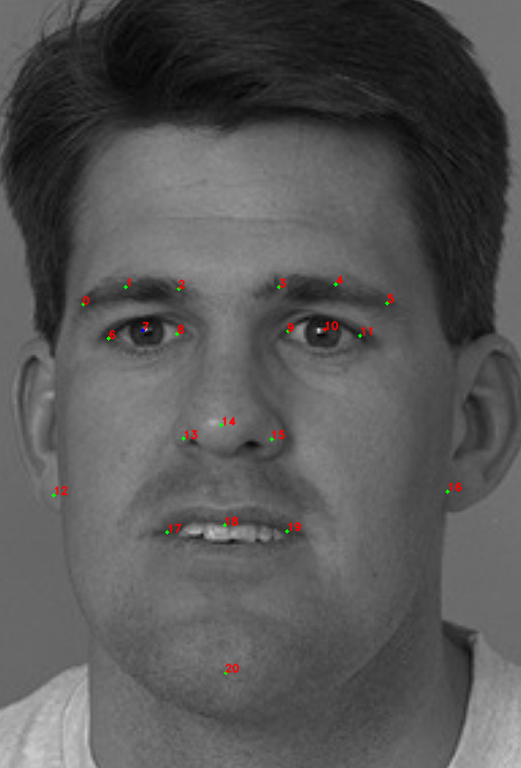
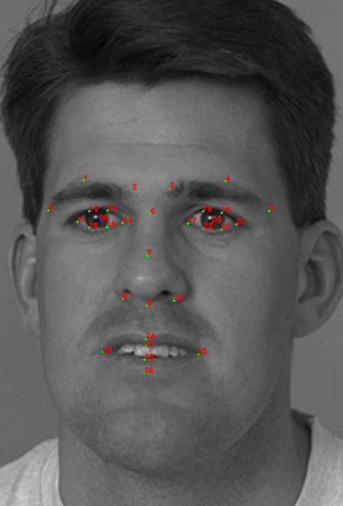
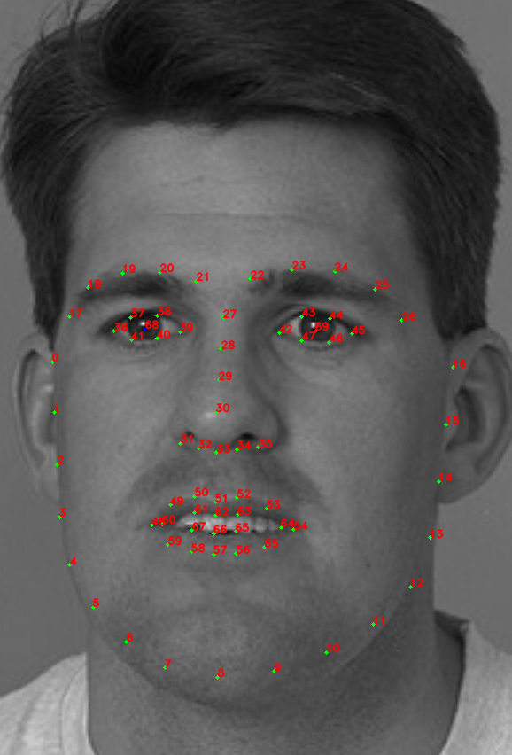
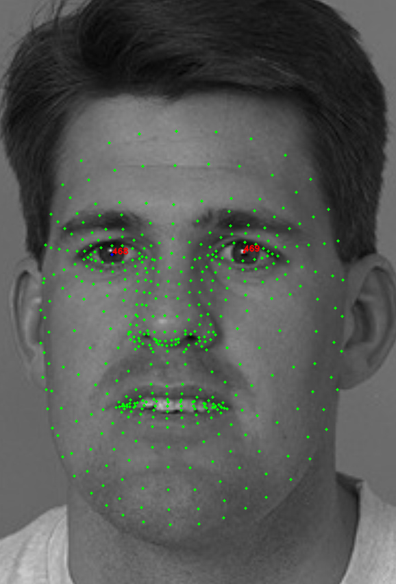

# Face Capturing

Face detection consists of several stages:

1. Detecting a face in the image. The result of this stage is a rectangle (a frame) around the detected face. There are several types of detectors that are described [below](#detectors).

<p align="center">
<br>
</p>

2. Fitting (positioning) of anthropometric points. The result of this stage is a set of anthropometric points with 2D/3D coordinates linked to a specific detected face. There are several types of fitters that use different sets of anthropometric points, which are described [below](#anthropometric-points).

<p align="center">
<br>
</p>

3. Calculating head rotation angles relative to the observation axis. The result of this stage is three head rotation angles: *pitch*, *yaw*, *roll*. The accuracy of these angles depends on the set of anthropometric points used.

<p align="center">
<br>
</p>

The `Capturer` class is used for face detection. A **configuration file** should be specified when creating a class object. The configuration file contains the detector type to be used and the type of set of anthropometric points to be used (see [Configuration files](#configuration-files)). You can also configure various detection parameters in the configuration file that affect the quality and speed of the entire algorithm. The detector and the set of anthropometric points are specified in the name of the configuration file, for example: `common_capturer_blf_fda_front.xml` - the blf detector, the fda set of points.

There is also another option of face detection combined with face tracking in a video stream. In this case, the algorithm assumes that a set of consecutive frames from the video is provided at the input, therefore, faces are tracked from frame to frame. In addition to the stages described above, the face tracking stage is added and a unique identifier is assigned to each face. This id does not change from the moment a face is detected in the video stream until the moment it is lost. Such configurations contain the word *video* in the file name, for example, `common_video_capturer_fda.xml`. Currently, two trackers are available:
* *common_video_capturer* - provides high speed, but the quality is lower compared to *fda_tracker_capturer*
* *fda_tracker_capturer* - provides high quality, but the speed is lower compared to *common_video_capturer*

## Detectors

Currently, the following detectors are available:
* LBF - the standard detector
* BLF - a new detector that is faster than LBF and provides more accurate detection of masked faces

When a detector is created, you can use it to detect / track faces. There are two ways to pass an image to the detector:
* pass the data of the **decoded** image to the method `Capturer.capture`(`RawImage image`), using the `RawImage` class (see [Samples](../samples))
* pass the data of the **encoded** image in JPG, PNG, TIF or BPM format to the method `Capturer.capture(byte[] data`)

In both cases, the result is the vector of detected / tracked faces (`RawSample` is the object storing the captured face).

For a tracker, you can also call the `Capturer.resetHistory` method to start tracking on a new video sequence.

### Anthropometric Points

_**Note:** Learn how to display anthropometric points and head rotation angles [in our tutorial](../tutorials/displaying_anthropometric_points_and_head_rotation_angles.md)._

There are four sets of anthropometric points: *esr*, *singlelbf*, *doublelbf*, *fda*, *mesh*.

* The *esr* set is our first set that was the only set available in previous SDK versions. The *esr* set contains 47 points.
* The *singlelbf* and *doublelbf* provide higher accuracy than *esr*. The *singlelbf* set contains 31 points. The *doublelbf* set contains 101 points. Actually, the *doublebf* set consists of two concatenated sets – the last 31 points of *doublelbf* duplicate the *singlelbf* set (in the same order).
* The *fda* provides high accuracy in a wide range of facial angles (up to the full profile), in contrast to the previous sets, so we recommend you to use detectors with these set.  However, recognition algorithms still require face samples to be close to frontal. The *fda* set contains 21 points.
* At the moment, the *mesh* set is the newest. It contains 470 3D points of a face. Use this set to get a 3D face mesh.

<table border="1" style="border-collapse:collapse;center">
<tr align="left">
  <th><i>fda</i> set of points <br>
      <b>RawSample.getLeftEye  </b> returns point 7  <br>
      <b>RawSample.getRightEye </b> returns point 10 </th>
  <th><i>esr</i> set of points <br>
      <b>RawSample.getLeftEye  </b> returns point 16 <br>
      <b>RawSample.getRightEye </b> returns point 17 </th>
</tr>
<tr align="center">
  <td>  </td>
  <td>  </td>
</tr>
</table>


<table border="1" style="border-collapse:collapse;center">
<tr align="left">
  <th><i>singlelbf</i> set of points <br>
      <b>RawSample.getLeftEye  </b> returns point 29  <br>
      <b>RawSample.getRightEye </b> returns point 30 </th>
  <th>first 70 points of <i>doubleldb</i> set of points (the rest 31 points are taken from <i>singlelbf</i>)  <br>
      <b>RawSample.getLeftEye  </b> returns point 68 <br>
      <b>RawSample.getRightEye </b> returns point 69 </th>
</tr>
<tr align="center">
  <td>  </td>
  <td>  </td>
</tr>
</table>


<table border="1" style="border-collapse:collapse;center">
<tr align="left">
  <th><i>mesh</i> set of points <br>
      <b>RawSample.getLeftEye  </b> returns point 468  <br>
      <b>RawSample.getRightEye </b> returns point 469 </th>
</tr>
<tr align="center">
  <td>  
       </td>
</tr>
</table>

## Capturer Class Reference

To capture faces, you should create a `Capturer` object using `FacerecService.createCapturer`, passing the path to the configuration file or the `FacerecService.Config` object. If you pass the path to the configuration file, the default settings will be used. By using `FacerecService.Config` you can override any numerical option inside the config file. Also, some parameters can be changed in the existing `Capturer` object with the `Capturer.setParameter` method. See the Capturer usage examples [here](#capturer-usage-examples). 

The type and characteristics of the capturer depend on the configuration file or the `FacerecService.Config` object passed to the `FacerecService.createCapturer` member function.

_**Note:** We recommend you to use `VideoWorker` for face tracking on video streams. When `VideoWorker` is created with `matching_thread=0` and `processing_thread=0`, then the standard [Face Detector license](../components.md) is used._

### Capturer Usage Examples

Example 1: 

**C++**: ```pbio::Capturer::Ptr capturer = service->createCapturer("common_capturer4.xml");```  
**C#**: ```Capturer capturer = service.createCapturer("common_capturer4_lbf.xml");```  
**Java**: ```final Capturer capturer = service.createCapturer(service.new Config("common_capturer4_lbf.xml"));```  

Example 2: 

**C++**

```cpp
pbio::FacerecService::Config capturer_config("common_capturer4.xml");
capturer_config.overrideParameter("min_size", 200);
pbio::Capturer::Ptr capturer = service->createCapturer(capturer_config);
```

**C#**

```cs
FacerecService.Config capturerConfig = new FacerecService.Config("common_capturer4_lbf.xml");
capturerConfig.overrideParameter("min_size", 200);
Capturer capturer = service.createCapturer(capturerConfig);
```

**Java**

```java
FacerecService.Config capturerConfig = service.new Config("common_capturer4_lbf.xml");
capturerConfig.overrideParameter("min_size", 200);
final Capturer capturer = service.createCapturer(capturerConfig);
```

Example 3:

**C++**

<details>
  <summary>Click to expand</summary>

```cpp
pbio::Capturer::Ptr capturer = service->createCapturer("common_capturer4.xml");
capturer->setParameter("min_size", 200);
capturer->setParameter("max_size", 800);
// capturer->capture(...);
// ...
capturer->setParameter("min_size", 100);
capturer->setParameter("max_size", 400);
// capturer->capture(...);
```
</details>

**C#**

<details>
  <summary>Click to expand</summary>

```cs
Capturer capturer = service.createCapturer("common_capturer4_lbf.xml");
capturer.setParameter("min_size", 200);
capturer.setParameter("max_size", 800);
// capturer.capturer(...);
// ...
capturer.setParameter("min_size", 100);
capturer.setParameter("max_size", 400);
// capturer.capture(...);
```
</details>

**Java**

<details>
  <summary>Click to expand</summary>

```java
Capturer capturer = service.createCapturer(service.new Config("common_capturer4_lbf.xml"));
capturer.setParameter("min_size", 200);
capturer.setParameter("max_size", 800);
// capturer.capturer(...);
// ...
capturer.setParameter("min_size", 100);
capturer.setParameter("max_size", 400);
// capturer.capture(...);
```
</details>

## Configuration files 

| File | Detector | Set of points | Angles (roll/yaw/pitch) | Description and use case | 
|------|----------|---------------|-------------------------|--------------------------| 
|common_capturer4_fda.xml|lbf|fda|[-30;30][-60;60][-60;60]|Frontal face detector.|
|common_capturer4_fda_with_angles.xml|lbf|fda|[-90;90][-60;60][-60;60]|Frontal face detector. Adapted for a wide range of head rotation angles.|
|common_capturer4_fda_with_angles_noise.xml|lbf|fda|[-90;90][-60;60][-60;60]|Frontal face detector. Adapted for a wide range of head rotation angles. Suitable for images with high noise level.|
|common_capturer4_fda_singleface.xml|lbf|fda|[-30;30][-60;60][-60;60]|Only one frontal face is detected.|
|common_capturer4_fda_singleface_with_angles.xml|lbf|fda|[-90;90][-75;75][-60;60]|Only one frontal face is detected. The detector is adapted for a wide range of head rotation angles.|
|common_capturer4_fda_singleface_with_angles_noise.xml|lbf|fda|[-90;90][-75;75][-60;60]|Only one frontal face is detected. The detector is adapted for a wide range of head rotation angles. Suitable for images with high noise level.|
|common_capturer4_lbf.xml|lbf|doublelbf|[-30;30][-60;60][-60;60]|Frontal face detector.| 
|common_capturer4_lbf_singleface.xml|lbf|doublelbf|[-30;30][-60;60][-60;60]|Only one frontal face is detected.|
|common_capturer4_mesh.xml|lbf|mesh|[-30;30][-60;60][-60;60]|Frontal face detector. Allows you to get a 3D face mask.|
|common_capturer4_mesh_with_angles.xml|lbf|mesh|[-90;90][-60;60][-60;60]|Frontal face detector. Adapted for a wide range of head rotation angles. Allows you to get a 3D face mask.|
|common_capturer4_mesh_with_angles_noise.xml|lbf|mesh|[-90;90][-60;60][-60;60]|Frontal face detector. Adapted for a wide range of head rotation angles. Suitable for images with high noise level. Allows you to get a 3D face mask.|
|common_capturer4_mesh_singleface.xml|lbf|mesh|[-30;30][-60;60][-60;60]|Only one frontal face is detected. Allows you to get a 3D face mask.|
|common_capturer4_mesh_singleface_with_angles.xml|lbf|mesh|[-90;90][-75;75][-60;60]|Only one frontal face is detected. The detector is adapted for a wide range of head rotation angles. Allows you to get a 3D face mask.|
|common_capturer4_mesh_singleface_with_angles_noise.xml|lbf|mesh|[-90;90][-75;75][-60;60]|Only one frontal face is detected. The detector is adapted for a wide range of head rotation angles. Suitable for images with high noise level. Allows you to get a 3D face mask.|
|common_capturer_blf_fda_front.xml|blf|fda|[-70;70][-90;90][-70;70]|Detection of large face images (the face should take up most of the frame size). Suitable for detection of masked faces.|
|common_capturer_blf_fda_back.xml|blf|fda|[-70;70][-90;90][-70;70]|Detection of several faces or small face images. Suitable for detection of masked faces.|
|common_capturer_blf_fda_auto.xml|blf|fda|[-70;70][-90;90][-70;70]|Detection of large and small face images (the parameters `resolution_width` and `min_face_size` should be specified in the configuration file). Suitable for detection of masked faces.|
|common_video_capturer_fda.xml|lbf|fda|[-30;30][-60;60][-60;60]|Frontal face video tracker (RGB only).|
|common_video_capturer_lbf.xml|lbf|singlelbf|[-30;30][-60;60][-60;60]|Frontal face video tracker (RGB only).|
|common_video_capturer_mesh.xml|lbf|mesh|[-30;30][-60;60][-60;60]|Frontal face video tracker (RGB only). Allows you to get a 3D face mask.|
|fda_tracker_capturer.xml|lbf|fda|[-30;30][-60;60][-60;60]|Frontal face video tracker.|
|fda_tracker_capturer.w.xml|lbf|fda|[-30;30][-60;60][-60;60]|Frontal face video tracker. Can be used in case of insufficient lighting. Please note that false detections can occur a bit more often in this case.|
|fda_tracker_capturer_mesh.xml|lbf|fda|[-30;30][-60;60][-60;60]|Frontal face video tracker. Allows you to get a 3D face mask.|
|fda_tracker_capturer_fake_detector.xml|lbf|fda|[-30;30][-60;60][-60;60]|Detection speed is higher because only fitter is used (no detector). Suitable only if a face takes up most of the image size.|
|fda_tracker_capturer_blf.xml|blf|fda|[-30;30][-60;60][-60;60]|Frontal face video tracker. Suitable for detection of masked faces.|
|manual_capturer_fda.xml|lbf|fda|[-30;30][-60;60][-60;60]|Eye points should be manually specified. The remaining points are calculated based on the eye points.|
|manual_capturer_mesh.xml|lbf|mesh|[-30;30][-60;60][-60;60]|Eye points should be manually specified. The remaining points are calculated based on the eye points. Allows you to get a 3D face mask.|

### Capturers Timing Characteristics (for 1 GHz 1 Core)

<table border="1" style="border-collapse:collapse;center">
<tr>                <th rowspan=2> config file                                         </th>    <th colspan=6>capture time (ms) </th> </tr>
<tr>                                                                                            <th>640x480, 1 face</th> <th>640x480, 4 faces</th> <th>1280x720, 1 face</th> <th>1280x720, 4 faces</th> <th>1920x1080, 1 face</th> <th>1920x1080, 4 faces</th>  </tr>
<tr align="center"> <td align="left"> common_capturer4_fda.xml                              </td>    <td>55            </td> <td>140             </td> <td>150             </td> <td>260              </td> <td>300             </td> <td>530              </td>  </tr>
<tr align="center"> <td align="left"> common_video_capturer_fda.xml                             </td>    <td>40            </td> <td>80             </td> <td>40             </td> <td>80              </td> <td>50             </td> <td>90              </td>  </tr>
</table>

_**Note:** Actual capture time may vary depending on the image content._

### Face Cropping

To crop the face, you can call the `RawSample.cutFaceImage` method. The image of a cropped face will be saved in a provided binary stream encoded in a specified format. 

Available face cropping types (`RawSample.FaceCutType`):
* FACE_CUT_BASE - Unspecified cropping (any sample type).
* FACE_CUT_FULL_FRONTAL - ISO/IEC 19794-5 Full Frontal (for ID, travel documents) (only frontal sample type). It is used for saving face images in electronic biometric documents.
* FACE_CUT_TOKEN_FRONTAL - ISO/IEC 19794-5 Token Frontal (fixed eye positions) (only frontal sample type).

To preview the cropping, call the `RawSample.getFaceCutRectangle` method by specifying the cropping type. As a result, you will have four points – the corners of the rectangle that will be used for cropping.

See the example of usage in [Samples](../samples).

### RawSample Class Reference

With `RawSample` you can:

* get track id (`RawSample.getID`) – only if the sample was captured from a tracker
* get a face rectangle (`RawSample.getRectangle`), angles (`RawSample.getAngles`), left / right eyes (`RawSample.getLeftEye` / `RawSample.getRightEye`, see [Anthropometric Points](#anthropometric-points)), anthropometric points (`RawSample.getLandmarks`, see [Anthropometric Points](#anthropometric-points)) – only if the face is frontal (i.e captured with frontal detector / tracker)
* crop the face (see [Face Cropping](#face-cropping))
* downscale an internal face image to suitable size (`RawSample.downscaleToPreferredSize`)
* serialize an object in a binary stream (`RawSample.save` or `RawSample.saveWithoutImage`), you can deserialize it later using `FacerecService.loadRawSample` or `FacerecService.loadRawSampleWithoutImage`
* pass the estimates of the age, gender, quality and liveness to the methods (see [Face Estimation](face_estimation.md))
* provide it to `Recognizer.processing` for template creating (see [Face Identification](face_identification.md), [test_identify](../samples/cpp/test_identify.md))
