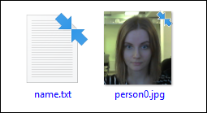
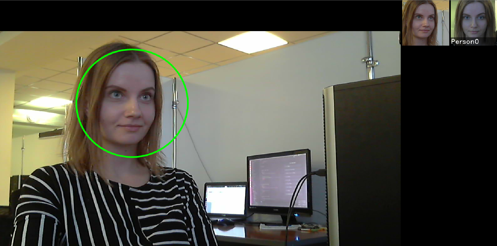

# video_recognition_demo

The program is an example of using `pbio::VideoWorker` and demonstrates face tracking and identification on several video streams.

To make a quick run of the demo with default parameters and check face recognition on Windows:

1. Create a database, which will be used for face recognition. To create a database, go to the *bin/base* folder and create a new folder, for example, *person0*. Copy a picture of a person to be used for recognition and create a file *name.txt*, which should contain a person's name.

 
<b>Content of bin/base/person0</b>

2. Go to the *bin* folder and run the script `demo_web_m_last_v30.bat`, `demo_web_m_last_v300.bat`, `demo_web_m_last_v1000.bat` or `demo_web_m6v7.bat` by double-left-click. You can use any above script to run this demo, the only difference is a recognition method (**9.30**, **9.300**, **9.1000**, and **6.7**, see the detailed information in [Face Identification](../../development/face_identification.md)).

 
<b>Location of C++ video_recognition_demo</b>

3. Tracking and identification results are displayed in a window (one window per one source). Tracked faces are highlighted with a green circle. In the upper right corner of the window you can see the recognition results: a tracked face on the left and a face from the database and the name on the right.

 
<b>Running C++ video_recognition_demo</b>

You can also run `video_recognition_demo.exe` specifying some parameters (for example, if you have an online license).  
Startup parameters:

* at least one source, each source is a number (webcam number), or a text (the URL of a video stream or the path to a video file);
* and then, in any order, the following parameters:
    * `config_dir` – path to the *conf/facerec* directory
    * `dll_path` – path to the `libfacerec.so` or `facerec.dll` library file
    * `database_dir` – path to the directory with a database, in which a directory was created for each person containing his/her photos and a text file `name.txt` containing his/her name. An example of the database is stored in *bin/base*
    * `frame_fps_limit` – FPS limit
    * `fullscreen` – fullscreen mode
    * `license_dir` – path to the directory with a license; provide this parameter if you need to change a default directory license;
    * `vw_config_file` – name of the `VideoWorker` config file
    * `method_config` – name of the `Recognizer` config file
    * `recognition_distance_threshold` – recognition distance threshold (float number)

Examples of startup scripts:

* Linux:
    * `demo_web_m_last_v30.sh` – with method 9.30 and webcam 0
    * `demo_web_m_last_v300.sh` – with method 9.300 and webcam 0
    * `demo_web_m_last_v1000.sh` – with method 9.1000 and webcam 0
    * `demo_web_m6v7.sh` – with method 6.7 and webcam 0

* Windows:
    * `demo_web_m_last_v30.bat` – with method 9.30 and webcam 0
    * `demo_web_m_last_v300.bat` – with method 9.300 and webcam 0
    * `demo_web_m_last_v1000.bat` – with method 9.1000 and webcam 0
    * `demo_web_m6v7.bat` – with method 6.7 and webcam 0

Error messages (if any) are printed in the console.

Source code: [examples/cpp/video_recognition_demo](../../../../examples/cpp/video_recognition_demo)

The OpenCV and boost libraries are required for build.
