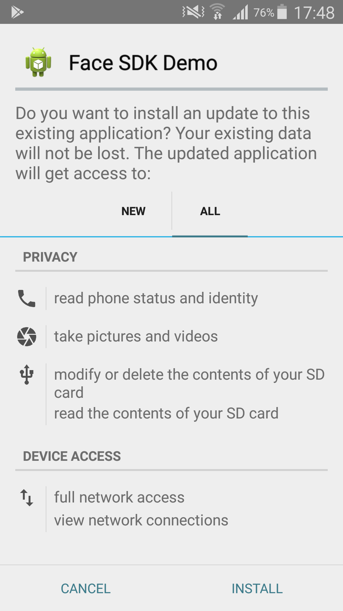
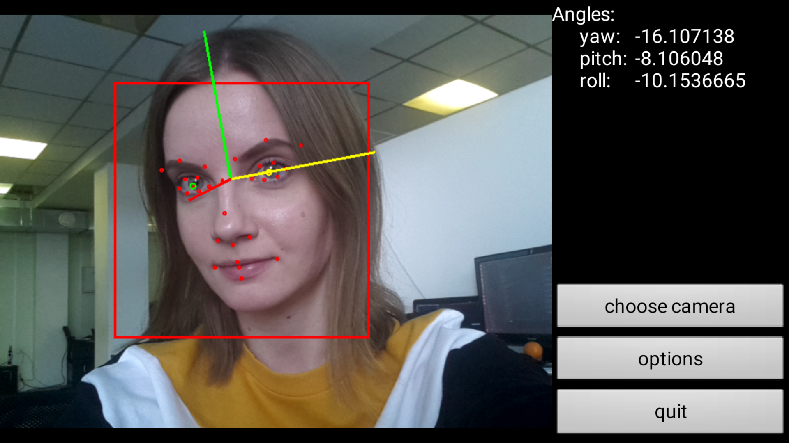

# Android Demo

The program demonstrates tracking, detection and cropping of faces, detection of anthropometric points and angles, as well as estimation of face quality, age and gender, emotions, and liveness (by processing an RGB image from your camera).

To run the demo, install `demo.apk` on your device. To install the demo, you should allow the app to have access to the listed functions.

 
<b>Permissions requested when installing demo.apk</b>

Tracking results and face information are displayed in a window. The results depending on the selected options are displayed in the upper right corner.

In the lower right corner there is a menu with the following sections:

* **choose camera** – select camera type and image resolution
* **options** – parameters of the detected face (face rectangle, angles, image quality, liveness, gender and age, anthropometric points, face quality, vector angles, emotions), as well as the type of face cropping (basic, full frontal, token frontal)
* **quit** – exit the program

 
<b>Running demo.apk</b>

Source code: [examples/android/demo](../../../../examples/android/demo)
