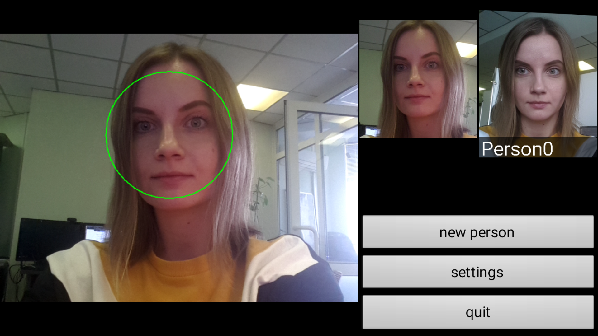

# Android Video Recognition

The program demonstrates tracking, detection and recognition of faces from the database.

To run the demo, install `video_recognition_demo.apk` on your device. To install the demo, you should allow the app to have access to the listed functions.

 
<b>Permissions requested when installing video_recognition_demo.apk</b>

To add a person to the database, in the app click on the "new person" button and enter a name.

 
<b>Adding a face to a database in the app</b>

Tracking results and face information are displayed in a window. In the upper right corner you can see a tracked face and recognition result (a person from a database and his/her name).

In the lower right corner there is a menu with the following sections:

* **new person** – add an unidentified person to the database
* **settings** – select the type of camera used, image resolution, the method used to detect faces, and the recognition threshold
* **quit** – exit the program

 
<b>Running video_recognition_demo.apk</b>

Source code: [examples/android/video_recognition_demo](../../../../examples/android/video_recognition_demo)
