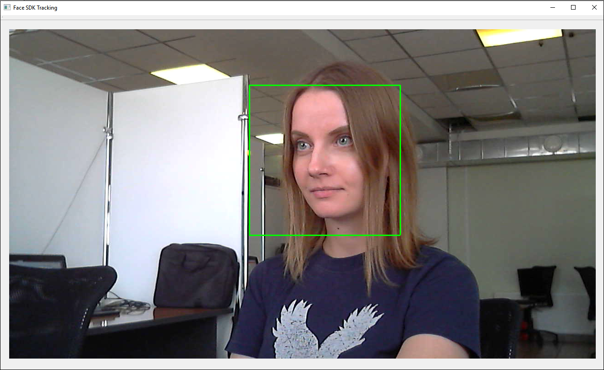
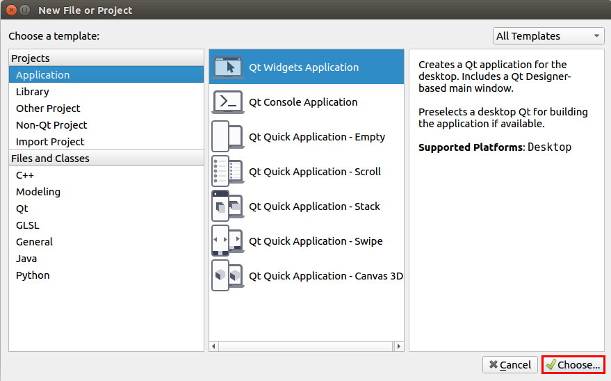
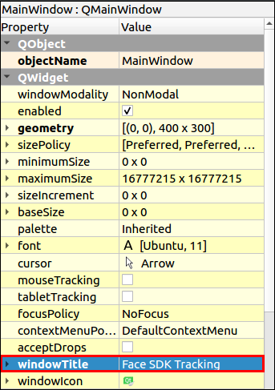
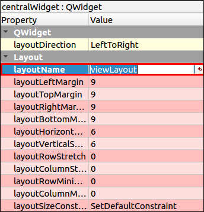
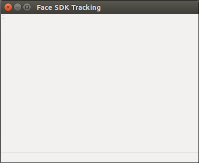
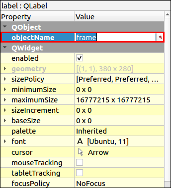
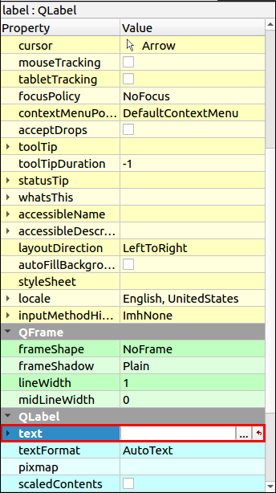
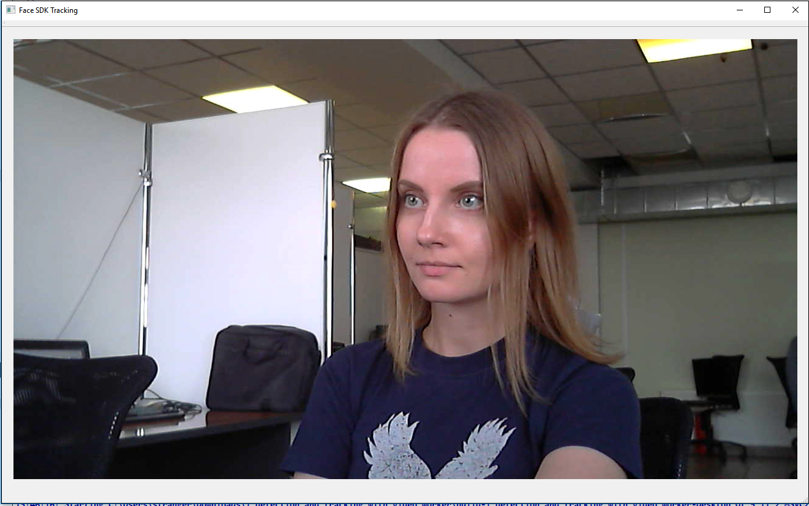

# Face Detection and Tracking in a Video Stream

In this tutorial, you'll learn how to detect and track faces in a video stream from your camera using the `VideoWorker` object from Face SDK API. Tracked faces are highlighted with a green rectangle.

Besides Face SDK and Qt, you'll need **a camera connected to your PC** (for example, a webcam). You can build and run this project either on Windows or on Ubuntu (v16.04 or higher).

You can find the tutorial project in Face SDK: [examples/tutorials/detection_and_tracking_with_video_worker](../../../examples/tutorials/detection_and_tracking_with_video_worker)

<p align="center">
<br>
</p>

## Creating a Qt Project 

1. Run Qt and create a new project: **File > New File or Project > Application > Qt Widgets Application > Choose...**

<p align="center">
<br>
</p>

2. Name it, for example, *1_detection_and_tracking_with_video_worker* and choose the path. Click **Next** and choose the necessary platform for you project in the **Kit Selection** section, for example, **Desktop**.  Click **Details** and select the **Release** build configuration (we don't need **Debug** in this project). 
3. In the **Class Information** window, leave settings as default and click **Next**. Then, leave settings as default in the **Project Management** window and click **Finish**.
4. Let's title the main window of our app: in the project tree, double-click the file **Forms > mainwindow.ui**. Specify the name of the window in the **Properties** tab (the right part of the editor): **windowTitle > Face SDK Tracking**. 

<p align="center">
<br>
</p>

5. To lay out widgets in a grid, drag-and-drop the **Grid Layout** object to the **MainWindow** widget. Call context menu of **MainWindow** by right-clicking and select **Layout > Lay Out in a Grid**. The **Grid Layout** object will be stretched to the size of the **MainWindow** widget. Rename the **Layout: layoutName > viewLayout**.

<p align="center">
<br>
</p>

6. To run the project, click **Run** (Ctrl+R). You'll see an empty window with the title **Face SDK Tracking**.

<p align="center">
<br>
</p>

## Displaying the Image from Camera

1. In order to use a camera in our project, we have to add Qt multimedia widgets. To do this, add the following line to the .pro file:

**detection_and_tracking_with_video_worker.pro**
```cpp
...
QT  += multimedia multimediawidgets
...
```

2. Create a new class `QCameraCapture` to receive the image from a camera: **Add New > C++ > C++ Class > Choose… > Class name – QCameraCapture > Base class – QObject > Next > Project Management** (default settings) **> Finish**. Create a new class `CameraSurface` in the file `qcameracapture.h`, which will provide the frames from camera via the `present` callback.

**qcameracapture.h**
```cpp
#include <QCamera>
#include <QAbstractVideoSurface>
#include <QVideoSurfaceFormat>
#include <QVideoFrame>

class CameraSurface : public QAbstractVideoSurface
{
	Q_OBJECT

	public:
		explicit CameraSurface(QObject* parent = 0);

		bool present(const QVideoFrame& frame);

		QList<QVideoFrame::PixelFormat> supportedPixelFormats(
			QAbstractVideoBuffer::HandleType type = QAbstractVideoBuffer::NoHandle) const;

		bool start(const QVideoSurfaceFormat& format);

	signals:
		void frameUpdatedSignal(const QVideoFrame&);
};
```

3. Describe the implementation of this class in the file `qcameracapture.cpp`. Designate the `CameraSurface::CameraSurface` constructor and the `supportedPixelFormats` method. In `CameraSurface::supportedPixelFormats`, list all the image formats supported by Face SDK (RGB24, BGR24, NV12, NV21). With some cameras, the image is received in the RGB32 format, so we add this format to the list. This format isn't supported by Face SDK, so we'll convert the image from RGB32 to RGB24.

**qcameracapture.cpp**
```cpp
#include "qcameracapture.h"

...
CameraSurface::CameraSurface(QObject* parent) :
	QAbstractVideoSurface(parent)
{
}

QList<QVideoFrame::PixelFormat> CameraSurface::supportedPixelFormats(
	QAbstractVideoBuffer::HandleType handleType) const
{
	if (handleType == QAbstractVideoBuffer::NoHandle)
    	{
		return QList<QVideoFrame::PixelFormat>()
			<< QVideoFrame::Format_RGB32
			<< QVideoFrame::Format_RGB24
			<< QVideoFrame::Format_BGR24
			<< QVideoFrame::Format_NV12
			<< QVideoFrame::Format_NV21;
    	}

    	return QList<QVideoFrame::PixelFormat>();
}
```

4. In the `CameraSurface::start` method, check the image format. Start the camera, if the format is supported, otherwise handle the exception.

**qcameracapture.cpp**
```cpp
...
bool CameraSurface::start(const QVideoSurfaceFormat& format)
{
	if (!supportedPixelFormats(format.handleType()).contains(format.pixelFormat()))
	{
		qDebug() << format.handleType() << " " << format.pixelFormat() << " - format is not supported.";
			return false;
	}

	return QAbstractVideoSurface::start(format);
}
```

5. In the `CameraSurface::present` method, process a new frame. If the frame is successfully verified, send the signal `frameUpdatedSignal` to update the frame. Next, we'll connect this signal to the slot `frameUpdatedSlot`, where the frame will be processed.

**qcameracapture.cpp**
```cpp
...
bool CameraSurface::present(const QVideoFrame& frame)
{
	if (!frame.isValid())
	{
		return false;
	}

	emit frameUpdatedSignal(frame);

 	return true;
}
```

6. The `QCameraCapture` constructor takes the pointer to a parent widget (`parent`), camera id and image resolution (width and height), which will be stored in the relevant class fields.

**cameracapture.h**
```cpp
class QCameraCapture : public QObject
{
	Q_OBJECT

	public:
		explicit QCameraCapture(
			QWidget* parent,
			const int cam_id,
			const int res_width,
			const int res_height);
		...
	private:
		QObject* _parent;
		int cam_id;
		int res_width;
		int res_height;
}
```

7. Add the camera objects `m_camera` and `m_surface` to the `QCameraCapture` class.

**qcameracapture.h**
```cpp
#include <QScopedPointer>

class QCameraCapture : public QObject
{
	...
	private:
		...
		QScopedPointer<QCamera> m_camera;
		QScopedPointer<CameraSurface> m_surface;
};
```

8. Include the `stdexcept` header file to `qcameracapture.cpp` to throw exceptions. Save the pointer to a parent widget, camera id and image resolution in the initializer list of the constructor `QCameraCapture::QCameraCapture`. In the constructor body, get the list of available cameras. The list of cameras should contain at least one camera, otherwise, the `runtime_error` exception will be thrown. Check that the camera with the requested id is in the list. Create a camera and connect the camera signals to the slots processing the object. When the camera status changes, the camera sends the `statusChanged` signal. Create the `CameraSurface` object to display the frames from the camera. Connect the signal `CameraSurface::frameUpdatedSignal` to the slot `QCameraCapture::frameUpdatedSlot`.

**qcameracapture.cpp**
```cpp
#include <QCameraInfo>

#include <stdexcept>

...
QCameraCapture::QCameraCapture(
	QWidget* parent,
	const int cam_id,
	const int res_width,
	const int res_height) : QObject(parent),
_parent(parent),
cam_id(cam_id),
res_width(res_width),
res_height(res_height)
{
	const QList<QCameraInfo> availableCameras = QCameraInfo::availableCameras();

	qDebug() << "Available cameras:";
	for (const QCameraInfo &cameraInfo : availableCameras)
    	{
		qDebug() << cameraInfo.deviceName() << " " << cameraInfo.description();
	}

	if(availableCameras.empty())
	{
		throw std::runtime_error("List of available cameras is empty");
	}

	if (!(cam_id >= 0 && cam_id < availableCameras.size()))
	{
		throw std::runtime_error("Invalid camera index");
	}

	const QCameraInfo cameraInfo = availableCameras[cam_id];

	m_camera.reset(new QCamera(cameraInfo));

	connect(m_camera.data(), &QCamera::statusChanged, this, &QCameraCapture::onStatusChanged);
	connect(m_camera.data(), QOverload<QCamera::Error>::of(&QCamera::error), this, &QCameraCapture::cameraError);

	m_surface.reset(new CameraSurface());

	m_camera->setViewfinder(m_surface.data());

	connect(m_surface.data(), &CameraSurface::frameUpdatedSignal, this, &QCameraCapture::frameUpdatedSlot);
}
```

9. Stop the camera in the destructor `QCameraCapture`.

**qcameracapture.h**
```cpp
class QCameraCapture : public QObject
{
	...
	explicit QCameraCapture(...);
	virtual ~QCameraCapture();
	...
}
```

**qcameracapture.cpp**
```cpp
QCameraCapture::~QCameraCapture()
{
	if (m_camera)
	{
		m_camera->stop();
	}
}
```

10. Add the method `QCameraCapture::frameUpdatedSlot`, which processes the signal `CameraSurface::frameUpdatedSignal`. In this method, we convert the `QVideoFrame` object to `QImage` and send a signal that a new frame is available. Create a pointer to the image `FramePtr`. If the image is received in the RGB32 format, convert it to RGB888.

**qcameracapture.h**
```cpp
#include <memory>

class QCameraCapture : public QObject
{
	Q_OBJECT

	public:
		typedef std::shared_ptr<QImage> FramePtr;
		...
	signals:
		void newFrameAvailable();
		...
	public slots:
		void frameUpdatedSlot(const QVideoFrame&);
		...
}
```

**qcameracapture.cpp**
```cpp
void QCameraCapture::frameUpdatedSlot(
	const QVideoFrame& frame)
{
	QVideoFrame cloneFrame(frame);

	cloneFrame.map(QAbstractVideoBuffer::ReadOnly);

	if (cloneFrame.pixelFormat() == QVideoFrame::Format_RGB24 ||
		cloneFrame.pixelFormat() == QVideoFrame::Format_RGB32)
	{
		QImage image((const uchar*)cloneFrame.bits(),
			cloneFrame.width(),
			cloneFrame.height(),
			QVideoFrame::imageFormatFromPixelFormat(cloneFrame.pixelFormat()));
 
           
		if (image.format() == QImage::Format_RGB32)
		{
			image = image.convertToFormat(QImage::Format_RGB888);
		}


		FramePtr frame = FramePtr(new QImage(image));
	}

	cloneFrame.unmap();

	emit newFrameAvailable();
}
```

11. Add the methods to start and stop the camera to `QCameraCapture`.

**qcameracapture.h**
```cpp
class QCameraCapture : public QObject
{
	...
	public:
		...
		void start();
		void stop();
		...
}
```

**qcameracapture.cpp**
```cpp
void QCameraCapture::start()
{
	m_camera->start();
}

void QCameraCapture::stop()
{
	m_camera->stop();
}
```

12. In the `QCameraCapture::onStatusChanged` method, process the change of the camera status to `LoadedStatus`. Check if the camera supports the requested resolution. Set the requested resolution, if it's supported by the camera, otherwise set the default resolution (640 x 480), specified by the static fields `default_res_width`, `default_res_height`.

**qcameracapture.h**
```cpp
class QCameraCapture {
		...
	private slots:
		void onStatusChanged();
		...

	private:
		static const int default_res_width;
		static const int default_res_height;
		...
}
```

**qcameracapture.cpp**
```cpp
const int QCameraCapture::default_res_width = 640;
const int QCameraCapture::default_res_height = 480;

...
void QCameraCapture::onStatusChanged()
{
	if (m_camera->status() == QCamera::LoadedStatus)
	{
		bool found = false;
		const QList<QSize> supportedResolutions = m_camera->supportedViewfinderResolutions();
		for (const QSize &resolution : supportedResolutions)
		{
			if (resolution.width() == res_width &&
				resolution.height() == res_height)
			{
				found = true;
			}
		}

		if (!found)
		{
			qDebug() << "Resolution: " << res_width << "x" << res_width << " unsupported";
			qDebug() << "Set default resolution: " << default_res_width << "x" << default_res_height;

			res_width = default_res_width;
			res_height = default_res_height;
		}

		QCameraViewfinderSettings viewFinderSettings;
		viewFinderSettings.setResolution(
			res_width,
			res_height);
			m_camera->setViewfinderSettings(viewFinderSettings);
	}
}
```

13. In the `cameraError` method, display the camera error messages if they occur.

**qcameracapture.h**
```cpp
class QCameraCapture : public QObject
{
	...
	private slots:
		...
		void cameraError();
	...
}
```

**qcameracapture.cpp**
```cpp
void QCameraCapture::cameraError()
{
	qDebug() << "Camera error: " << m_camera->errorString();
}
```

14. Create a new class `Worker`: **Add New > C++ > C++ Class > Choose… > Class name - Worker > Next > Finish**. Through the `addFrame` method, the `Worker` class will save the last frame from the camera and pass this frame through the `getDataToDraw` method.

**worker.h**
```cpp
#include "qcameracapture.h"

#include <mutex>

class Worker
{
	public:
		// Data to be drawn
		struct DrawingData
		{
			bool updated;

			QCameraCapture::FramePtr frame;

			DrawingData() : updated(false)
			{
			}
		};

		Worker();

		void addFrame(QCameraCapture::FramePtr frame);

		void getDataToDraw(DrawingData& data);

	private:
		DrawingData _drawing_data;
		std::mutex _drawing_data_mutex;
};
```

**worker.cpp**
```cpp
void Worker::getDataToDraw(DrawingData &data)
{
	const std::lock_guard<std::mutex> guard(_drawing_data_mutex);

	data = _drawing_data;
	_drawing_data.updated = false;
}

void Worker::addFrame(QCameraCapture::FramePtr frame)
{
	const std::lock_guard<std::mutex> guard(_drawing_data_mutex);

	_drawing_data.frame = frame;
	_drawing_data.updated = true;
}
```

15. Frames will be displayed in the `ViewWindow` class. Create a widget **ViewWindow: Add > New > Qt > Designer Form Class > Choose... > Template > Widget** (default settings) **> Next  > Name – ViewWindow > Project Management** (default settings) **> Finish**.
16. In the editor (Design), drag-and-drop the **Grid Layout** object to the widget. To do this, call context menu of **ViewWindow** by right-clicking and select **Layout > Lay Out in a Grid**. The **Grid Layout** object allows you to place widgets in a grid and is stretched to the size of the ViewWindow widget. Then, add the **Label** object to **gridLayout** and name it **frame: QObject > objectName > frame**.

<p align="center">
<br>
</p>

17. Delete the default text in **QLabel > text**.

<p align="center">
<br>
</p>

18. Add the camera `_qCamera` to the `ViewWindow` class and initialize it in the constructor. Using the static fields `camera_image_width` and `camera_image_height`, set the required image resolution to 1280x720. The `_running` flag stores the status of the camera: `true` means that the camera is running, `false` - the camera is stopped.

**viewwindow.h**
```cpp
#include "qcameracapture.h"

#include <QWidget>

namespace Ui {
class ViewWindow;
}

class ViewWindow : public QWidget
{
	Q_OBJECT

	public:
		explicit ViewWindow(QWidget *parent);
		~ViewWindow();

	private:
		Ui::ViewWindow *ui;

		static const int camera_image_width;
		static const int camera_image_height;

		QScopedPointer<QCameraCapture> _qCamera;
		bool _running;
};
```

**viewwindow.cpp**
```cpp
const int ViewWindow::camera_image_width = 1280;
const int ViewWindow::camera_image_height = 720;

ViewWindow::ViewWindow(QWidget *parent) :
QWidget(parent),
ui(new Ui::ViewWindow())
{
	ui->setupUi(this);

	_running = false;

	_qCamera.reset(new QCameraCapture(
		this,
		0, // camera id 
		camera_image_width,
		camera_image_height));
}
```

19. Add the `Worker` object to the `ViewWindow` class and initialize it in the constructor. 

**viewwindow.h**
```cpp
#include "worker.h"

class ViewWindow : public QWidget
{
	...

	private:
		...
		std::shared_ptr<Worker> _worker;
};
```

**viewwindow.cpp**
```cpp
ViewWindow::ViewWindow(QWidget *parent) :
QWidget(parent),
ui(new Ui::ViewWindow())
{
	...
	_worker = std::make_shared<Worker>();
	...
}
```

20. Frames will be passed to `Worker` from `QCameraCapture`. Modify the `QCameraCapture` and `ViewWindow` classes.

**qcameracapture.h**
```cpp
...
class Worker;

class QCameraCapture : public QObject
{
	...

	public:
	...
		QCameraCapture(
		...
		std::shared_ptr<Worker> worker,
		...);
	...
	private:
		...
		std::shared_ptr<Worker> _worker;
	...
};
```

**qcameracapture.cpp**
```cpp
#include "worker.h"
...
QCameraCapture::QCameraCapture(
	...
	std::shared_ptr<Worker> worker,
	...) :
_worker(worker),
...
void QCameraCapture::frameUpdatedSlot(
    const QVideoFrame& frame)
{
	if (cloneFrame.pixelFormat() == QVideoFrame::Format_RGB24 ||
		cloneFrame.pixelFormat() == QVideoFrame::Format_RGB32)
	{
		...
		FramePtr frame = FramePtr(new QImage(image));
		_worker->addFrame(frame);
	}
...
}
```

**viewwindow.cpp**
```cpp
ViewWindow::ViewWindow(QWidget *parent) :
QWidget(parent),
ui(new Ui::ViewWindow())
{
	...
	_qCamera.reset(new QCameraCapture(
		this,
		_worker,
		...));
}
```

21. The `QCameraCapture::newFrameAvailable` signal is processed in the `ViewWindow::draw` slot, which displays the camera image on the frame widget.

**viewwindow.h**
```cpp
class ViewWindow : public QWidget
{
	...
	private slots:
		void draw();
	...
}
```

**viewwindow.cpp**
```cpp
ViewWindow::ViewWindow(QWidget *parent) :
QWidget(parent),
ui(new Ui::ViewWindow())
{
	...
	connect(_qCamera.data(), &QCameraCapture::newFrameAvailable, this, &ViewWindow::draw);
}

void ViewWindow::draw()
{
	Worker::DrawingData data;
	_worker->getDataToDraw(data);

	// If data is the same, image is not redrawn
	if(!data.updated)
	{
		return;
	}

	// Drawing
	const QImage image = data.frame->copy();

	ui->frame->setPixmap(QPixmap::fromImage(image));
}
```

22. Start the camera in the `runProcessing` method and stop it in `stopProcessing`.

**viewwindow.h**
```cpp
class ViewWindow : public QWidget
{
	public:
	...

	void runProcessing();
	void stopProcessing();
	...
}
```

**viewwindow.cpp**
```cpp
void ViewWindow::stopProcessing()
{
	if (!_running)
		return;

	_qCamera->stop();
	_running = false;
}

void ViewWindow::runProcessing()
{
	if (_running)
		return;

	_qCamera->start();

	_running = true;
}
```

23. Stop the camera in the desctructor `~ViewWindow`.

**viewwindow.cpp**
```cpp
ViewWindow::~ViewWindow()
{
	stopProcessing();

	delete ui;
}
```

24. Connect the camera widget to the main application window: create a view window and start processing in the `MainWindow` constructor. Stop the processing in the `~MainWindow` destructor.

**mainwindow.h**
```cpp
...
class ViewWindow;

class MainWindow : public QMainWindow
{
	...

	private:
		Ui::MainWindow *ui;

		QScopedPointer<ViewWindow> _view;
};
```

**mainwindow.cpp**
```cpp
#include "viewwindow.h"

#include <QMessageBox>

MainWindow::MainWindow(QWidget *parent) :
	QMainWindow(parent),
ui(new Ui::MainWindow)
{
	ui->setupUi(this);

	try
	{
		_view.reset(new ViewWindow(this));

		ui->viewLayout->addWidget(_view.data());

		_view->runProcessing();
	}
	catch(std::exception &ex)
	{
		QMessageBox::critical(
			this,
			"Initialization Error",
			ex.what());

		throw;
	}
}

MainWindow::~MainWindow()
{
	if (_view)
	{
		_view->stopProcessing();
	}

	delete ui;
}
...
```

25. Modify the `main` function to catch possible exceptions.

**main.cpp**
```cpp
#include <QDebug>

int main(int argc, char *argv[])
{
	QApplication a(argc, argv);

	try
	{
		MainWindow w;
		w.show();

		return a.exec();
	}
	catch(std::exception& ex)
	{
		qDebug() << "Exception caught: " << ex.what();
	}
	catch(...)
	{
		qDebug() << "Unknown exception caught";
	}

	return 0;
}
```

26. Run the project. You should see a window with the image from your camera.

_**Note:** On Windows, the image from some cameras can be flipped or mirrored, which happens due to some peculiarities of the image processing by Qt. In this case, you'll need to process the image, for example, using [QImage::mirrored()](https://doc.qt.io/qt-5/qimage.html)._

<p align="center">
<br>
</p>

## Detecting and Tracking Faces in Video Stream

1. Download and extract the Face SDK distribution as described in the section [Getting Started](../../../README.md#getting-started). The root folder of the distribution should contain the *bin* and *lib* folders, depending on your platform. 
2. To detect and track faces on the image from your camera, you have to integrate Face SDK into your project. In the .pro file, specify the path to the Face SDK root folder in the variable `FACE_SDK_PATH`, which includes necessary headers. Also, specify the path to the `include` folder (from Face SDK). If the paths are not specified, the exception “Empty path to Face SDK” is thrown.

**detection_and_tracking_with_video_worker.pro**
```cpp
...
# Set path to FaceSDK root directory
FACE_SDK_PATH =
isEmpty(FACE_SDK_PATH) {
	error("Empty path to Face SDK")
}

DEFINES += FACE_SDK_PATH=\\\"$$FACE_SDK_PATH\\\"

INCLUDEPATH += $${FACE_SDK_PATH}/include
...
```

_**Note:** When specifying the path to Face SDK, please use a slash ("/")._

3. [Linux only] To build the project with Face SDK, add the following option to the .pro file:

**detection_and_tracking_with_video_worker.pro**
```cpp
...
unix: LIBS += -ldl
...
```

4. Besides, we have to specify the path to the `facerec` library and configuration files. Create the `FaceSdkParameters` class, which will store the configuration (**Add New > C++ > C++ Header File > FaceSdkParameters**) and use it in `MainWindow`.

**facesdkparameters.h**
```cpp
#include <string>

// Processing and face sdk settings.
struct FaceSdkParameters
{
	std::string face_sdk_path = FACE_SDK_PATH;
};
```

**mainwindow.h**
```cpp
#include <QMainWindow>

#include "facesdkparameters.h"
...
class MainWindow : public QMainWindow
{
	private:
	...
	FaceSdkParameters _face_sdk_parameters;
}
```

5. Integrate Face SDK: add necessary headers to `mainwindow.h` and the `initFaceSdkService` method to initialize the Face SDK services. Create a `FacerecService` object, which is a component used to create the Face SDK modules, by calling the `FacerecService::createService` static method. Pass the path to the library and path to the folder with the configuration files in a `try-catch` block in order to catch possible exceptions. If the initialization was successful, the `initFaceSdkService` function will return `true`, otherwise, it'll return `false` and you'll see a window with an exception.

**mainwindow.h**
```cpp
#include <facerec/libfacerec.h>

class MainWindow : public QMainWindow
{
	...
	private:
		bool initFaceSdkService();

	private:
		...
		pbio::FacerecService::Ptr _service;
		...
}
```

**mainwindow.cpp**
```cpp
bool MainWindow::initFaceSdkService()
{
	// Integrate Face SDK
	QString error;
	try
	{
		#ifdef _WIN32
			std::string facerec_lib_path = _face_sdk_parameters.face_sdk_path + "/bin/facerec.dll";
		#else
			std::string facerec_lib_path = _face_sdk_parameters.face_sdk_path + "/lib/libfacerec.so";
		#endif
		_service = pbio::FacerecService::createService(
			facerec_lib_path,
				_face_sdk_parameters.face_sdk_path + "/conf/facerec");

		return true;
	}
	catch(const std::exception &e)
	{
		error = tr("Can't init Face SDK service: '") + e.what() + "'.";
	}
	catch(...)
	{
		error = tr("Can't init Face SDK service: ... exception.");
	}

	QMessageBox::critical(
		this,
		tr("Face SDK error"),
		error + "\n" +
		tr("Try to change face sdk parameters."));

	return false;
}
```

6. In the `MainWindow::MainWindow` constructor, add a service initialization call. In case of an error, throw the `std::runtime_error` exception.

**mainwindow.cpp**
```cpp
MainWindow::MainWindow(QWidget *parent) :
	QMainWindow(parent),
ui(new Ui::MainWindow)
{
	...
	if (!initFaceSdkService())
	{
		throw std::runtime_error("Face SDK initialization error");
	}
	...
}
```

7. Pass `FacerecService` and Face SDK parameters to the `ViewWindow` constructor, where they'll be used to create the `VideoWorker` tracking module. Save the service and parameters to the class fields.

**mainwindow.cpp**
```cpp
MainWindow::MainWindow(QWidget *parent) :
	QMainWindow(parent),
ui(new Ui::MainWindow)
{
	...
	_view.reset(new ViewWindow(
		this,
		_service,
		_face_sdk_parameters));
	...
}
```

**viewwindow.h**
```cpp
#include "facesdkparameters.h"
#include <facerec/libfacerec.h>
...
class ViewWindow : public QWidget
{
	Q_OBJECT

	public:
		ViewWindow(
			QWidget *parent,
			pbio::FacerecService::Ptr service,
			FaceSdkParameters face_sdk_parameters);
	...

	private:
		...
		pbio::FacerecService::Ptr _service;
		FaceSdkParameters _face_sdk_parameters;
};
```

**viewwindow.cpp**
```cpp
...
ViewWindow::ViewWindow(
	QWidget *parent,
	pbio::FacerecService::Ptr service,
	FaceSdkParameters face_sdk_parameters) :
QWidget(parent),
ui(new Ui::ViewWindow()),
_service(service),
_face_sdk_parameters(face_sdk_parameters)
...
```

8. Modify the `Worker` class for interaction with Face SDK. The `Worker` class takes the `FacerecService` pointer and name of the configuration file of the tracking module. The `Worker` class creates the `VideoWorker` component from Face SDK, which is responsible for face tracking, passes the frames to it and processes the callbacks, which contain the tracking results. Imlement the constructor – create the object `VideoWorker`, specifying the configuration file, recognizer method (in our case, it's empty because we don't recognize faces in this project), number of video streams (it's 1 in our case because we use only one camera).

**worker.h**
```cpp
#include <facerec/libfacerec.h>

class Worker
{
	...
	public:
		...
		Worker(
			const pbio::FacerecService::Ptr service,
			const std::string videoworker_config);

	private:
		...
		pbio::VideoWorker::Ptr _video_worker;
};
```

**worker.cpp**
```cpp
#include "worker.h"
#include "videoframe.h"

Worker::Worker(
	const pbio::FacerecService::Ptr service,
	const std::string videoworker_config)
{
	pbio::FacerecService::Config vwconfig(videoworker_config);

	_video_worker = service->createVideoWorker(
		vwconfig,
		"",  // Recognition isn't used 
		1,   // streams_count
		0,   // processing_threads_count
		0);  // matching_threads_count
}
```

_**Note:** In addition to the face detection and tracking, `VideoWorker` can be used for face recognition on several video streams. In this case, you have to specify the recognizer method and the streams `processing_threads_count` and `matching_threads_count`._

9. Subscribe to the callbacks from the `VideoWorker` class – `TrackingCallback` (a face is detected and tracked), `TrackingLostCallback` (a face was lost). Delete them in the destructor.

**worker.h**
```cpp
class Worker
{
	public:
		...
		Worker(...);
		~Worker();
	...
	private:
		...
		static void TrackingCallback(
			const pbio::VideoWorker::TrackingCallbackData &data,
			void* const userdata);

		static void TrackingLostCallback(
			const pbio::VideoWorker::TrackingLostCallbackData &data,
			void* const userdata);

		int _tracking_callback_id;
		int _tracking_lost_callback_id;
};
```

**worker.cpp**
```cpp
Worker::Worker(...)
{
	...
	_tracking_callback_id =
		_video_worker->addTrackingCallbackU(
			TrackingCallback,
			this);

	_tracking_lost_callback_id =
		_video_worker->addTrackingLostCallbackU(
			TrackingLostCallback,
			this);
}

Worker::~Worker()
{
	_video_worker->removeTrackingCallback(_tracking_callback_id);
	_video_worker->removeTrackingLostCallback(_tracking_lost_callback_id);
}
```

10. Include the `cassert` header to handle exceptions. In `TrackingCallback`, the result is received in the form of the `TrackingCallbackData` structure, which stores data about all faces, which are being tracked. The preview output is synchronized with the result output. We cannot immediately display the frame, which is passed to `VideoWorker`, because it'll processed a little later. Therefore, frames are stored in a queue. When we get a result, we can find a frame that matches this result. Some frames may be skipped by `VideoWorker` under heavy load, which means that sometimes there's no matching result for some frames. In the algorithm below, the image corresponding to the last received frame is extracted from the queue. Save the detected faces for each frame so that we can use them later for visualization. To synchronize the changes of shared data in `TrackingCallback` and `TrackingLostCallback`, we use `std::mutex`.

**worker.h**
```cpp
#include <cassert>
...
class Worker
{
	...
	public:
		// Face data 
		struct FaceData
		{
			pbio::RawSample::Ptr sample;
			bool lost;
			int frame_id;

			FaceData() : lost(true)
			{
			}
		};

		// Drawing data
		struct DrawingData
		{
			...
			int frame_id;

			// map<track_id, face>
			std::map<int, FaceData> faces;
			...
		};
	...
};
```

**worker.cpp**
```cpp
...
// static
void Worker::TrackingCallback(
	const pbio::VideoWorker::TrackingCallbackData &data,
	void * const userdata)
{
	// Checking arguments
	assert(userdata);

	// frame_id - frame used for drawing, samples - info about faces to be drawn
	const int frame_id = data.frame_id;
	const std::vector<pbio::RawSample::Ptr> &samples = data.samples;

	// User information - pointer to Worker
	// Pass the pointer
	Worker &worker = *reinterpret_cast<Worker*>(userdata);

	// Get the frame with frame_id
	QCameraCapture::FramePtr frame;
	{
		const std::lock_guard<std::mutex> guard(worker._frames_mutex);

		auto& frames = worker._frames;

		// Searching in worker._frames
		for(;;)
		{
			// Frames should already be received 
			assert(frames.size() > 0);

			// Check that frame_id are received in ascending order 
			assert(frames.front().first <= frame_id);


			if(frames.front().first == frame_id)
			{
				// Frame is found 
				frame = frames.front().second;
				frames.pop();
				break;
			}
			else
			{
				// Frame was skipped (i.e. the worker._frames.front())
				std::cout << "skipped " << ":" << frames.front().first << std::endl;
				frames.pop();
			}
		}
	}

	// Update the information
	{
		const std::lock_guard<std::mutex> guard(worker._drawing_data_mutex);

		// Frame
		worker._drawing_data.frame = frame;
		worker._drawing_data.frame_id = frame_id;
		worker._drawing_data.updated = true;

		// Samples
		for(size_t i = 0; i < samples.size(); ++i)
		{
			FaceData &face = worker._drawing_data.faces[samples[i]->getID()];
			face.frame_id = samples[i]->getFrameID();  // May differ from frame_id
			face.lost = false;
			face.sample = samples[i];
		}
	}
}
```

11. Implement `TrackingLostCallback`, in which we mark that the tracked face left the frame.

**worker.cpp**
```cpp
...
// static
void Worker::TrackingLostCallback(
	const pbio::VideoWorker::TrackingLostCallbackData &data,
	void* const userdata)
{
	const int track_id = data.track_id;

	// User information - pointer to Worker
	// Pass the pointer
	Worker &worker = *reinterpret_cast<Worker*>(userdata);
	{
		const std::lock_guard<std::mutex> guard(worker._drawing_data_mutex);
		
		FaceData &face = worker._drawing_data.faces[track_id];

		assert(!face.lost);

		face.lost = true;
	}
}
```

12. `VideoWorker` receives the frames via the `pbio::IRawImage` interface. Create the `VideoFrame` header file: **Add New > C++ > C++ Header File > VideoFrame**. Include it to the file `videoframe.h` and implement the `pbio::IRawImage` interface for the `QImage` class. The `pbio::IRawImage` interface allows to get the pointer to image data, its format, width and height.

**videoframe.h**

<details>
  <summary>Click to expand</summary>
	
```cpp
#include "qcameracapture.h"
#include <pbio/IRawImage.h>

class VideoFrame : public pbio::IRawImage
{
public:
	VideoFrame(){}

	virtual ~VideoFrame(){}

	virtual const unsigned char* data() const throw();

	virtual int32_t width() const throw();

	virtual int32_t height() const throw();

	virtual int32_t format() const throw();

	QCameraCapture::FramePtr& frame();

	const QCameraCapture::FramePtr& frame() const;

private:
	QCameraCapture::FramePtr _frame;
};


inline
const unsigned char* VideoFrame::data() const throw()
{
	if(_frame->isNull() || _frame->size().isEmpty())
	{
		return NULL;
	}

	return _frame->bits();
}

inline
int32_t VideoFrame::width() const throw()
{
	return _frame->width();
}


inline
int32_t VideoFrame::height() const throw()
{
	return _frame->height();
}


inline
int32_t VideoFrame::format() const throw()
{
	if(_frame->format() == QImage::Format_Grayscale8)
	{
		return (int32_t) FORMAT_GRAY;
	}

	if(_frame->format() == QImage::Format_RGB888)
	{
		return (int32_t) FORMAT_RGB;
	}

	return -1;
}

inline
QCameraCapture::FramePtr& VideoFrame::frame()
{
	return _frame;
}

inline
const QCameraCapture::FramePtr& VideoFrame::frame() const
{
	return _frame;
}
```
</details>

13. In the `addFrame` method, pass the frames to `VideoWorker`. If there are any exceptions during the callback processing, they're thrown again in the `checkExceptions` method. Create the `_frames` queue to store the frames. This queue will contain the frame id and the corresponding image, so that we can find the frame, which matches the processing result in `TrackingCallback`. To synchronize the changes in shared data, we use `std::mutex`.

**worker.h**
```cpp
#include <queue>
...
class Worker : public QObject
{
	...
	private:
		...
		std::queue<std::pair<int, QCameraCapture::FramePtr> > _frames;
		std::mutex _frames_mutex;
		...
};
```

**worker.cpp**
```cpp
#include "videoframe.h"
...
void Worker::addFrame(
	QCameraCapture::FramePtr frame)
{
	VideoFrame video_frame;
	video_frame.frame() = frame;

	const std::lock_guard<std::mutex> guard(_frames_mutex);

	const int stream_id = 0;

	const int frame_id = _video_worker->addVideoFrame(
		video_frame,
		stream_id);

	_video_worker->checkExceptions();

	_frames.push(std::make_pair(frame_id, video_frame.frame()));
}
```

14. Modify the `getDataToDraw` method - we won't draw the faces, for which `TrackingLostCallback` was called.

**worker.cpp**
```cpp
void Worker::getDataToDraw(DrawingData &data)
{
	...

		// Delete the samples, for which TrackingLostCallback was called
		{
			for(auto it = _drawing_data.faces.begin();
				it != _drawing_data.faces.end();)
			{
				const std::map<int, FaceData>::iterator i = it;
				++it; // i can be deleted, so increment it at this stage

				FaceData &face = i->second;

				// Keep the faces, which are being tracked 
				if(!face.lost)
					continue;

				_drawing_data.updated = true;

				// Delete faces 
				_drawing_data.faces.erase(i);
			}
		}
	...
}
```

15. Modify the `QCameraCapture` class to catch the exceptions, which may be thrown in `Worker::addFrame`.

**qcameracapture.cpp**
```cpp
#include <QMessageBox>
...
void QCameraCapture::frameUpdatedSlot(
	const QVideoFrame& frame)
{
	...
	if (cloneFrame.pixelFormat() == QVideoFrame::Format_RGB24 ||
	    cloneFrame.pixelFormat() == QVideoFrame::Format_RGB32)
	{
		QImage image(...);

		if (image.format() == QImage::Format_RGB32)
		{
			image = image.convertToFormat(QImage::Format_RGB888);
		}

		try
		{
			FramePtr frame = FramePtr(new QImage(image));
			_worker->addFrame(frame);
		}
		catch(std::exception& ex)
		{
			stop();
			cloneFrame.unmap();

			QMessageBox::critical(
				_parent,
				tr("Face SDK error"),
				ex.what());

				return;
		}
   	}
	...
}
```

16. Create the `DrawFunction` class, which will contain a method to draw the tracking results in the image: **Add New > C++ > C++ Class > Choose… > Class name – DrawFunction**.

**drawfunction.h**
```cpp
#include "worker.h"

class DrawFunction
{
public:
	DrawFunction();

	static QImage Draw(
		const Worker::DrawingData &data);
};
```

**drawfunction.cpp**
```cpp
#include "drawfunction.h"
#include <QPainter>

DrawFunction::DrawFunction()
{
}

// static
QImage DrawFunction::Draw(
	const Worker::DrawingData &data)
{
	QImage result = data.frame->copy();

	QPainter painter(&result);

	// Clone the information about faces 
	std::vector<std::pair<int, Worker::FaceData> > faces_data(data.faces.begin(), data.faces.end());

	// Draw faces 
	for(const auto &face_data : faces_data)
	{
		const Worker::FaceData &face = face_data.second;

		painter.save();

		// Visualize faces in the frame 
		if(face.frame_id == data.frame_id && !face.lost)
		{
			const pbio::RawSample& sample = *face.sample;
			QPen pen;

			// Draw the bounding box 
			{
				// Get the bounding box 
				const pbio::RawSample::Rectangle bounding_box = sample.getRectangle();

				pen.setWidth(3);
				pen.setColor(Qt::green);
				painter.setPen(pen);
				painter.drawRect(bounding_box.x, bounding_box.y, bounding_box.width, bounding_box.height);
			}
		}

		painter.restore();
	}

	painter.end();

	return result;
}
```

17. In the `ViewWindow` constructor, pass the `FacerecService` pointer and the name of the configuration file of the tracking module when creating `Worker`. In the `Draw` method, draw the tracking result in the image by calling `DrawFunction::Draw`.

**viewwindow.cpp**
```cpp
#include "drawfunction.h"
...

ViewWindow::ViewWindow(...) :
...
{
	...
	_worker = std::make_shared<Worker>(
		_service,
		"video_worker_lbf.xml");
	...
}
...
void ViewWindow::draw()
{
	...
	// Drawing
	const QImage image = DrawFunction::Draw(data);
	...
}
```

18. Run the project. Now you should see that faces in the image are detected and tracked (they're highlighted with a green rectangle). You can find more info about using the `VideoWorker` object in the section [Video Stream Processing](../development/video_stream_processing.md).

<p align="center">
<br>
</p>
