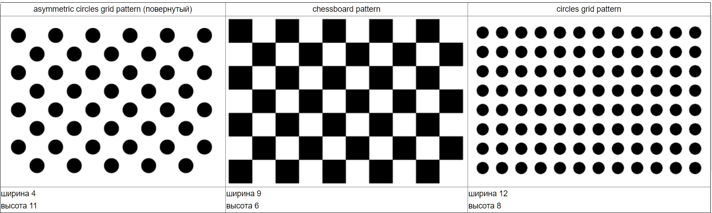

# Калибровка камеры и коррекция дисторсии

Объект `CameraCalibrator` предназначен для калибровки камеры и коррекции дисторсии. Он может быть создан с помощью метода `FacerecService.createCameraCalibrator`.

Для коррекции дисторсии необходимо либо провести калибровку, либо загрузить откалиброванные параметры с помощью метода `CameraCalibrator.loadCameraParameters`. После это вы сможете произвести коррекцию дисторсии изображения с помощью метода `CameraCalibrator.undistort`.

Для проведения калибровки необходимо распечатать калибровочный шаблон и закрепить его на плоской поверхности, желательно черной.

Существует три вида калибровочных шаблонов:

* asymmetric circles grid pattern
* chessboard pattern
* circles grid pattern

Примеры шаблонов:

 

Полноразмерные изображения находятся в каталоге *share/calibration*.

Рекомендуется использовать шаблон *asymmetric circles grid*.

Перед калибровкой необходимо инициализировать объект `CameraCalibrator`, вызвав метод `CameraCalibrator.initCalibration`. Затем снимайте калибровочный шаблон в различных позах и ориентациях камерой, которую нужно скалибровать, и передавайте кадры в метод `CameraCalibrator.addImage`.

Метод `CameraCalibrator.getPatternSpaceCoverProgress` позволяет получить оценку покрытия пространства позиций и ориентаций шаблонов. Метод `CameraCalibrator.getTip` выдает подсказку необходимой позиции и шаблона.

Далее вызовите метод `CameraCalibrator.calibrate`.

После успешной калибровки вы можете оценить результат коррекции дисторсии, вызвав метод `CameraCalibrator.undistort`. Если результат вас устроил, вы можете сохранить параметры калибровки с помощью метода `CameraCalibrator.saveCameraParameters`, или, в противном случае, добавить больше изображений и произвести калибровку еще раз.

Чтобы начать калибровку заново, вызовите метод `CameraCalibrator.initCalibration`.

Пример использования *CameraCalibrator* см. в [test_calibration](../samples/cpp/test_calibration.md).
