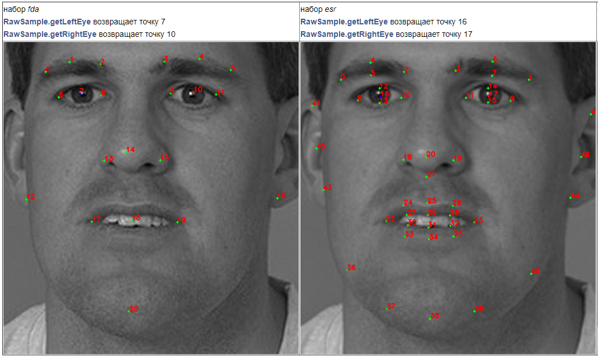
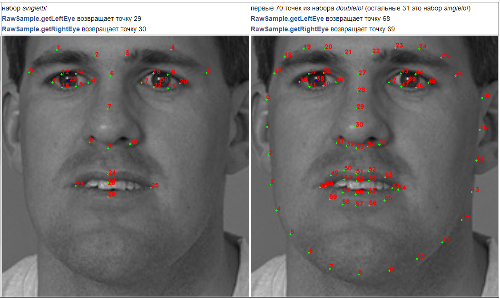

# Класс Capturer

Для захвата лиц необходимо создать объект `Capturer` с помощью метода `FacerecService.createCapturer`, передав путь к конфигурационному файлу или объект `FacerecService.Config`. При передаче пути к конфигурационному файлу будут использованы параметры по умолчанию. При использовании `FacerecService.Config` можно переопределить значение любого числового параметра из конфигурационного файла. Также значения некоторых параметров можно изменить в уже созданном объекте `Capturer` с помощью метода `Capturer.setParameter`.

Пример 1: 

**C++**: ```pbio::Capturer::Ptr capturer = service->createCapturer("common_capturer4.xml");```  
**C#**: ```Capturer capturer = service.createCapturer("common_capturer4_lbf.xml");```  
**Java**: ```final Capturer capturer = service.createCapturer(service.new Config("common_capturer4_lbf.xml"));```  

Пример 2: 

**C++**

<details>
  <summary>Нажмите, чтобы развернуть</summary>

```cpp
pbio::FacerecService::Config capturer_config("common_capturer4.xml");
capturer_config.overrideParameter("min_size", 200);
pbio::Capturer::Ptr capturer = service->createCapturer(capturer_config);
```
</details>

**C#**

<details>
  <summary>Нажмите, чтобы развернуть</summary>

```cs
FacerecService.Config capturerConfig = new FacerecService.Config("common_capturer4_lbf.xml");
capturerConfig.overrideParameter("min_size", 200);
Capturer capturer = service.createCapturer(capturerConfig);
```
</details>

**Java**

<details>
  <summary>Нажмите, чтобы развернуть</summary>

```java
FacerecService.Config capturerConfig = service.new Config("common_capturer4_lbf.xml");
capturerConfig.overrideParameter("min_size", 200);
final Capturer capturer = service.createCapturer(capturerConfig);
```
</details>

Пример 3:

**C++**

<details>
  <summary>Нажмите, чтобы развернуть</summary>

```cpp
pbio::Capturer::Ptr capturer = service->createCapturer("common_capturer4.xml");
capturer->setParameter("min_size", 200);
capturer->setParameter("max_size", 800);
// capturer->capture(...);
// ...
capturer->setParameter("min_size", 100);
capturer->setParameter("max_size", 400);
// capturer->capture(...);
```
</details>

**C#**

<details>
  <summary>Нажмите, чтобы развернуть</summary>

```cs
Capturer capturer = service.createCapturer("common_capturer4_lbf.xml");
capturer.setParameter("min_size", 200);
capturer.setParameter("max_size", 800);
// capturer.capturer(...);
// ...
capturer.setParameter("min_size", 100);
capturer.setParameter("max_size", 400);
// capturer.capture(...);
```
</details>

**Java**

<details>
  <summary>Нажмите, чтобы развернуть</summary>

```java
Capturer capturer = service.createCapturer(service.new Config("common_capturer4_lbf.xml"));
capturer.setParameter("min_size", 200);
capturer.setParameter("max_size", 800);
// capturer.capturer(...);
// ...
capturer.setParameter("min_size", 100);
capturer.setParameter("max_size", 400);
// capturer.capture(...);
```
</details>

Тип и характеристики созданного детектора зависят от переданного в `FacerecService.createCapturer` конфигурационного файла или объекта `FacerecService.Config`.

Мы рекомендуем использовать следующие конфигурационные файлы: 
* `common_capturer4_fda.xml` – детектор фронтальных лиц, разработанный 3DiVi Inc., который работает значительно лучше, чем детекторы из открытых библиотек, таких как OpenCV или Dlib
* `common_video_capturer_fda.xml` – видеотрекер фронтальных лиц, разработанный 3DiVi Inc. (работает только с цветными изображениями).

_**Примечание:** Для детекции лиц на видеопотоках рекомендуется использовать интерфейсный объект `VideoWorker`. Если при создании `VideoWorker` указаны параметры `matching_thread=0` и `processing_thread=0`, то потребляется обычная [лицензия Face Detector](../components.md)._

Используемые наборы антропометрических точек (см. [Антропометрические точки](#антропометрические-точки)):

|config file|points set|
|-----------|----------|
|common_capturer4_fda.xml |fda|
|common_video_capturer_fda.xml|fda|

Вы можете использовать созданный детектор для обнаружения и отслеживания лиц. Существует два способа подать изображение на вход детектору:
* подать данные **раскодированного** изображения в метод `Capturer.capture(final RawImage image)`, используя класс `RawImage` (см. [Сэмплы](../samples))
* подать данные **закодированного** изображения в формате JPEG, PNG, TIF или BMP в метод `Capturer.capture(final byte[] data)`

В обоих случаях результатом является список найденных / отслеженных лиц (`RawSample` – объект, хранящий найденное лицо).

Для трекера вы также можете вызвать метод `Capturer.resetHistory`, чтобы начать отслеживание на новой видеопоследовательности.

# Класс RawSample

При помощи RawSample вы можете:
* получить id, назначенное сэмплу при детекции (`RawSample.getID`) в том случае, если объект был получен от трекера
* получить прямоугольник лица (`RawSample.getRectangle`), углы (`RawSample.getAngles`), левый / правый глаз (`RawSample.getLeftEye` / `RawSample.getRightEye`, см. [Антропометрические точки](#антропометрические-точки)), антропометрические точки (`RawSample.getLandmarks`, см. [Антропометрические точки](#антропометрические-точки)), если если лицо расположено фронтально (т.е. получено фронтальным детектором / трекером)
* обрезать лицо (см. [Обрезка лиц](#обрезка-лиц), [test_facecut](../samples/cpp/test_facecut.md))
* уменьшить внутреннее изображение лица до предпочтительного размера (`RawSample.downscaleToPreferredSize`)
* сериализовать объект в бинарном формате (`RawSample.save` или `RawSample.saveWithoutImage`), после чего вы можете десериализовать объект методом `FacerecService.loadRawSample` или `FacerecService.loadRawSampleWithoutImage`
* передать объект в методы оценки возраста, пола, качества и принадлежности лица реальному человеку (см. [Оценка лиц](face_estimation.md), [test_facecut](../samples/cpp/test_facecut.md), [test_videocap](../samples/cpp/test_videocap.md))
* передать объект в `Recognizer.processing` для создания шаблона (см. [Идентификация лиц](face_identification.md), [test_identify](../samples/cpp/test_identify.md))

# Антропометрические точки

_**Примечание:** Узнайте, как отобразить антропометрические точки и углы поворота лица в [нашем туториале](../tutorials/displaying_anthropometric_points_and_head_rotation_angles.md)._

Существует четыре набора точек: *esr, singlelbf, doublelbf* и *fda*.

* Набор *esr* – первый созданный и единственный набор, доступный в предыдущих версиях SDK. Набор *esr* содержит 47 точек.
* Наборы *singlelbf* и *doublelbf* новые. Они обеспечивают большую точность, поэтому мы рекомендуем использовать детекторы с одним из этих наборов. Набор *singlelbf* содержит 31 точку. Набор *doublelbf* содержит 101 точку. Фактически, он представляет собой два сконкатенированных набора – последние 31 точки набора *doublelbf* дублируют набор *singlelbf* (в том же порядке).
* Набор *fda* на данный момент является самым новым. В отличие от предыдущих наборов, он обеспечивает высокое качество в широком диапазоне ракурсов (вплоть до профильных). Однако алгоритмы распознавания по-прежнему требуют, чтобы ракурс лица был максимально приближен к фронтальному. Набор *fda* содержит 21 точку.

<p align="center">
<br>
</p>

<p align="center">
<br>
</p>

# Временные характеристики (для одного ядра с тактовой частотой 1 ГГц)

<table border="1" style="border-collapse:collapse;center">
<tr>                <th rowspan=2> конфигурационный файл                                         </th>    <th colspan=6>время детекции (мс) </th> </tr>
<tr>                                                                                            <th>640x480, 1 лицо</th> <th>640x480, 4 лица</th> <th>1280x720, 1 лицо</th> <th>1280x720, 4 лица</th> <th>1920x1080, 1 лицо</th> <th>1920x1080, 4 лица</th>  </tr>
<tr align="center"> <td align="left"> common_capturer4_fda.xml                              </td>    <td>55            </td> <td>140             </td> <td>150             </td> <td>260              </td> <td>300             </td> <td>530              </td>  </tr>
<tr align="center"> <td align="left"> common_video_capturer_fda.xml                             </td>    <td>40            </td> <td>80             </td> <td>40             </td> <td>80              </td> <td>50             </td> <td>90              </td>  </tr>
</table>

_**Примечание:** Время работы может значительно меняться в зависимости от содержания изображения._

# Рабочие диапазоны углов

|конфигурационный файл|roll|yaw|pitch|
|-----------|----|---|-----|
|common_capturer4_fda.xml|[-30; 30]|[-60; 60]|[60; 60]|
|common_video_capturer_fda.xml|[-30; 30]|[-60; 60]|[60; 60]|

# Обрезка лиц

Для обрезки лица вы можете вызвать метод `RawSample.cutFaceImage`. Изображение обрезанного лица будет сохранено в указанном формате. Все доступные типы обрезки смотрите в `RawSample.FaceCutType`.

Для предварительного просмотра обрезки вызовите метод `RawSample.getFaceCutRectangle`, указав тип обрезки. В результате вы получите четыре точки – углы прямоугольника, которые будут использованы для обрезки.

Пример использования см. в разделе [Сэмплы](../samples).
