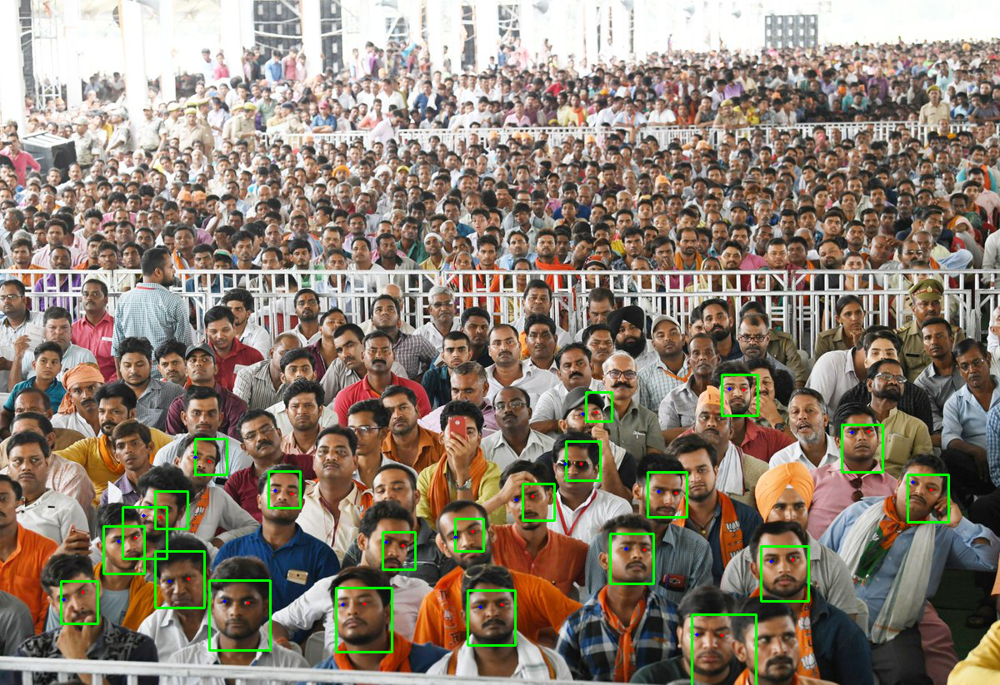
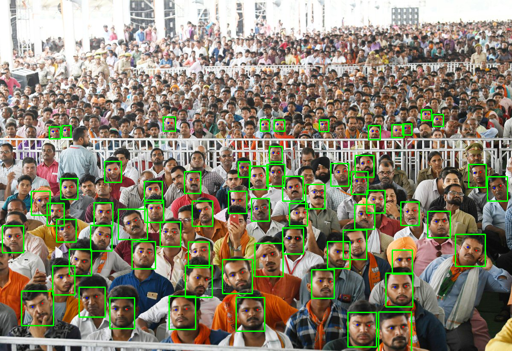
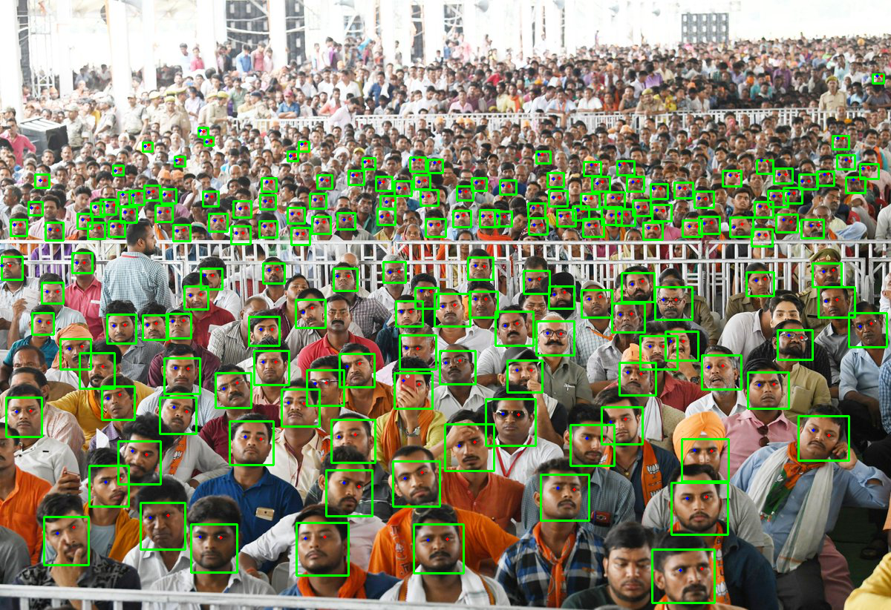
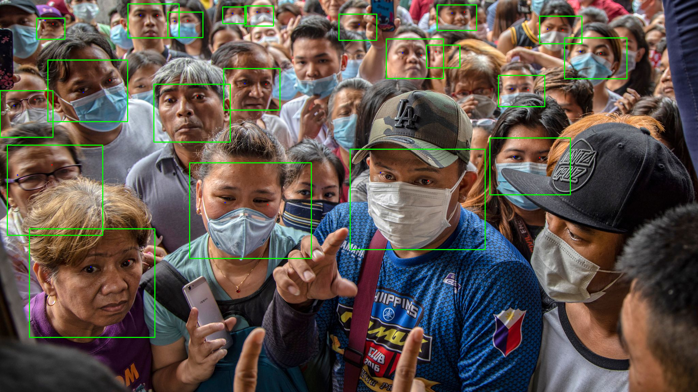
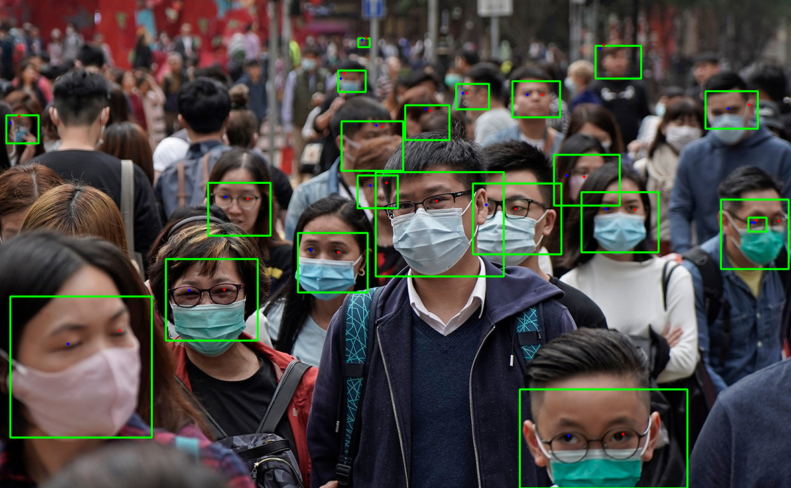
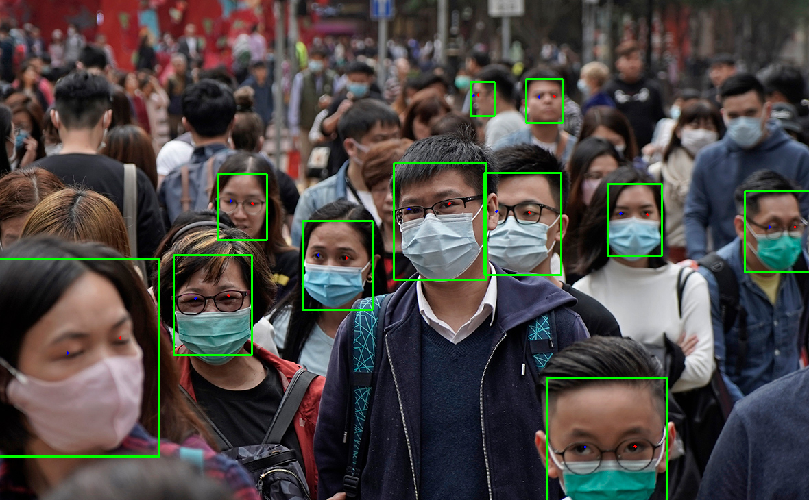
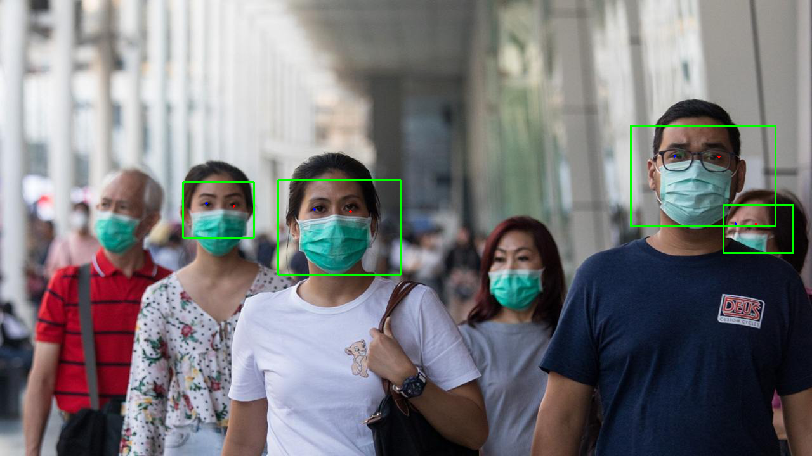
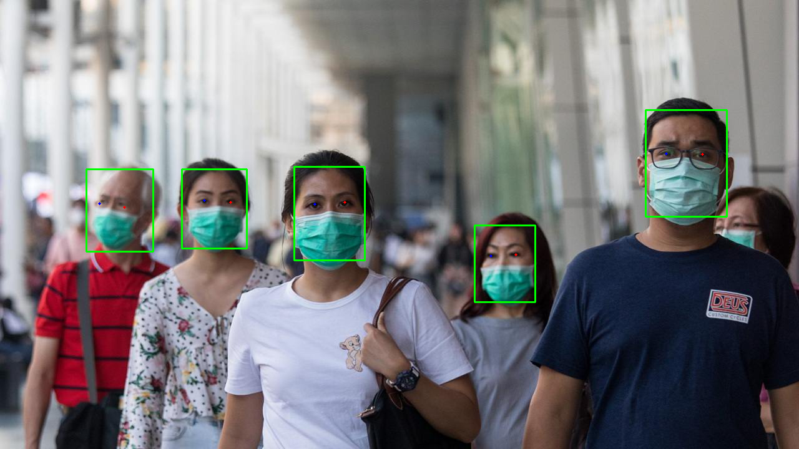

# Детекция лиц

Детекция лиц состоит из нескольких этапов:

1. Детектия лица на изображении. Результатом этого этапа является рамка вокруг задетектированного лица. Существует несколько вариантов детекторов о которых написано [ниже](#детекторы).

<p align="center">
<br>
</p>

2. Фиттинг (расстановка) антропометрических точек. Результатом этого этапа является набор антрометрических точек с 2D/3D координатами, привязанными к конкретному задетектированному лицу. Существует несколько вариантов фиттеров, отличающихся набором антопометрических точек, о которых написано [ниже](#антропометрические-точки).

<p align="center">
<br>
</p>

3. Вычисление углов поворота лица относительно оси наблюдения. Результатом этого этапа являются три угла поворота лица: *pitch*, *yaw*, *roll*. Точность определения углов зависит от используемого набора антропометрических точек.

<p align="center">
<br>
</p>

Для выполнения детекции лиц используется класс `Capturer`. При создании объекта класса используется **файл конфигурации**, в котором задаются тип используемого детектора и тип используемого набора антропометрических точек (см. [Конфигурационные файлы](#конфигурационные-файлы)). Также в конфигурационном файле можно настроить различные параметры детектирования, влияющие на качество и скорость работы всего алгоритма. Детектор и набор используемых точек указывается в названии файла конфигурации, например: `common_capturer_blf_fda_front.xml` - детектор blf, набор точек fda.

Существует отдельный вариант детекции лиц, совмещенный с трекингом лиц в видеопотоке - в этом случае алгоритм предполагает, что на вход подается набор последовательных кадров из видео и осуществляется трекинг лиц от кадра к кадру. Кроме описанных выше этапов добавляется этап трекинга лиц и дополнительно выдается уникальный идентификатор для каждого лица, который не меняется с момента обнаружения лица в видеопотоке и до момента его потери. Такие конфигурации в названии файла содержат слово *video*, например, `common_video_capturer_fda.xml`. На данный момент доступны два трекера:
* *common_video_capturer* - обеспечивает высокую скорость, но качество при этом ниже, чем у трекера *fda_tracker_capturer*
* *fda_tracker_capturer* - обеспечивает высокое качество, но скорость при этом ниже, чем у трекера *common_video_capturer*

## Детекторы

На данный момент доступны следующие детекторы:
* LBF – устаревший детектор, не рекомендован к использованию;
* BLF – детектор, обеспечивающий более высокое качество и скорость детекции, чем LBF, для лиц среднего размера и больше (в т.ч. в масках). На Android позволяет использовать GPU ускорение (включено по умолчанию);
* REFA – детектор, более медленный в сравнении с детекторами LBF и BLF, но при этом гарантирует высокое качество детекции лиц различных размеров (в т.ч. в масках). Рекомендован для использования в экспертных системах;
* ULD – новый детектор, более быстрый в сравнении с REFA. Позволяет детектировать лица различных размеров (в т.ч. в масках).

Для детекторов LBF, REFA, ULD размер детектируемых лиц можно задать через параметр `min_size` (см. раздел [Подробная информация о параметрах Capturer](/doc/ru/development/capturer_config_parameters.md)). Уменьшение значения данного параметра увеличивает время детекции.

Ниже представлены примеры работы разных детекторов в различных условиях.

<details>
  <summary>Нажмите, чтобы развернуть таблицу</summary>

<table>
    <tr align="center">
        <td> <b>BLF (score_threshold=0.6)</b> </td>
        <td> <b>REFA (min_size=0.2, score_threshold=0.89)</b> </td>
        <td> <b>ULD (min_size=10, score_threshold=0.7)</b> </td>
    </tr>
    <tr align="center">
        <td>  </td>
        <td>  </td>
        <td>  </td>
    </tr>
    <tr align="center">
        <td>  </td>
        <td>  </td>
        <td>  </td>
    </tr>
</table>
</details>

Ниже представлены примеры работы разных детекторов на различных порогах.  

<details>
  <summary>Нажмите, чтобы развернуть таблицу</summary>

<table>
    <tr align="center">
        <td> <b>ULD (score_threshold=0.4)</b> </td>
        <td> <b>ULD (score_threshold=0.7)</b> </td>
        <td> <b>REFA (score_threshold=0.89)</b> </td>
    </tr>
    <tr align="center">
        <td>  </td>
        <td>  </td>
        <td>  </td>
    </tr>
    <tr>
        <td>  </td>
        <td>  </td>
        <td>  </td>
    </tr>
    <tr align="center">
        <td>  </td>
        <td>  </td>
        <td>  </td>
    </tr>
</table>
</details>

Вы можете использовать созданный детектор для обнаружения и отслеживания лиц. Существует два способа подать изображение на вход детектору:
* подать данные **раскодированного** изображения в метод `Capturer.capture(final RawImage image)`, используя класс `RawImage` (см. [Сэмплы](../samples))
* подать данные **закодированного** изображения в формате JPEG, PNG, TIF или BMP в метод `Capturer.capture(final byte[] data)`

В обоих случаях результатом является список найденных / отслеженных лиц (`RawSample` – объект, хранящий найденное лицо). 

Для трекера вы также можете вызвать метод `Capturer.resetHistory`, чтобы начать отслеживание на новой видеопоследовательности.

## Антропометрические точки

_**Примечание:** Узнайте, как отобразить антропометрические точки и углы поворота лица в [нашем туториале](../tutorials/displaying_anthropometric_points_and_head_rotation_angles.md)._

Существует четыре набора точек: *esr, singlelbf, doublelbf*, *fda*, *mesh*.

* Набор *esr* – первый созданный и единственный набор, доступный в предыдущих версиях SDK. Набор *esr* содержит 47 точек.
* Наборы *singlelbf* и *doublelbf* обеспечивают большую точность, чем *esr*. Набор *singlelbf* содержит 31 точку. Набор *doublelbf* содержит 101 точку. Фактически, он представляет собой два сконкатенированных набора – последние 31 точки набора *doublelbf* дублируют набор *singlelbf* (в том же порядке).
* Набор *fda* обеспечивает высокое качество в широком диапазоне ракурсов (вплоть до профильных), в отличие от предыдущих наборов, поэтому мы рекомендуем использовать детекторы с этим набором. Однако алгоритмы распознавания по-прежнему требуют, чтобы ракурс лица был максимально приближен к фронтальному. Набор *fda* содержит 21 точку.
* Набор *mesh* на данный момент является самым новым. Он содержит 470 3D точек лица. Мы рекомендуем использовать его для получения 3D маски лица.


<table border="1" style="border-collapse:collapse;center">
<tr align="left">
  <th>Набор <i>fda</i> <br>
      <b>RawSample.getLeftEye  </b> возвращает точку 7  <br>
      <b>RawSample.getRightEye </b> возвращает точку 10 </th>
  <th>Набор <i>esr</i> <br>
      <b>RawSample.getLeftEye  </b> возвращает точку 16 <br>
      <b>RawSample.getRightEye </b> возвращает точку 17 </th>
</tr>
<tr align="center">
  <td>  </td>
  <td>  </td>
</tr>
</table>


<table border="1" style="border-collapse:collapse;center">
<tr align="left">
  <th>Набор <i>singlelbf</i> <br>
      <b>RawSample.getLeftEye  </b> возвращает точку 29  <br>
      <b>RawSample.getRightEye </b> возвращает точку 30 </th>
  <th>Первые 70 точек из набора <i>doubleldb</i> (остальные 31 – это набор <i>singlelbf</i>) <br>
      <b>RawSample.getLeftEye  </b> возвращает точку 68 <br>
      <b>RawSample.getRightEye </b> возвращает точку 69 </th>
</tr>
<tr align="center">
  <td>  </td>
  <td>  </td>
</tr>
</table>


<table border="1" style="border-collapse:collapse;center">
<tr align="left">
  <th>Набор <i>mesh</i> <br>
      <b>RawSample.getLeftEye  </b> возвращает точку 468  <br>
      <b>RawSample.getRightEye </b> возвращает точку 469 </th>
</tr>
<tr align="center">
  <td>  
       </td>
</tr>
</table>

## Класс Capturer

Для захвата лиц необходимо создать объект `Capturer` с помощью метода `FacerecService.createCapturer`, передав путь к конфигурационному файлу или объект `FacerecService.Config`. При передаче пути к конфигурационному файлу будут использованы параметры по умолчанию. При использовании `FacerecService.Config` можно переопределить значение любого числового параметра из конфигурационного файла. Также значения некоторых параметров можно изменить в уже созданном объекте `Capturer` с помощью метода `Capturer.setParameter`. Примеры использования объекта `Capturer` см. [здесь](#примеры-использования-объекта-capturer). 

Тип и характеристики созданного детектора зависят от переданного в `FacerecService.createCapturer` конфигурационного файла или объекта `FacerecService.Config`.

_**Примечание:** Для детекции лиц на видеопотоках рекомендуется использовать интерфейсный объект `VideoWorker`. Если при создании `VideoWorker` указаны параметры `matching_thread=0` и `processing_thread=0`, то потребляется обычная [лицензия Face Detector](../components.md)._

### Примеры использования объекта Capturer

Пример 1: 

**C++**: ```pbio::Capturer::Ptr capturer = service->createCapturer("common_capturer4.xml");```  
**C#**: ```Capturer capturer = service.createCapturer("common_capturer4_lbf.xml");```  
**Java**: ```final Capturer capturer = service.createCapturer(service.new Config("common_capturer4_lbf.xml"));```  
**Python**: ```capturer = service.create_capturer(Config("common_capturer4_lbf.xml"))```    

Пример 2: 

**C++**

```cpp
pbio::FacerecService::Config capturer_config("common_capturer4.xml");
capturer_config.overrideParameter("min_size", 200);
pbio::Capturer::Ptr capturer = service->createCapturer(capturer_config);
```

**C#**

```cs
FacerecService.Config capturerConfig = new FacerecService.Config("common_capturer4_lbf.xml");
capturerConfig.overrideParameter("min_size", 200);
Capturer capturer = service.createCapturer(capturerConfig);
```

**Java**

```java
FacerecService.Config capturerConfig = service.new Config("common_capturer4_lbf.xml");
capturerConfig.overrideParameter("min_size", 200);
final Capturer capturer = service.createCapturer(capturerConfig);
```

**Python**

```python
capturer_config = Config("common_capturer4_lbf.xml")
capturer_config.override_parameter("min_size", 200)
capturer = service.createCapturer(capturer_config)
```

Пример 3:

**C++**

<details>
  <summary>Нажмите, чтобы развернуть</summary>

```cpp
pbio::Capturer::Ptr capturer = service->createCapturer("common_capturer4.xml");
capturer->setParameter("min_size", 200);
capturer->setParameter("max_size", 800);
// capturer->capture(...);
// ...
capturer->setParameter("min_size", 100);
capturer->setParameter("max_size", 400);
// capturer->capture(...);
```
</details>

**C#**

<details>
  <summary>Нажмите, чтобы развернуть</summary>

```cs
Capturer capturer = service.createCapturer("common_capturer4_lbf.xml");
capturer.setParameter("min_size", 200);
capturer.setParameter("max_size", 800);
// capturer.capturer(...);
// ...
capturer.setParameter("min_size", 100);
capturer.setParameter("max_size", 400);
// capturer.capture(...);
```
</details>

**Java**

<details>
  <summary>Нажмите, чтобы развернуть</summary>

```java
Capturer capturer = service.createCapturer(service.new Config("common_capturer4_lbf.xml"));
capturer.setParameter("min_size", 200);
capturer.setParameter("max_size", 800);
// capturer.capturer(...);
// ...
capturer.setParameter("min_size", 100);
capturer.setParameter("max_size", 400);
// capturer.capture(...);
```
</details>

## Конфигурационные файлы 

| Файл | Детектор | Набор точек | Углы (roll/yaw/pitch) | Описание и применение | 
|------|----------|-------------|-----------------------|-----------------------| 
|common_capturer4_fda.xml|lbf|fda|[-30;30][-60;60][-60;60]|Детектор фронтальных лиц.|
|common_capturer4_fda_with_angles.xml|lbf|fda|[-90;90][-60;60][-60;60]|Детектор фронтальных лиц. Адаптирован под работу с большим диапазоном углов поворота головы.|
|common_capturer4_fda_with_angles_noise.xml|lbf|fda|[-90;90][-60;60][-60;60]|Детектор фронтальных лиц. Адаптирован под работу с большим диапазоном углов поворота головы. Подходит для изображений с высоким уровнем шума.|
|common_capturer4_fda_singleface.xml|lbf|fda|[-30;30][-60;60][-60;60]|Детектируется только одно фронтальное лицо.|
|common_capturer4_fda_singleface_with_angles.xml|lbf|fda|[-90;90][-75;75][-60;60]|Детектируется только одно фронтальное лицо. Детектор адаптирован под работу с большим диапазоном углов поворота головы.|
|common_capturer4_fda_singleface_with_angles_noise.xml|lbf|fda|[-90;90][-75;75][-60;60]|Детектируется только одно фронтальное лицо. Детектор адаптирован под работу с большим диапазоном углов поворота головы. Подходит для изображений с высоким уровнем шума.|
|common_capturer4_lbf.xml|lbf|doublelbf|[-30;30][-60;60][-60;60]|Детектор фронтальных лиц.| 
|common_capturer4_lbf_singleface.xml|lbf|doublelbf|[-30;30][-60;60][-60;60]|Детектируется только одно фронтальное лицо.|
|common_capturer4_mesh.xml|lbf|mesh|[-30;30][-60;60][-60;60]|Детектор фронтальных лиц. Позволяет получить 3D маску лица.|
|common_capturer4_mesh_with_angles.xml|lbf|mesh|[-90;90][-60;60][-60;60]|Детектор фронтальных лиц. Адаптирован под работу с большим диапазоном углов поворота головы. Позволяет получить 3D маску лица.|
|common_capturer4_mesh_with_angles_noise.xml|lbf|mesh|[-90;90][-60;60][-60;60]|Детектор фронтальных лиц. Адаптирован под работу с большим диапазоном углов поворота головы. Подходит для изображений с высоким уровнем шума. Позволяет получить 3D маску лица.|
|common_capturer4_mesh_singleface.xml|lbf|mesh|[-30;30][-60;60][-60;60]|Детектируется только одно фронтальное лицо. Позволяет получить 3D маску лица.|
|common_capturer4_mesh_singleface_with_angles.xml|lbf|mesh|[-90;90][-75;75][-60;60]|Детектируется только одно фронтальное лицо. Детектор адаптирован под работу с большим диапазоном углов поворота головы. Позволяет получить 3D маску лица.|
|common_capturer4_mesh_singleface_with_angles_noise.xml|lbf|mesh|[-90;90][-75;75][-60;60]|Детектируется только одно фронтальное лицо. Детектор адаптирован под работу с большим диапазоном углов поворота головы. подходит для изображений с высоким уровнем шума. Позволяет получить 3D маску лица.|
|common_capturer_blf_fda_front.xml|blf|fda|[-70;70][-90;90][-70;70]|Детекция крупных изображений лиц (т.е. лицо занимает большую часть кадра). Подходит для детекции лиц в масках.|
|common_capturer_blf_fda_back.xml|blf|fda|[-70;70][-90;90][-70;70]|Детекция нескольких лиц, либо небольших изображений лица. Подходит для детекции лиц в масках.|
|common_capturer_blf_fda_auto.xml|blf|fda|[-70;70][-90;90][-70;70]|Детекция лиц разного размера (требуется указать в конфигурационном файле параметры `resolution_width` и `min_face_size`). Подходит для детекции лиц в масках.|
|common_capturer_refa_fda_a.xml|refa|fda|[-70;70][-90;90][-70;70]|Детектор лиц, рекомендуемый для использования в экспертных системах. Обеспечивает детекцию лиц с наибольшим покрытием углов поворота и максимальным качеством (в т.ч. в масках).|
|common_capturer_uld_fda.xml|uld|fda|[-70;70][-90;90][-70;70]|Детекция лиц разного размера. Подходит для детекции лиц в масках.|
|common_video_capturer_fda.xml|lbf|fda|[-30;30][-60;60][-60;60]|Видеотрекер фронтальных лиц (работает только с цветными изображениями).|
|common_video_capturer_lbf.xml|lbf|singlelbf|[-30;30][-60;60][-60;60]|Видеотрекер фронтальных лиц (работает только с цветными изображениями).|
|common_video_capturer_mesh.xml|lbf|mesh|[-30;30][-60;60][-60;60]|Видеотрекер фронтальных лиц (работает только с цветными изображениями). Позволяет получить 3D маску лица.|
|fda_tracker_capturer.xml|lbf|fda|[-30;30][-60;60][-60;60]|Видеотрекер фронтальных лиц.|
|fda_tracker_capturer.w.xml|lbf|fda|[-30;30][-60;60][-60;60]|Видеотрекер фронтальных лиц. Предназначен для детекции лиц при низком качестве освещения. Вероятность ложных детекций при этом немного выше.|
|fda_tracker_capturer_mesh.xml|lbf|fda|[-30;30][-60;60][-60;60]|Видеотрекер фронтальных лиц. Позволяет получить 3D маску лица.|
|fda_tracker_capturer_fake_detector.xml|lbf|fda|[-30;30][-60;60][-60;60]|Детекция происходит быстрее за счет работы одного фиттера (без детектора). Работает только на лицах, занимающих большую часть изображения.|
|fda_tracker_capturer_blf.xml|blf|fda|[-30;30][-60;60][-60;60]|Видеотрекер фронтальных лиц. Подходит для детекции лиц в масках.|
|fda_tracker_capturer_refa_a.xml|refa|fda|[-70;70][-90;90][-70;70]|Видеотрекер фронтальных лиц. Предназначен для использования в экспертных системах. Обеспечивает детекцию лиц с наибольшим покрытием углов поворота и максимальным качеством (в т.ч. в масках).|
|fda_tracker_capturer_uld_fda.xml|uld|fda|[-70;70][-90;90][-70;70]|Видеотрекер фронтальных лиц. Позволяет детектировать лица разного размера. Подходит для детекции лиц в масках.|
|manual_capturer_fda.xml|lbf|fda|[-30;30][-60;60][-60;60]|Требует указания точек глаз вручную. На основании точек глаз рассчитываются остальные точки на лице.|
|manual_capturer_mesh.xml|lbf|mesh|[-30;30][-60;60][-60;60]|Требует указания точек глаз вручную. На основании точек глаз рассчитываются остальные точки на лице. Позволяет получить 3D маску лица.|

## Временные характеристики для Core i7 4.5 ГГц*

<table>
<thead>
  <tr>
    <th rowspan="2">конфигурационный файл</th>
    <th colspan="6">время детекции (мс)</th>
  </tr>
  <tr>
    <td>640x480, 1 лицо</td>
    <td>640x480, 4 лица</td>
    <td>1280x720, 1 лицо</td>
    <td>1280x720, 4 лица</td>
    <td>1920x1080, 1 лицо</td>
    <td>1920x1080, 4 лица</td>
  </tr>
</thead>
<tbody>
  <tr>
    <td>common_capturer4_fda.xml</td>
    <td>13</td> <td>25</td> <td>34</td> <td>49</td> <td>81</td> <td>103</td>
  </tr>
  <tr>
    <td>common_capturer4_fda_with_angles.xml</td>
    <td>282</td> <td>387</td> <td>260</td> <td>356</td> <td>273</td> <td>370</td>
  </tr>
  <tr>
    <td>common_capturer4_mesh.xml</td>
    <td>18</td> <td>47</td> <td>39</td> <td>72</td> <td>87</td> <td>735</td>
  </tr>
  <tr>
    <td>common_capturer4_mesh_with_angles.xml</td>
    <td>291</td> <td>415</td> <td>268</td> <td>383</td> <td>281</td> <td>398</td>
  </tr>
  <tr>
    <td>common_capturer_blf_fda_auto.xml</td>
    <td>6-30</td> <td>12-36</td> <td>8-32</td> <td>14-38</td> <td>19-44</td> <td>26-51</td>
  </tr>
  <tr>
    <td>common_capturer_blf_fda_back.xml</td>
    <td>30</td> <td>36</td> <td>32</td> <td>38</td> <td>44</td> <td>51</td> 
  </tr>
  <tr>
    <td>common_capturer_blf_fda_front.xml</td>
    <td>6</td> <td>12</td> <td>8</td> <td>14</td> <td>19</td> <td>26</td> 
  </tr>
  <tr>
    <td>common_capturer_refa_fda_a.xml</td>
    <td>644</td> <td>650</td> <td>512</td> <td>518</td> <td>580</td> <td>586</td>
  </tr>
  <tr>
    <td>common_capturer_uld_fda.xml (min_size=150)</td>
    <td>12</td> <td>18</td> <td>13</td> <td>19</td> <td>21</td> <td>28</td>
  </tr>
  <tr>
    <td>common_capturer_uld_fda.xml (min_size=90)</td>
    <td>46</td> <td>52</td> <td>47</td> <td>54</td> <td>56</td> <td>63</td>
  </tr>
  <tr>
    <td>common_capturer_uld_fda.xml (min_size=50)</td>
    <td>195</td> <td>202</td> <td>193</td> <td>200</td> <td>204</td> <td>211</td>
  </tr>
  <tr>
    <td>common_capturer4_fda_singleface.xml</td>
    <td>16</td> <td>-</td> <td>51</td> <td>-</td> <td>123</td> <td>-</td>
  </tr>
  <tr>
    <td>common_capturer4_mesh_singleface.xml</td>
    <td>23</td> <td>-</td> <td>58</td> <td>-</td> <td>129</td> <td>-</td>
  </tr>
</table>

\* – характеристики указаны для одного ядра процессора

_**Примечание:** Время работы может значительно меняться в зависимости от содержания изображения._

## Обрезка лиц

Для обрезки лица вы можете вызвать метод `RawSample.cutFaceImage`. Изображение обрезанного лица будет сохранено в указанном формате. 

Доступные типы обрезки (`RawSample.FaceCutType`):
* FACE_CUT_BASE - базовый (подходит для образцов всех типов).
* FACE_CUT_FULL_FRONTAL - полный фронтальный ТИЛ (тип изображения лица) по ГОСТ Р ИСО / МЭК 19794-5 (ISO/IEC 19794-5 Full Frontal) (только для фронтальных образцов). Используется для сохранения изображений лица в электронных биометрических документах.
* FACE_CUT_TOKEN_FRONTAL - условно фронтальный ТИЛ (тип изображения лица) по ГОСТ Р ИСО / МЭК 19794-5 (ISO/IEC 19794-5 Token Frontal) (только для фронтальных образцов).

Для предварительного просмотра обрезки вызовите метод `RawSample.getFaceCutRectangle`, указав тип обрезки. В результате вы получите четыре точки – углы прямоугольника, которые будут использованы для обрезки.

Пример использования см. в разделе [Сэмплы](../samples).

## Класс RawSample

При помощи RawSample вы можете:
* получить id, назначенное сэмплу при детекции (`RawSample.getID`) в том случае, если объект был получен от трекера
* получить прямоугольник лица (`RawSample.getRectangle`), углы (`RawSample.getAngles`), левый / правый глаз (`RawSample.getLeftEye` / `RawSample.getRightEye`, см. [Антропометрические точки](#антропометрические-точки)), антропометрические точки (`RawSample.getLandmarks`, см. [Антропометрические точки](#антропометрические-точки)), если если лицо расположено фронтально (т.е. получено фронтальным детектором / трекером)
* обрезать лицо (см. [Обрезка лиц](#обрезка-лиц), [test_facecut](../samples/cpp/test_facecut.md))
* уменьшить внутреннее изображение лица до предпочтительного размера (`RawSample.downscaleToPreferredSize`)
* сериализовать объект в бинарном формате (`RawSample.save` или `RawSample.saveWithoutImage`), после чего вы можете десериализовать объект методом `FacerecService.loadRawSample` или `FacerecService.loadRawSampleWithoutImage`
* передать объект в методы оценки возраста, пола, качества и принадлежности лица реальному человеку (см. [Оценка лиц](face_estimation.md), [test_facecut](../samples/cpp/test_facecut.md), [test_videocap](../samples/cpp/test_videocap.md))
* передать объект в `Recognizer.processing` для создания шаблона (см. [Идентификация лиц](face_identification.md), [test_identify](../samples/cpp/test_identify.md))

