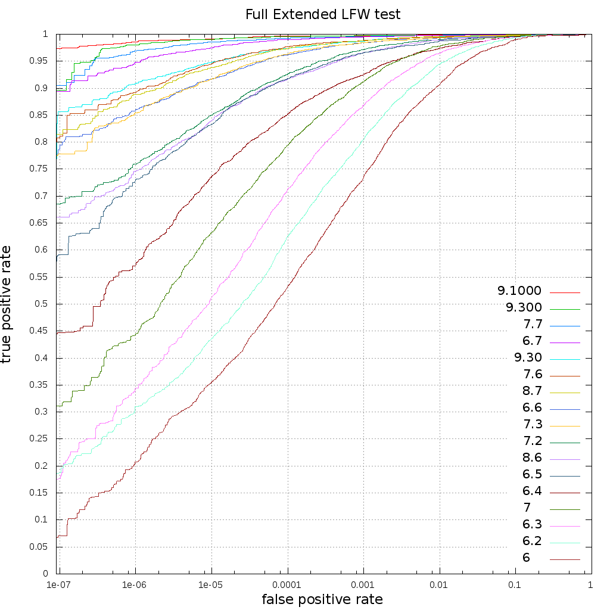

# Параметры производительности

В данном пункте используются следующие сокращения:
* FAR (false accept rate) – вероятность ложного сопоставления с объектом в базе.
* TAR (true accept rate) – вероятность корректного сопоставления с объектом в базе.
* FRR (false reject rate) – вероятность ложного отказа в доступе объекту, который есть в базе.
* IR (identification rate) – вероятность идентификации.

## Характеристики идентификации

### Временные характеристики для Core i7 4.5 ГГц

<table cellpadding ="5" border="1" style="border-collapse:collapse;center">
<tr>
  <th rowspan=3>Метод распознавания</th>
  <th rowspan=3>Создание шаблона (мс)</th>
  <th colspan=6>Поиск среди N шаблонов (мс)</th>
  <th rowspan=3>Сравнение шаблонов (мс)</th>
</tr>
<tr>
  <th colspan=3>Без ускорения</th>
  <th colspan=3>Ускоренный</th>
</tr>
<tr>
  <th>N = 10<sup>4</sup> </th>
  <th>N = 10<sup>6</sup> </th>
  <th>N = 10<sup>7</sup> </th>
  <th>N = 10<sup>4</sup> </th>
  <th>N = 10<sup>6</sup> </th>
  <th>N = 10<sup>7</sup> </th>
</tr>
<tr align="center"> <th align="center"> 6      </th>    <td>  35 (50*)  </td>  <td> 0.22</td> <td> 34.2 </td> <td> 340 </td>  <td> 0.22</td> <td> 34.2 </td> <td> 340 </td>  <td>0.00008</td>  </tr>
<tr align="center"> <th align="center"> 6.2    </th>    <td>  35 (50*)  </td>  <td> 0.22</td> <td> 34.2 </td> <td> 340 </td>  <td> 0.22</td> <td> 34.2 </td> <td> 340 </td>  <td>0.00008</td>  </tr>
<tr align="center"> <th align="center"> 6.3    </th>    <td>  35 (50*)  </td>  <td> 0.22</td> <td> 34.2 </td> <td> 340 </td>  <td> 0.22</td> <td> 34.2 </td> <td> 340 </td>  <td>0.00008</td>  </tr>
<tr align="center"> <th align="center"> 6.4    </th>    <td>  35 (50*)  </td>  <td> 0.22</td> <td> 34.2 </td> <td> 340 </td>  <td> 0.22</td> <td> 34.2 </td> <td> 340 </td>  <td>0.00008</td>  </tr>
<tr align="center"> <th align="center"> 6.5    </th>    <td>  35 (50*)  </td>  <td> 2.95</td> <td> 296  </td> <td> 2880</td>  <td> 0.43</td> <td> 16.1 </td> <td> 165 </td>  <td>0.06   </td>  </tr>
<tr align="center"> <th align="center"> 6.6    </th>    <td>  50 (55*)  </td>  <td> 1.22</td> <td> 131  </td> <td> 1310</td>  <td> 0.25</td> <td> 12.1 </td> <td> 126 </td>  <td>0.04   </td>  </tr>
<tr align="center"> <th align="center"> 6.7    </th>    <td>  40 (45*)  </td>  <td> 1.22</td> <td> 131  </td> <td> 1310</td>  <td> 0.25</td> <td> 12.1 </td> <td> 126 </td>  <td>0.04   </td>  </tr>
<tr align="center"> <th align="center"> 7      </th>    <td> 210 (290*) </td>  <td> 0.22</td> <td> 34.2 </td> <td> 340 </td>  <td> 0.22</td> <td> 34.2 </td> <td> 340 </td>  <td>0.00008</td>  </tr>
<tr align="center"> <th align="center"> 7.2    </th>    <td> 210 (290*) </td>  <td> 0.22</td> <td> 34.2 </td> <td> 340 </td>  <td> 0.22</td> <td> 34.2 </td> <td> 340 </td>  <td>0.00008</td>  </tr>
<tr align="center"> <th align="center"> 7.3    </th>    <td> 210 (290*) </td>  <td> 2.95</td> <td> 296  </td> <td> 2880</td>  <td> 0.43</td> <td> 16.1 </td> <td> 165 </td>  <td>0.06   </td>  </tr>
<tr align="center"> <th align="center"> 7.6    </th>    <td> 210 (290*) </td>  <td> 1.22</td> <td> 131  </td> <td> 1310</td>  <td> 0.25</td> <td> 12.1 </td> <td> 126 </td>  <td>0.04   </td>  </tr>
<tr align="center"> <th align="center"> 7.7    </th>    <td> 170 (180*) </td>  <td> 1.22</td> <td> 131  </td> <td> 1310</td>  <td> 0.25</td> <td> 12.1 </td> <td> 126 </td>  <td>0.04   </td>  </tr>
<tr align="center"> <th align="center"> 8.6    </th>    <td>  20 (20*)  </td>  <td> 1.22</td> <td> 131  </td> <td> 1310</td>  <td> 0.25</td> <td> 12.1 </td> <td> 126 </td>  <td>0.04   </td>  </tr>
<tr align="center"> <th align="center"> 8.7    </th>    <td>  20 (20*)  </td>  <td> 1.22</td> <td> 131  </td> <td> 1310</td>  <td> 0.25</td> <td> 12.1 </td> <td> 126 </td>  <td>0.04   </td>  </tr>
<tr align="center"> <th align="center"> 9.30   </th>    <td>  30        </td>  <td> 0.60</td> <td> 64.2 </td> <td> 643 </td>  <td> 0.18</td> <td> 12.0 </td> <td> 117 </td>  <td>0.04   </td>  </tr>
<tr align="center"> <th align="center"> 9.300  </th>    <td> 260        </td>  <td> 0.60</td> <td> 64.2 </td> <td> 643 </td>  <td> 0.18</td> <td> 12.0 </td> <td> 117 </td>  <td>0.04   </td>  </tr>
<tr align="center"> <th align="center"> 9.1000 </th>    <td> 730        </td>  <td> 0.60</td> <td> 64.2 </td> <td> 643 </td>  <td> 0.18</td> <td> 12.0 </td> <td> 117 </td>  <td>0.04   </td>  </tr>
</table>

\* – время создания шаблона при параметре `processing_less_memory_consumption` с установленным значением `true` при вызове метода `FacerecService.createRecognizer` для создания распознавателя.

**Примечания:**
* Время ускоренного поиска приведено для `k=1`, при больших значениях `k` время будет увеличиваться до времени поиска без ускорения.
* Ускоренный поиск реализован только для методов распознавания 6.5, 6.6, 6.7, 7.3, 7.6, 7.7, 8.6, 8.7, 9.30, 9.300, 9.1000.
* Для достижения этих скоростей шаблоны в индексе дожны быть расположены в порядке их создания (через метод `Recognizer.processing` или `Recognizer.loadTemplate`).
* Для достижения более высоких скоростей вы можете использовать GPU (см. [Использование  GPU](development/gpu_usage.md)).  

### Характеристики памяти

<table cellpadding ="5" border="1" style="border-collapse:collapse;center">
<tr>
  <th>Метод распознавания</th>
  <th>Размер сериализованного шаблона (Байт)</th>
  <th>Размер шаблона в оперативной памяти (Байт)</th>
  <th>Потребление памяти* (МБ)</th>
</tr>
<tr align="center"> <th align="center"> 6     </th>   <td>  520 </td>  <td>  620 </td>  <td>   64 (33**)</td> </tr>
<tr align="center"> <th align="center"> 6.2   </th>   <td>  520 </td>  <td>  620 </td>  <td>   64 (33**)</td> </tr>
<tr align="center"> <th align="center"> 6.3   </th>   <td>  520 </td>  <td>  620 </td>  <td>   64 (33**)</td> </tr>
<tr align="center"> <th align="center"> 6.4   </th>   <td>  520 </td>  <td>  620 </td>  <td>   64 (33**)</td> </tr>
<tr align="center"> <th align="center"> 6.5   </th>   <td> 4232 </td>  <td> 4332 </td>  <td>   64 (35**)</td> </tr>
<tr align="center"> <th align="center"> 6.6   </th>   <td>  536 </td>  <td>  636 </td>  <td>  110 (85**)</td> </tr>
<tr align="center"> <th align="center"> 6.7   </th>   <td>  536 </td>  <td>  636 </td>  <td>  105 (85**)</td> </tr>
<tr align="center"> <th align="center"> 7     </th>   <td>  520 </td>  <td>  620 </td>  <td>  258 (128**)</td> </tr>
<tr align="center"> <th align="center"> 7.2   </th>   <td>  520 </td>  <td>  620 </td>  <td>  258 (128**)</td> </tr>
<tr align="center"> <th align="center"> 7.3   </th>   <td> 4232 </td>  <td> 4332 </td>  <td>  285 (153**)</td> </tr>
<tr align="center"> <th align="center"> 7.6   </th>   <td>  536 </td>  <td>  636 </td>  <td>  285 (153**)</td> </tr>
<tr align="center"> <th align="center"> 7.7   </th>   <td>  536 </td>  <td>  636 </td>  <td>  195 (163**)</td> </tr>
<tr align="center"> <th align="center"> 8.6   </th>   <td>  536 </td>  <td>  636 </td>  <td>   52 (40**)</td> </tr>
<tr align="center"> <th align="center"> 8.7   </th>   <td>  536 </td>  <td>  636 </td>  <td>   52 (40**)</td> </tr>
<tr align="center"> <th align="center"> 9.30  </th>   <td>  280 </td>  <td>  380 </td>  <td>  155       </td> </tr>
<tr align="center"> <th align="center"> 9.300 </th>   <td>  280 </td>  <td>  380 </td>  <td>  210       </td> </tr>
<tr align="center"> <th align="center"> 9.1000</th>   <td>  280 </td>  <td>  380 </td>  <td>  290       </td> </tr>
</table>

\* – количество используемой памяти не зависит от количества созданных объектов `Recognizer` этого метода.  
\** – потребление памяти при параметре `processing_less_memory_consumption` с установленным значением `true` при вызове метода `FacerecService.createRecognizer` для создания распознавателя. 

### ROC-кривая на расширенном тесте LFW

В данном тесте набор mismatch-пар был увеличен, также были исправлены ошибки LFW для точных измерений при низких значениях FAR.

<p align="center">
<br>
</p>

<table cellpadding ="3" border="1" style="border-collapse:collapse;center">
<tr>
  <th>FAR</th>
  <th>6   TAR (%)</th>
  <th>6.2 TAR (%)</th>
  <th>6.3 TAR (%)</th>
  <th>7   TAR (%)</th>
  <th>6.4 TAR (%)</th>
  <th>6.5 TAR (%)</th>
  <th>8.6 TAR (%)</th>
  <th>7.2 TAR (%)</th>
  <th>7.3 TAR (%)</th>
  <th>6.6 TAR (%)</th>
  <th>8.7 TAR (%)</th>
  <th>7.6 TAR (%)</th>
  <th>6.7 TAR (%)</th>
  <th>7.7 TAR (%)</th>
  <th>9.30 TAR (%)</th>
  <th>9.300 TAR (%)</th>
  <th>9.1000 TAR (%)</th>
</tr>
<tr align="center"> <th> 1e-2 </th>  <td> 90.6 </td>  <td> 94.4 </td>  <td> 96.4 </td>  <td> 97.7 </td>  <td> 97.4 </td>  <td> 98.7 </td>  <td> 98.9 </td>  <td> 99.0 </td>  <td> 99.3 </td>  <td> 99.3 </td>  <td> 99.6 </td>  <td> 99.5 </td>  <td> 99.7 </td>  <td> 99.8 </td> <td> 99.5 </td> <td> 99.7 </td> <td> 99.8 </td> </tr>
<tr align="center"> <th> 9e-3 </th>  <td> 90.1 </td>  <td> 94.0 </td>  <td> 96.3 </td>  <td> 97.6 </td>  <td> 97.2 </td>  <td> 98.5 </td>  <td> 98.9 </td>  <td> 98.9 </td>  <td> 99.3 </td>  <td> 99.3 </td>  <td> 99.6 </td>  <td> 99.5 </td>  <td> 99.7 </td>  <td> 99.7 </td> <td> 99.5 </td> <td> 99.7 </td> <td> 99.8 </td> </tr>
<tr align="center"> <th> 8e-3 </th>  <td> 89.5 </td>  <td> 93.3 </td>  <td> 96.0 </td>  <td> 97.6 </td>  <td> 97.0 </td>  <td> 98.5 </td>  <td> 98.8 </td>  <td> 98.9 </td>  <td> 99.3 </td>  <td> 99.2 </td>  <td> 99.6 </td>  <td> 99.5 </td>  <td> 99.7 </td>  <td> 99.7 </td> <td> 99.4 </td> <td> 99.7 </td> <td> 99.8 </td> </tr>
<tr align="center"> <th> 7e-3 </th>  <td> 88.8 </td>  <td> 92.5 </td>  <td> 95.6 </td>  <td> 97.2 </td>  <td> 96.8 </td>  <td> 98.3 </td>  <td> 98.7 </td>  <td> 98.8 </td>  <td> 99.2 </td>  <td> 99.2 </td>  <td> 99.5 </td>  <td> 99.4 </td>  <td> 99.7 </td>  <td> 99.7 </td> <td> 99.4 </td> <td> 99.7 </td> <td> 99.8 </td> </tr>
<tr align="center"> <th> 6e-3 </th>  <td> 87.8 </td>  <td> 91.8 </td>  <td> 94.9 </td>  <td> 96.9 </td>  <td> 96.7 </td>  <td> 98.1 </td>  <td> 98.5 </td>  <td> 98.8 </td>  <td> 99.2 </td>  <td> 99.1 </td>  <td> 99.5 </td>  <td> 99.4 </td>  <td> 99.7 </td>  <td> 99.7 </td> <td> 99.4 </td> <td> 99.7 </td> <td> 99.8 </td> </tr>
<tr align="center"> <th> 5e-3 </th>  <td> 86.8 </td>  <td> 90.8 </td>  <td> 94.4 </td>  <td> 96.4 </td>  <td> 96.5 </td>  <td> 98.0 </td>  <td> 98.3 </td>  <td> 98.7 </td>  <td> 99.1 </td>  <td> 99.1 </td>  <td> 99.5 </td>  <td> 99.3 </td>  <td> 99.7 </td>  <td> 99.7 </td> <td> 99.3 </td> <td> 99.7 </td> <td> 99.7 </td> </tr>
<tr align="center"> <th> 4e-3 </th>  <td> 85.6 </td>  <td> 89.8 </td>  <td> 93.5 </td>  <td> 95.9 </td>  <td> 96.0 </td>  <td> 97.9 </td>  <td> 98.1 </td>  <td> 98.5 </td>  <td> 99.0 </td>  <td> 99.1 </td>  <td> 99.4 </td>  <td> 99.3 </td>  <td> 99.7 </td>  <td> 99.7 </td> <td> 99.3 </td> <td> 99.7 </td> <td> 99.7 </td> </tr>
<tr align="center"> <th> 3e-3 </th>  <td> 83.6 </td>  <td> 88.1 </td>  <td> 92.4 </td>  <td> 95.2 </td>  <td> 95.4 </td>  <td> 97.7 </td>  <td> 97.8 </td>  <td> 98.3 </td>  <td> 98.9 </td>  <td> 99.0 </td>  <td> 99.3 </td>  <td> 99.2 </td>  <td> 99.6 </td>  <td> 99.7 </td> <td> 99.2 </td> <td> 99.7 </td> <td> 99.7 </td> </tr>
<tr align="center"> <th> 2e-3 </th>  <td> 79.9 </td>  <td> 85.6 </td>  <td> 90.7 </td>  <td> 94.1 </td>  <td> 94.6 </td>  <td> 97.2 </td>  <td> 97.4 </td>  <td> 98.0 </td>  <td> 98.8 </td>  <td> 98.8 </td>  <td> 99.2 </td>  <td> 99.1 </td>  <td> 99.6 </td>  <td> 99.6 </td> <td> 99.1 </td> <td> 99.7 </td> <td> 99.7 </td> </tr>
<tr align="center"> <th> 1e-3 </th>  <td> 73.5 </td>  <td> 80.4 </td>  <td> 86.8 </td>  <td> 91.1 </td>  <td> 92.5 </td>  <td> 96.5 </td>  <td> 96.6 </td>  <td> 97.2 </td>  <td> 98.4 </td>  <td> 98.4 </td>  <td> 98.8 </td>  <td> 98.8 </td>  <td> 99.5 </td>  <td> 99.6 </td> <td> 98.7 </td> <td> 99.7 </td> <td> 99.7 </td> </tr>
<tr align="center"> <th> 9e-4 </th>  <td> 72.5 </td>  <td> 79.6 </td>  <td> 86.2 </td>  <td> 90.7 </td>  <td> 92.3 </td>  <td> 96.4 </td>  <td> 96.4 </td>  <td> 97.0 </td>  <td> 98.4 </td>  <td> 98.4 </td>  <td> 98.7 </td>  <td> 98.8 </td>  <td> 99.4 </td>  <td> 99.6 </td> <td> 98.6 </td> <td> 99.7 </td> <td> 99.7 </td> </tr>
<tr align="center"> <th> 8e-4 </th>  <td> 71.7 </td>  <td> 78.8 </td>  <td> 85.7 </td>  <td> 90.3 </td>  <td> 92.0 </td>  <td> 96.2 </td>  <td> 96.1 </td>  <td> 96.8 </td>  <td> 98.2 </td>  <td> 98.3 </td>  <td> 98.7 </td>  <td> 98.7 </td>  <td> 99.4 </td>  <td> 99.5 </td> <td> 98.6 </td> <td> 99.7 </td> <td> 99.7 </td> </tr>
<tr align="center"> <th> 7e-4 </th>  <td> 70.8 </td>  <td> 77.5 </td>  <td> 84.9 </td>  <td> 89.8 </td>  <td> 91.7 </td>  <td> 96.1 </td>  <td> 95.9 </td>  <td> 96.7 </td>  <td> 98.2 </td>  <td> 98.1 </td>  <td> 98.7 </td>  <td> 98.7 </td>  <td> 99.4 </td>  <td> 99.5 </td> <td> 98.5 </td> <td> 99.7 </td> <td> 99.6 </td> </tr>
<tr align="center"> <th> 6e-4 </th>  <td> 69.1 </td>  <td> 76.7 </td>  <td> 84.0 </td>  <td> 88.9 </td>  <td> 91.4 </td>  <td> 95.8 </td>  <td> 95.5 </td>  <td> 96.4 </td>  <td> 98.1 </td>  <td> 98.1 </td>  <td> 98.6 </td>  <td> 98.6 </td>  <td> 99.4 </td>  <td> 99.5 </td> <td> 98.5 </td> <td> 99.7 </td> <td> 99.6 </td> </tr>
<tr align="center"> <th> 5e-4 </th>  <td> 68.0 </td>  <td> 75.2 </td>  <td> 82.8 </td>  <td> 88.0 </td>  <td> 90.9 </td>  <td> 95.3 </td>  <td> 95.2 </td>  <td> 96.3 </td>  <td> 98.0 </td>  <td> 98.0 </td>  <td> 98.5 </td>  <td> 98.6 </td>  <td> 99.4 </td>  <td> 99.5 </td> <td> 98.5 </td> <td> 99.7 </td> <td> 99.6 </td> </tr>
<tr align="center"> <th> 4e-4 </th>  <td> 65.7 </td>  <td> 73.7 </td>  <td> 81.4 </td>  <td> 87.1 </td>  <td> 90.2 </td>  <td> 95.0 </td>  <td> 94.6 </td>  <td> 95.6 </td>  <td> 97.9 </td>  <td> 97.8 </td>  <td> 98.4 </td>  <td> 98.5 </td>  <td> 99.4 </td>  <td> 99.5 </td> <td> 98.3 </td> <td> 99.7 </td> <td> 99.6 </td> </tr>
<tr align="center"> <th> 3e-4 </th>  <td> 63.0 </td>  <td> 71.7 </td>  <td> 79.6 </td>  <td> 85.6 </td>  <td> 89.4 </td>  <td> 94.3 </td>  <td> 93.9 </td>  <td> 95.1 </td>  <td> 97.6 </td>  <td> 97.6 </td>  <td> 98.2 </td>  <td> 98.4 </td>  <td> 99.2 </td>  <td> 99.5 </td> <td> 98.1 </td> <td> 99.6 </td> <td> 99.6 </td> </tr>
<tr align="center"> <th> 2e-4 </th>  <td> 59.2 </td>  <td> 68.2 </td>  <td> 76.5 </td>  <td> 83.3 </td>  <td> 88.0 </td>  <td> 93.4 </td>  <td> 93.1 </td>  <td> 94.2 </td>  <td> 97.2 </td>  <td> 97.1 </td>  <td> 98.0 </td>  <td> 98.1 </td>  <td> 99.2 </td>  <td> 99.4 </td> <td> 97.7 </td> <td> 99.6 </td> <td> 99.6 </td> </tr>
<tr align="center"> <th> 1e-4 </th>  <td> 53.3 </td>  <td> 62.5 </td>  <td> 71.2 </td>  <td> 79.4 </td>  <td> 85.1 </td>  <td> 91.8 </td>  <td> 91.7 </td>  <td> 92.7 </td>  <td> 96.3 </td>  <td> 96.2 </td>  <td> 97.3 </td>  <td> 97.7 </td>  <td> 99.0 </td>  <td> 99.3 </td> <td> 97.3 </td> <td> 99.5 </td> <td> 99.6 </td> </tr>
<tr align="center"> <th> 9e-5 </th>  <td> 52.3 </td>  <td> 61.2 </td>  <td> 70.3 </td>  <td> 78.8 </td>  <td> 84.7 </td>  <td> 91.5 </td>  <td> 91.4 </td>  <td> 92.3 </td>  <td> 96.2 </td>  <td> 96.1 </td>  <td> 97.3 </td>  <td> 97.6 </td>  <td> 99.0 </td>  <td> 99.2 </td> <td> 97.3 </td> <td> 99.5 </td> <td> 99.6 </td> </tr>
<tr align="center"> <th> 8e-5 </th>  <td> 51.4 </td>  <td> 60.0 </td>  <td> 69.0 </td>  <td> 77.8 </td>  <td> 84.2 </td>  <td> 91.2 </td>  <td> 91.1 </td>  <td> 92.0 </td>  <td> 96.1 </td>  <td> 96.0 </td>  <td> 97.2 </td>  <td> 97.4 </td>  <td> 99.0 </td>  <td> 99.2 </td> <td> 97.2 </td> <td> 99.5 </td> <td> 99.6 </td> </tr>
<tr align="center"> <th> 7e-5 </th>  <td> 50.3 </td>  <td> 58.9 </td>  <td> 68.0 </td>  <td> 76.8 </td>  <td> 83.5 </td>  <td> 90.9 </td>  <td> 90.9 </td>  <td> 91.5 </td>  <td> 95.8 </td>  <td> 95.8 </td>  <td> 97.1 </td>  <td> 97.3 </td>  <td> 98.9 </td>  <td> 99.2 </td> <td> 97.1 </td> <td> 99.5 </td> <td> 99.6 </td> </tr>
<tr align="center"> <th> 6e-5 </th>  <td> 48.9 </td>  <td> 56.9 </td>  <td> 66.9 </td>  <td> 75.9 </td>  <td> 82.8 </td>  <td> 90.5 </td>  <td> 90.5 </td>  <td> 91.2 </td>  <td> 95.6 </td>  <td> 95.5 </td>  <td> 96.9 </td>  <td> 97.2 </td>  <td> 98.8 </td>  <td> 99.1 </td> <td> 96.9 </td> <td> 99.5 </td> <td> 99.6 </td> </tr>
<tr align="center"> <th> 5e-5 </th>  <td> 47.2 </td>  <td> 55.3 </td>  <td> 65.0 </td>  <td> 74.7 </td>  <td> 81.8 </td>  <td> 89.8 </td>  <td> 90.0 </td>  <td> 90.7 </td>  <td> 95.3 </td>  <td> 95.0 </td>  <td> 96.6 </td>  <td> 97.0 </td>  <td> 98.7 </td>  <td> 99.0 </td> <td> 96.6 </td> <td> 99.4 </td> <td> 99.5 </td> </tr>
<tr align="center"> <th> 4e-5 </th>  <td> 45.6 </td>  <td> 53.6 </td>  <td> 63.1 </td>  <td> 73.0 </td>  <td> 80.9 </td>  <td> 88.9 </td>  <td> 89.3 </td>  <td> 89.8 </td>  <td> 94.9 </td>  <td> 94.7 </td>  <td> 96.3 </td>  <td> 96.6 </td>  <td> 98.5 </td>  <td> 99.0 </td> <td> 96.5 </td> <td> 99.3 </td> <td> 99.5 </td> </tr>
<tr align="center"> <th> 3e-5 </th>  <td> 43.1 </td>  <td> 51.1 </td>  <td> 60.3 </td>  <td> 71.0 </td>  <td> 79.7 </td>  <td> 88.2 </td>  <td> 88.1 </td>  <td> 89.2 </td>  <td> 94.4 </td>  <td> 94.1 </td>  <td> 95.8 </td>  <td> 96.4 </td>  <td> 98.5 </td>  <td> 98.9 </td> <td> 96.3 </td> <td> 99.3 </td> <td> 99.3 </td> </tr>
<tr align="center"> <th> 2e-5 </th>  <td> 39.8 </td>  <td> 48.3 </td>  <td> 56.6 </td>  <td> 68.0 </td>  <td> 77.5 </td>  <td> 86.8 </td>  <td> 86.7 </td>  <td> 87.4 </td>  <td> 93.4 </td>  <td> 93.2 </td>  <td> 95.0 </td>  <td> 95.6 </td>  <td> 98.1 </td>  <td> 98.8 </td> <td> 95.8 </td> <td> 99.2 </td> <td> 99.2 </td> </tr>
<tr align="center"> <th> 1e-5 </th>  <td> 35.6 </td>  <td> 43.6 </td>  <td> 51.2 </td>  <td> 63.2 </td>  <td> 73.6 </td>  <td> 83.3 </td>  <td> 83.9 </td>  <td> 85.0 </td>  <td> 91.7 </td>  <td> 91.7 </td>  <td> 93.8 </td>  <td> 94.5 </td>  <td> 97.5 </td>  <td> 98.5 </td> <td> 94.7 </td> <td> 99.0 </td> <td> 99.0 </td> </tr>
<tr align="center"> <th> 9e-6 </th>  <td> 35.0 </td>  <td> 43.0 </td>  <td> 50.0 </td>  <td> 62.4 </td>  <td> 72.9 </td>  <td> 83.0 </td>  <td> 83.5 </td>  <td> 84.7 </td>  <td> 91.3 </td>  <td> 91.6 </td>  <td> 93.7 </td>  <td> 94.3 </td>  <td> 97.4 </td>  <td> 98.5 </td> <td> 94.6 </td> <td> 99.0 </td> <td> 99.0 </td> </tr>
<tr align="center"> <th> 8e-6 </th>  <td> 34.3 </td>  <td> 42.1 </td>  <td> 49.2 </td>  <td> 61.8 </td>  <td> 72.1 </td>  <td> 82.5 </td>  <td> 82.8 </td>  <td> 84.2 </td>  <td> 91.2 </td>  <td> 91.3 </td>  <td> 93.4 </td>  <td> 94.2 </td>  <td> 97.3 </td>  <td> 98.4 </td> <td> 94.4 </td> <td> 98.9 </td> <td> 99.0 </td> </tr>
<tr align="center"> <th> 7e-6 </th>  <td> 33.4 </td>  <td> 40.9 </td>  <td> 48.1 </td>  <td> 60.4 </td>  <td> 70.9 </td>  <td> 82.1 </td>  <td> 81.9 </td>  <td> 83.5 </td>  <td> 91.0 </td>  <td> 91.2 </td>  <td> 93.2 </td>  <td> 93.9 </td>  <td> 97.2 </td>  <td> 98.4 </td> <td> 94.2 </td> <td> 98.9 </td> <td> 99.0 </td> </tr>
<tr align="center"> <th> 6e-6 </th>  <td> 31.8 </td>  <td> 40.1 </td>  <td> 47.1 </td>  <td> 59.1 </td>  <td> 70.2 </td>  <td> 81.2 </td>  <td> 81.4 </td>  <td> 82.8 </td>  <td> 90.4 </td>  <td> 90.5 </td>  <td> 93.0 </td>  <td> 93.5 </td>  <td> 97.0 </td>  <td> 98.2 </td> <td> 93.9 </td> <td> 98.9 </td> <td> 99.0 </td> </tr>
<tr align="center"> <th> 5e-6 </th>  <td> 30.8 </td>  <td> 38.4 </td>  <td> 45.8 </td>  <td> 57.6 </td>  <td> 68.7 </td>  <td> 80.4 </td>  <td> 80.7 </td>  <td> 82.2 </td>  <td> 90.0 </td>  <td> 90.2 </td>  <td> 92.7 </td>  <td> 93.1 </td>  <td> 96.8 </td>  <td> 98.2 </td> <td> 93.7 </td> <td> 98.9 </td> <td> 98.9 </td> </tr>
<tr align="center"> <th> 4e-6 </th>  <td> 30.2 </td>  <td> 37.0 </td>  <td> 43.9 </td>  <td> 55.8 </td>  <td> 67.5 </td>  <td> 79.2 </td>  <td> 80.2 </td>  <td> 81.2 </td>  <td> 89.4 </td>  <td> 89.5 </td>  <td> 91.9 </td>  <td> 92.6 </td>  <td> 96.7 </td>  <td> 98.0 </td> <td> 93.1 </td> <td> 98.9 </td> <td> 98.9 </td> </tr>
<tr align="center"> <th> 3e-6 </th>  <td> 29.1 </td>  <td> 35.6 </td>  <td> 42.4 </td>  <td> 53.6 </td>  <td> 64.5 </td>  <td> 78.0 </td>  <td> 78.9 </td>  <td> 80.2 </td>  <td> 88.9 </td>  <td> 88.6 </td>  <td> 91.1 </td>  <td> 91.9 </td>  <td> 96.4 </td>  <td> 97.8 </td> <td> 92.8 </td> <td> 98.7 </td> <td> 98.8 </td> </tr>
<tr align="center"> <th> 2e-6 </th>  <td> 25.8 </td>  <td> 33.6 </td>  <td> 38.9 </td>  <td> 49.3 </td>  <td> 62.1 </td>  <td> 76.3 </td>  <td> 77.5 </td>  <td> 78.5 </td>  <td> 87.6 </td>  <td> 87.4 </td>  <td> 90.0 </td>  <td> 90.7 </td>  <td> 96.0 </td>  <td> 97.3 </td> <td> 92.1 </td> <td> 98.4 </td> <td> 98.8 </td> </tr>
<tr align="center"> <th> 1e-6 </th>  <td> 20.7 </td>  <td> 30.9 </td>  <td> 34.4 </td>  <td> 44.5 </td>  <td> 57.1 </td>  <td> 73.0 </td>  <td> 74.5 </td>  <td> 75.9 </td>  <td> 85.3 </td>  <td> 86.0 </td>  <td> 88.9 </td>  <td> 89.2 </td>  <td> 94.8 </td>  <td> 96.9 </td> <td> 90.8 </td> <td> 98.0 </td> <td> 98.5 </td> </tr>
<tr align="center"> <th> 9e-7 </th>  <td> 19.5 </td>  <td> 29.5 </td>  <td> 33.3 </td>  <td> 43.7 </td>  <td> 56.4 </td>  <td> 71.8 </td>  <td> 73.9 </td>  <td> 75.3 </td>  <td> 84.9 </td>  <td> 85.7 </td>  <td> 88.6 </td>  <td> 89.1 </td>  <td> 94.3 </td>  <td> 96.7 </td> <td> 90.6 </td> <td> 98.0 </td> <td> 98.5 </td> </tr>
<tr align="center"> <th> 8e-7 </th>  <td> 19.3 </td>  <td> 29.1 </td>  <td> 32.7 </td>  <td> 43.2 </td>  <td> 56.1 </td>  <td> 71.4 </td>  <td> 72.5 </td>  <td> 74.7 </td>  <td> 84.6 </td>  <td> 84.9 </td>  <td> 87.7 </td>  <td> 88.9 </td>  <td> 94.1 </td>  <td> 96.3 </td> <td> 90.4 </td> <td> 97.9 </td> <td> 98.4 </td> </tr>
<tr align="center"> <th> 7e-7 </th>  <td> 18.5 </td>  <td> 28.7 </td>  <td> 32.3 </td>  <td> 42.9 </td>  <td> 56.1 </td>  <td> 70.8 </td>  <td> 72.0 </td>  <td> 73.7 </td>  <td> 84.0 </td>  <td> 84.8 </td>  <td> 87.6 </td>  <td> 88.7 </td>  <td> 93.8 </td>  <td> 96.1 </td> <td> 89.7 </td> <td> 97.8 </td> <td> 98.3 </td> </tr>
<tr align="center"> <th> 6e-7 </th>  <td> 17.2 </td>  <td> 27.6 </td>  <td> 31.1 </td>  <td> 42.6 </td>  <td> 55.8 </td>  <td> 69.8 </td>  <td> 71.7 </td>  <td> 73.4 </td>  <td> 83.6 </td>  <td> 84.6 </td>  <td> 87.1 </td>  <td> 88.0 </td>  <td> 93.7 </td>  <td> 96.0 </td> <td> 89.3 </td> <td> 97.6 </td> <td> 98.2 </td> </tr>
<tr align="center"> <th> 5e-7 </th>  <td> 16.0 </td>  <td> 26.3 </td>  <td> 28.6 </td>  <td> 42.0 </td>  <td> 54.4 </td>  <td> 69.2 </td>  <td> 70.9 </td>  <td> 72.8 </td>  <td> 83.4 </td>  <td> 83.8 </td>  <td> 86.4 </td>  <td> 87.8 </td>  <td> 93.4 </td>  <td> 95.7 </td> <td> 89.1 </td> <td> 97.4 </td> <td> 98.1 </td> </tr>
<tr align="center"> <th> 4e-7 </th>  <td> 15.1 </td>  <td> 25.4 </td>  <td> 27.9 </td>  <td> 40.1 </td>  <td> 51.9 </td>  <td> 67.6 </td>  <td> 70.4 </td>  <td> 72.4 </td>  <td> 83.1 </td>  <td> 82.6 </td>  <td> 86.0 </td>  <td> 87.0 </td>  <td> 93.1 </td>  <td> 95.6 </td> <td> 88.1 </td> <td> 97.3 </td> <td> 98.0 </td> </tr>
<tr align="center"> <th> 3e-7 </th>  <td> 14.3 </td>  <td> 23.6 </td>  <td> 26.3 </td>  <td> 36.4 </td>  <td> 49.0 </td>  <td> 64.0 </td>  <td> 69.7 </td>  <td> 71.5 </td>  <td> 82.6 </td>  <td> 82.3 </td>  <td> 84.7 </td>  <td> 86.0 </td>  <td> 92.3 </td>  <td> 95.5 </td> <td> 87.8 </td> <td> 95.6 </td> <td> 97.9 </td> </tr>
<tr align="center"> <th> 2e-7 </th>  <td> 11.8 </td>  <td> 22.2 </td>  <td> 24.5 </td>  <td> 33.9 </td>  <td> 45.5 </td>  <td> 63.0 </td>  <td> 67.3 </td>  <td> 70.0 </td>  <td> 78.3 </td>  <td> 81.2 </td>  <td> 83.2 </td>  <td> 85.4 </td>  <td> 91.4 </td>  <td> 92.4 </td> <td> 86.9 </td> <td> 94.7 </td> <td> 97.7 </td> </tr>
<tr align="center"> <th> 1e-7 </th>  <td> 06.6 </td>  <td> 18.7 </td>  <td> 17.6 </td>  <td> 31.1 </td>  <td> 44.5 </td>  <td> 59.0 </td>  <td> 66.0 </td>  <td> 68.5 </td>  <td> 77.8 </td>  <td> 78.7 </td>  <td> 81.5 </td>  <td> 80.8 </td>  <td> 88.9 </td>  <td> 90.6 </td> <td> 85.6 </td> <td> 89.6 </td> <td> 97.3 </td> </tr>
</table>

## Тест производительности

Режимы:
* [Детекция](#детекция)
* [Процессинг](#процессинг)
* [Тест распознавания 1:1](#тест-распознавания-11)
* [Тест распознавания 1:N](#тест-распознавания-1n)
* [Тест скорости поиска](#тест-скорости-поиска)
* [Конвертация конфигурационного файла](#конвертация-конфигурационного-файла)
* [Формирование конфигурационного файла](#формирование-конфигурационного-файла)

### Детекция

В этом режиме программа детектирует лица в базе изображений c id в промежутке `[begin_image_id, end_image_id)`. Каждое изображение должно содержать только одно лицо. Изображения, на которых будет детектировано больше одного лица, будут проигнорированы.

Параметры запуска:
* `mode` – режим программы (`detection`)
* `dll_path` – путь до файла библиотеки `libfacerec.so` или `facerec.dll`
* `sdk_config_dir` – путь до каталога *conf/facerec*
* `dataset_config` – конфигурационный файл базы изображений (см. [Конвертация конфигурационного файла](#конвертация-конфигурационного-файла))
* `capturer_config` – имя конфигурационного файла детектора
* `dataset_root_dir` – путь до базы данных
* `detection_result_file` – файл для хранения результатов детекции
* `[begin_image_id]` – индекс изображения, с которого начинается детекция (по умолчанию `0`)
* `[end_image_id]` – индекс изображения, до которого осуществляется детекция (по умолчанию выполняется обработка до конца файла)
* `[use_cpu_cores_count]` – количество используемых ядер для детекции (по умолчанию `1`)

Пример запуска из каталога *bin*:

```cpp
./test_sdk \
    --mode detection \
    --dll_path ../lib/libfacerec.so \
    --sdk_config_dir ../conf/facerec \
    --capturer_config common_capturer4_lbf.xml \
    --dataset_config dataset_config.txt \
    --dataset_root_dir /path/to/data \
    --detection_result_file detection_result.txt \
```
    
Результаты детекции: текстовый файл со строками в формате: `<image_id> <количество_точек> <задетектированные_точки>`

### Процессинг

В этом режиме программа создает шаблоны детектированных лиц, обнаруженных на изображениях с id в промежутке `[begin_image_id, end_image_id)`.

Параметры запуска:
* `mode` – режим программы (`processing`)
* `dll_path` – путь до файла библиотеки `libfacerec.so` или `facerec.dll`
* `sdk_config_dir` – путь до каталога *conf/facerec*
* `dataset_config` – конфигурационный файл базы изображений (см. [Конвертация конфигурационного файла](#конвертация-конфигурационного-файла))
* `dataset_root_dir` – путь до базы данных
* `recognizer_config` – имя конфигурационного файла распознавателя
* `processing_result_file` – файл для сохранения результирующих шаблонов
* `[begin_image_id]` – индекс изображения, с которого начинается процессинг (по умолчанию `0`)
* `[end_image_id]` – индекс изображения, до которого осуществляется процессинг (по умолчанию обработка выполняется до конца файла)
* `[use_cpu_cores_count]` – количество используемых ядер для процессинга (по умолчанию `1`)
* `FILES` – файл(ы) хранящие результат детекции

Пример запуска из каталога *bin*:

```
./test_sdk \
    --mode processing \
    --dll_path ../lib/libfacerec.so \
    --sdk_config_dir ../conf/facerec \
    --dataset_config dataset_config.txt \
    --dataset_root_dir /path/to/data \
    --recognizer_config method6v7_recognizer.xml \
    --processing_result_file ./templates_6v7.bin \
    detection_result.txt
```

Результаты процессинга: бинарный файл, содержащий по одной записи на шаблон; каждая запись содержит 64-битное беззнаковое целое число (`image_id`) и шаблон.

### Тест распознавания 1:1

В этом режиме программа выполняет тест распознавания 1:1, используя шаблоны, сгенерированные на изображениях из промежутка `[begin_image_id, end_image_id)`.

Параметры запуска:
* `mode` – режим программы (`recognition_test_11`)
* `dll_path` – путь до файла библиотеки `libfacerec.so` или `facerec.dll`
* `sdk_config_dir` – путь до каталога *conf/facerec*
* `dataset_config` – конфигурационный файл базы изображений (см. [Конвертация конфигурационного файла](#конвертация-конфигурационного-файла))
* `recognizer_config` – имя конфигурационного файла распознавателя
* `result_roc_file` – файл для сохранения ROC-кривой
* `result_closest_mismatches_file` – файл для сохранения ближайших ложных пар
* `[begin_image_id]` – индекс первого изображения, используемого в тесте (по умолчанию `0`)
* `[end_image_id]` – индекс первого изображения после `begin_image_id`, не используемого в тесте (по умолчанию используются все начиная с `begin_image_id` до конца файла)
* `[use_cpu_cores_count]` – количество используемых ядер для теста (по умолчанию `1`)
* `FILES` – файл(ы) с шаблонами (результаты c шага процессинга)

Пример запуска из каталога *bin*:
```
./test_sdk \
    --mode recognition_test_11 \
    --dll_path ../lib/libfacerec.so \
    --sdk_config_dir ../conf/facerec \
    --dataset_config dataset_config.txt \
    --recognizer_config method6v7_recognizer.xml \
    --result_roc_file ./roc11_6v7.txt \
    --result_closest_mismatches_file ./closest_mismatches_file.txt \
    templates_6v7.bin
```

Результаты теста:
* `result_roc_file` – текстовый файл с ROC-кривой; строка файла описывает точку кривой в формате: `<far> <tar> <distance>`
* `result_closest_mismatches_file` – текстовый файл со строками вида: `<distance> <image_id1> <image_id2> <path_to_image1> <path_to_image2>`. Этот файл содержит пары изображений, размеченных как принадлежащие разным людям, но имеющие минимальное расстояние между шаблонами. Рекомендуется сгенерировать этот файл с лучшим распознавателем и просмотреть изображения из первых записей, чтобы проверить ошибки разметки набора данных.

### Тест распознавания 1:N

В этом режиме программа выполняет тест распознавания 1:N, используя шаблоны, сгенерированные на изображениях из промежутка `[begin_image_id, end_image_id)`.

Launch parameters:
* `mode` – режим программы (`recognition_test_1N`)
* `dll_path` – путь до файла библиотеки `libfacerec.so` или `facerec.dll`
* `sdk_config_dir` – путь до каталога `conf/facerec`
* `dataset_config` – конфигурационный файл базы изображений (см. [Конвертация конфигурационного файла](#конвертация-конфигурационного-файла))
* `recognizer_config` – имя конфигурационного файла распознавателя
* `result_roc_file` – файл для сохранения ROC-кривой
* `[begin_image_id]` – индекс первого изображения, используемого в тесте (по умолчанию `0`)
* `[end_image_id]` – индекс первого изображения после `begin_image_id`, не используемого в тесте (по умолчанию используются все начиная с `begin_image_id` до конца файла)
* `[use_cpu_cores_count]` – количество используемых ядер для теста (по умолчанию `1`)
* `[acceleration]` – тип ускорения поиска (по умолчанию `0`):
    * `0` – поиск с помощью `pbio::Recognizer::search` с типом ускорения `pbio::Recognizer::SearchAccelerationType::NO_SEARCH_ACCELERATION`
    * `1` – поиск с помощью `pbio::Recognizer::search` с типом ускорения `pbio::Recognizer::SearchAccelerationType::SEARCH_ACCELERATION_1`
    * `-1` – поиск с помощью `pbio::Recognizer::verifyMatch` в один поток (не зависит от `search_threads_count`)
* `FILES` – файл(ы) с шаблонами (результаты c шага процессинга)

Пример запуска из каталога *bin*:
```
./test_sdk \
    --mode recognition_test_1N \
    --dll_path ../lib/libfacerec.so \
    --sdk_config_dir ../conf/facerec \
    --dataset_config dataset_config.txt \
    --recognizer_config method6v7_recognizer.xml \
    --result_roc_file ./roc1N_6v7.txt \
    --acceleration 1 \
    templates_6v7.bin
```

Результат теста: текстовый файл с ROC-кривой; строка файла описывает точку кривой в формате: `<far> <tar> <distance>`

### Тест скорости поиска

В этом режиме программа выполняет тест скорости поиска, используя шаблоны, которые были сгенерированы в режиме `processing` или с помощью утилиты (см. [Генератор шаблонов](#генератор-шаблонов)).

Параметры запуска:
* `mode` – режим программы (`search_speed_test`)
* `dll_path` – путь до файла библиотеки `libfacerec.so` или `facerec.dll`
* `sdk_config_dir` – путь до каталога *conf/facerec*
* `recognizer_config` – имя конфигурационного файла распознавателя
* `[templates_count]` – количество используемых шаблонов (по умолчанию обработка выполняется до конца файла)
* `[queries_count]` – количество запросов (по умолчанию `1`)
* `[query_k_nearest]` – количество ближайших шаблонов для поиска (по умолчанию `1`)
* `[search_threads_count]` – количество потоков, используемых во время поиска (по умолчанию `1`)
* `[acceleration]` – тип ускорения поиска (по умолчанию 0):
    * `0` – поиск с помощью `pbio::Recognizer::search` с типом ускорения `pbio::Recognizer::SearchAccelerationType::NO_SEARCH_ACCELERATION`
    * `1` – поиск с помощью `pbio::Recognizer::search` с типом ускорения `pbio::Recognizer::SearchAccelerationType::SEARCH_ACCELERATION_1`
    * `-1` – поиск с помощью `pbio::Recognizer::verifyMatch` в один поток (не зависит от `search_threads_count`)
* `FILES` – файл(ы) с шаблонами, полученными из режима `processing` или с помощью утилиты

Пример запуска из каталога *bin*:
```
./test_sdk \
    --mode search_speed_test \
    --dll_path ../lib/libfacerec.so \
    --sdk_config_dir ../conf/facerec \
    --recognizer_config method6v7_recognizer.xml \
    templates.bin
```

Результаты теста: сообщение с результатами тестирования

### Конвертация конфигурационного файла
В этом режиме программа преобразовывает конфигурационный файл формата1 в формат2 (используется в остальных режимах):

* формат1 – текстовый файл со строками вида: `<path/to/person/dir/image_file>`. Изображения с одинаковыми *path/to/person/dir* принадлежат одному человеку. Изображения для одного человека должны идти подряд.

Пример:
```
person1_dir/image1
person1_dir/image2
person2_dir/image1
...
```

* формат2 – текстовый файл по 3 строки на одно изображение (`<person_id> <image_id> <path_to_image>`).

Пример:
```
person0_id
image0_id
path_to_image0
person0_id
image1_id
path_to_image1
...
```

Параметры запуска:
* `mode` – режим программы (`convert_config_format`)
* `result_dataset_config` – конфигурационный файл базы изображений
* `FILE` – один файл с данными в формате1

Пример запуска:
```
./test_sdk \
    --mode convert_config_format \
    --result_dataset_config dataset_config.txt \
    lfw_simple_format.txt
```

Результаты конвертации: конфигурационный файл базы изображений

### Формирование конфигурационного файла

Пример создания конфигурационного файла базы данных формата1:
```
find -type f | sort > ../lfw_simple_format.txt
```
Пути в конфигурационных файлах должны располагаться относительно директории, передаваемой через параметр `dataset_root_dir`

### Утилиты

#### Генератор шаблонов

Утилита для создания случайных шаблонов.

Параметры запуска:
* `recognizer_version` – версия распознавателя (необходимо выбрать одну из [9v30, 9v300, 9v1000, 8v7, 8v6, 7v7, 7v6, 7v3, 7v2, 7, 6v7, 6v6, 6v5, 6v4, 6v3, 6v2, 6])
* `templates_count` – генерируемое количество шаблонов
* `result_file` – бинарный файл, в который сохраняются сгенерированные шаблоны

Пример запуска:
```
./template_generator \
    6v7 \
    100000 \
    random_templates.bin
```

Результаты работы утилиты: бинарный файл со случайными шаблонами, такого же формата, как и в режиме `processing`

Исходный код: [examples/cpp/test_sdk](../../examples/cpp/test_sdk)
