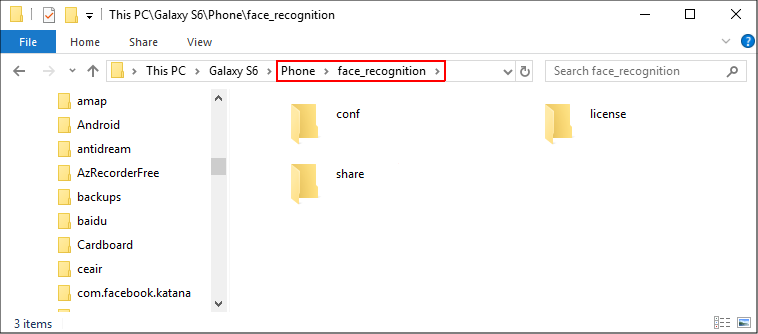

# Сэмплы

* Face SDK включает в себя набор программ, демонстрирующих работу с C++, Java и C# API.
* Предсобранные демонстрационные программы расположены в директориях *bin* (C++, C#) и *apk* (Java для Android). 
* Исходные коды находятся в директории *examples*.

## Windows/Linux

Для запуска сэмплов ([C++](cpp) и [C#](csharp)) на ПК скачайте и распакуйте дистрибутив Face SDK, как описано в пункте [Приступая к работе](../README.md#приступая-к-работе). Перед запуском сэмпла убедитесь, что к Вашему ПК подключена камера (например, веб-камера).

## Android (Java)

Для запуска сэмплов для Android-устройств:

1. Скачайте и распакуйте дистрибутив Face SDK, как описано в пункте [Приступая к работе](../README.md#приступая-к-работе).
2. Загрузите сэмплы (`demo.apk` и/или `video_recognition.apk`) из архива на Ваше Android-устройство.
3. Создайте на вашем Android-устройстве на sdcard папку *face_recognition* и скопируйте в нее директории *conf, share* и *license* из дистрибутива Face SDK. Подробнее о работе с онлайн лицензиями см. [Лицензии Face SDK](../licenses.md).

 
<b>Папка face_recognition на Android-устройстве</b>

4. Следуйте инструкциям, описанным в пунктах [Android Demo](java/demo.md) и [Android Video Recognition](java/video_recognition_demo.md).
