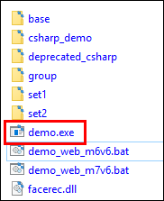
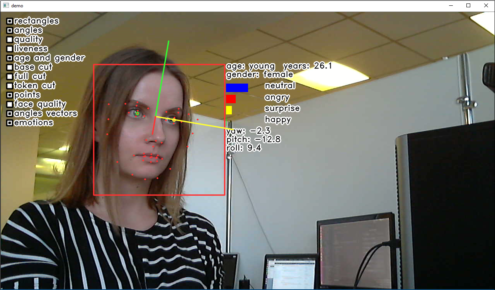

# demo

Программа демонстрирует трекинг, детекцию и обрезку лиц, определение антропометрических точек и углов, а также оценку качества лица, определение пола и возраста, эмоций, принадлежности лица живому человеку (анализ цветного изображения с камеры).

Для быстрого запуска сэмпла с параметрами по умолчанию на Windows зайдите в папку *bin* и двойным левым щелчком мыши запустите программу `demo.exe`.

 
<b>Расположение C++ demo</b>

В левой части окна программы расположены компоненты Face SDK, которые можно включать/выключать левым щелчком мыши:

* **rectangles** – ограничивающий прямоугольник лица
* **angles** – углы поворота головы
* **quality** – качество изображения
* **liveness** – принадлежность лица реальному человеку
* **age and gender** – возраст и пол
* **base cut, full cut, token cut** – тип обрезки лица (базовый, полный фронтальный ТИЛ, условно-фронтальный ТИЛ)
* **points** – антропометрические точки
* **face quality** – качество изображения лица
* **angles vectors** – векторы углов
* **emotions** – эмоции

 
<b>Результат запуска demo.exe</b>

В консоли отображаются сообщения об ошибках при их возникновении.

Также Вы можете запустить сэмпл `demo.exe`, указав определенные параметры (например, в случае, если у вас есть онлайн-лицензия). Параметры запуска:  

* `capturer_conf` – путь до конфигурационного файла детектора (подробнее о типах конфигурационных файлов см. [Класс Capturer](../../development/face_capturing.md#класс-capturer))
* `config_dir` – путь до каталога *conf/facerec*
* `dll_path` – путь до файла библиотеки `libfacerec.so` или `facerec.dll`
* `license_dir` – путь до каталога с лицензией; укажите, если нужно изменить каталог по умолчанию `license`

Исходный код: [demo.cpp](../../../../examples/cpp/demo/demo.cpp)

Для сборки требуется библиотека OpenCV.
