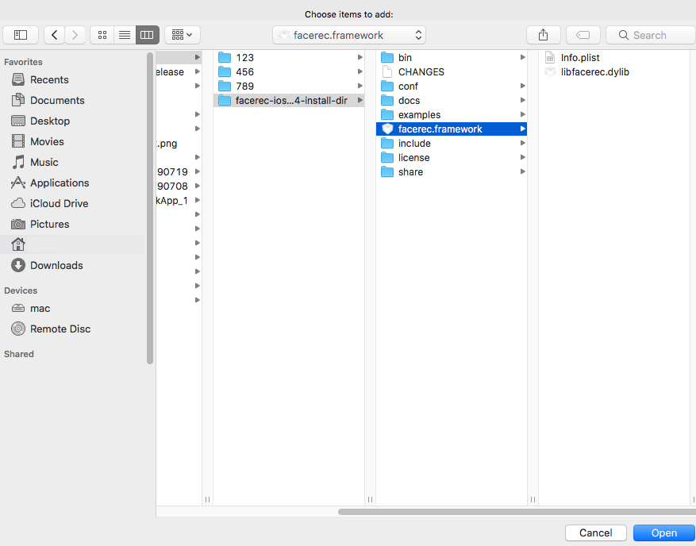
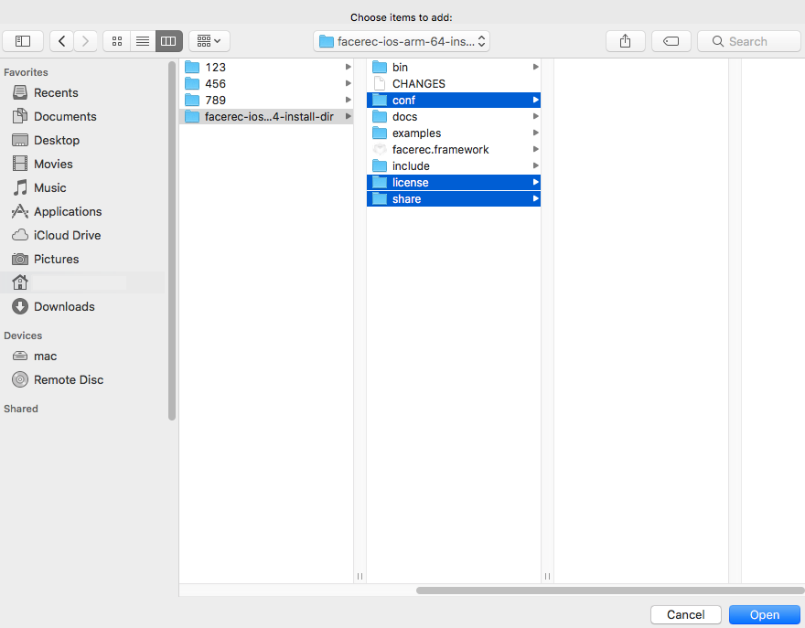
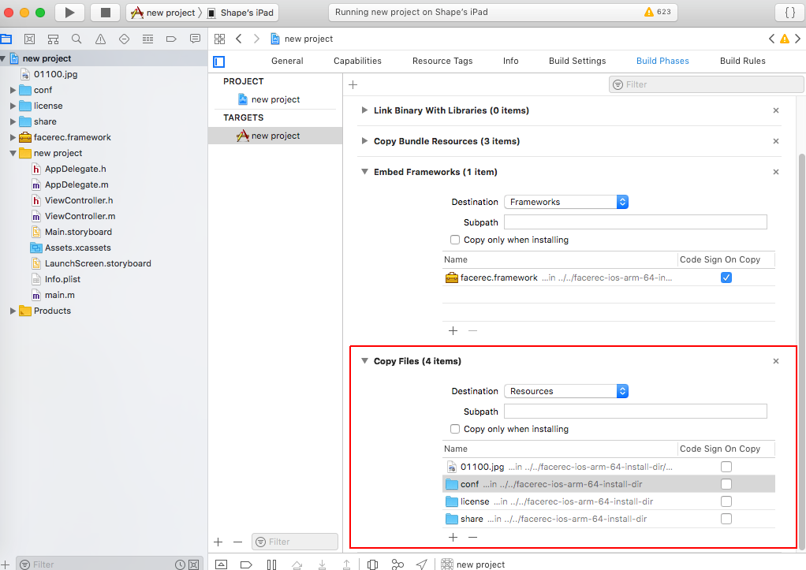
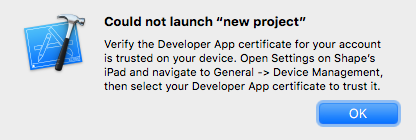
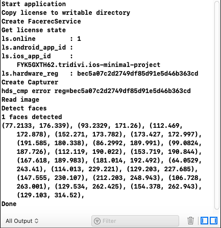

# Разработка приложений для iOS

В данном туториале Вы найдете информацию о том, как интегрировать Face SDK в базовое приложение в XCode. Созданное демо-приложение позволит оценить такие функции Face SDK, как инициализация работы с библиотекой *libfacerec* и определение антропометрических точек лица на фотографии.

Готовый демо-проект вы можете найти в дистрибутиве Face SDK: [examples/tutorials/ios_minimal_project](../../../examples/tutorials/ios_minimal_project)

_**Примечание:** Минимальная поддерживаемая версия iOS – 11.4._

1. Скачайте и распакуйте дистрибутив, как описано в пункте [Приступая к работе](../README.md#приступая-к-работе).
2. Создайте новый проект в XCode: **File > New > Project**. Выберите тип приложения *Single View App*. Настройки проекта – по умолчанию. Выберите директорию, в которой будет храниться проект.
3. Добавьте в приложение фреймворк *facerec*: в настройках проекта выберите **General > Embedded Binaries > + > Add Other...>** выберите директорию *facerec.framework* из распакованного дистрибутива. В группе **Destination** галочку **Copy items if needed** ставить необязательно. После этого нажмите **Finish**.

<p align="center">
<br>
</p>

4. По умолчанию фреймворк автоматически добавляется в **Linked Frameworks**. Удалите фреймворк из этого списка (связывание библиотек на данном этапе сборки не требуется, поскольку библиотека *facerec* загружается во время выполнения).
5. Добавьте в проект папки из дистрибутива с необходимыми файлами (*conf, license, share*). В настройках проекта выберите **Build Phases > + New Copy Files Phase > Copy Files > + > Add Other... >** выделите папки *conf, license, share*. В группе **Destination** галочку **Copy items if needed** ставить необязательно. После этого нажмите **Finish**.

<p align="center">
<br>
</p>

6. Укажите путь до заголовочных файлов из дистрибутива. В настройках проекта выберите **Build Settings > Search Paths > Header Search Paths >** сделайте двойной клик левой кнопкой мыши и перетащите папку *include* из дистрибутива.
7. Укажите поддерживаемую архитектуру: **Architectures > Valid Architectures > arm64**.
8. Отредактируйте созданный проект. Откройте файл `main.m` и укажите язык в настройках: **Identity and Type > Type > Objective-C++ Source**.
9. Отредактируйте код `main.m`, как показано в примере ниже.

```cpp
#import <UIKit/UIKit.h>
#import "AppDelegate.h"
#include "pbio/FacerecService.h"
#include <vector>
#include <fstream>
#include <iostream>
int main(int argc, char * argv[]) {
    std::cout << "log 1" << std::endl;
    const std::string frameworks_dir = [[[NSBundle mainBundle] privateFrameworksPath] UTF8String];
    const std::string resources_dir = [[[NSBundle mainBundle] resourcePath] UTF8String];
    const pbio::FacerecService::Ptr service = pbio::FacerecService::createService(
        frameworks_dir + "/facerec.framework/libfacerec.dylib",
        resources_dir + "/conf/facerec");
    std::cout << "log 2" << std::endl;
    const pbio::FacerecService::LicenseState ls = service->getLicenseState();
    std::cout << "ls.online         : "  << ls.online         << std::endl;
    std::cout << "ls.android_app_id : "  << ls.android_app_id << std::endl;
    std::cout << "ls.ios_app_id     : "  << ls.ios_app_id     << std::endl;
    std::cout << "ls.hardware_reg   : "  << ls.hardware_reg   << std::endl;
    std::cout << "log 3" << std::endl;
    const pbio::Capturer::Ptr capturer = service->createCapturer("fda_fake_detector_singleface.xml");
    std::cout << "log 4" << std::endl;
    std::vector<char> bytes;
    std::ifstream file((resources_dir + "/01100.jpg").c_str(), std::ios_base::binary);
    file.seekg(0, file.end);
    bytes.resize(file.tellg());
    file.seekg(0, file.beg);
    file.read(bytes.data(), bytes.size());
    file.close();
    std::cout << "log 5" << std::endl;
    const std::vector<pbio::RawSample::Ptr> samples = capturer->capture((const unsigned char*)bytes.data(), bytes.size());
    std::cout << "samples.size: " << samples.size() << std::endl;
    for(const pbio::RawSample::Ptr &sample : samples)
    {
        const std::vector<pbio::Point> pts = sample->getLandmarks();
        for(const pbio::Point &p : pts)
            std::cout << " " << p.x << " " << p.y << std::endl;
    }
    std::cout << "log 6" << std::endl;
    @autoreleasepool {
        return UIApplicationMain(argc, argv, nil, NSStringFromClass([AppDelegate class]));
    }
}
```

10. Для проверки работы демо используем фотографию лица. Вы можете использовать наш пример (путь до фото: `bin/set1/01100.jpg`), либо загрузить свое изображение. Добавьте фото в проект: **Copy Files > + > Add Other... >** укажите путь до изображения. В коде также укажите путь в строке `resources_dir + ...`

<p align="center">
<br>
</p>

11. Подключите Ваше iOS-устройство к компьютеру и соберите приложение (нажмите на кнопку **Run**). В случае возникновения ошибки (см. изображение ниже) подтвердите сертификат разработчика на iOS-устройстве.

<p align="center">
<br>
</p>

12. Вывод проекта должен быть аналогичен указанному на изображении ниже:

<p align="center">
<br>
</p>
