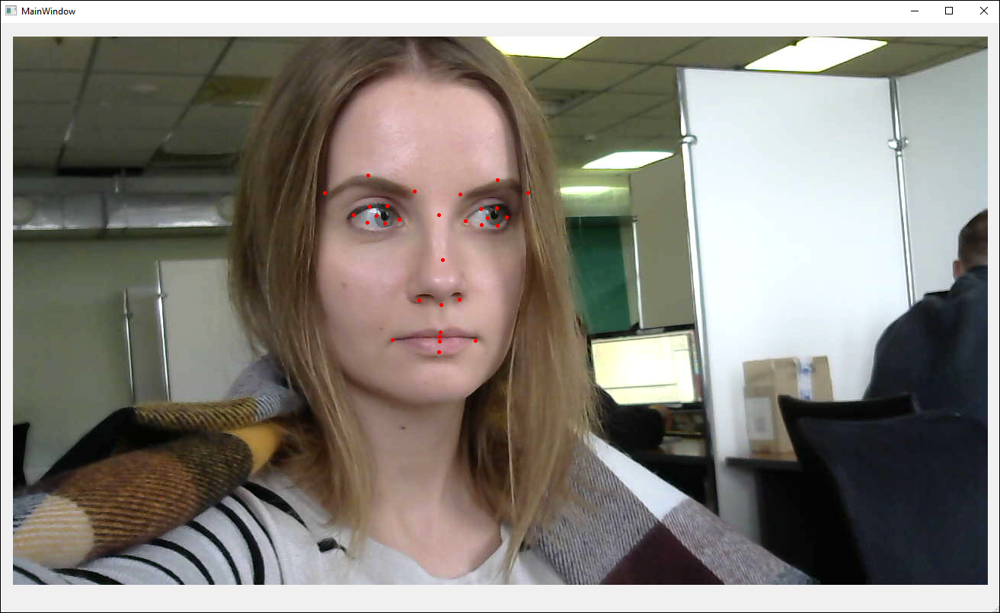
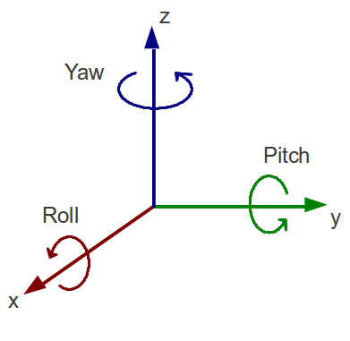

# Отображение антропометрических точек и углов поворота головы

В этом туториале вы узнаете, как отображать антропометрические точки и углы поворота головы после того, как лицо пользователя было найдено на видео или изображении. В основе этого туториала лежит туториал [Детекция и трекинг лиц на видеопотоке](face_detection_and_tracking_in_a_video_stream.md) и соответствующий проект, данный туториал является его продолжением и дополнением.

Готовый демо-проект вы можете найти в дистрибутиве Face SDK: [examples/tutorials/detection_and_tracking_with_video_worker](../../../examples/tutorials/detection_and_tracking_with_video_worker)

<p align="center">
<br>
</p>

## Отображаем антропометрические точки

1. Создайте проект, в котором лицо будет находиться и отслеживаться при помощи объекта `VideoWorker`. Также в этом проекте лицо будет выделяться зеленым прямоугольником (см. [Детекция и трекинг лиц на видеопотоке](face_detection_and_tracking_in_a_video_stream.md)).
2. Модифицируем функцию `DrawFunction::Draw`. Объект `pbio::RawSample` содержит в себе информацию об отслеживаемом лице, а именно: ограничивающий прямоугольник, антропометрические точки, позиции глаз, углы и т.д. Используя метод `pbio::RawSample::getLandmarks` получаем антропометрические точки отслеживаемого лица.

**drawfunction.cpp**
```cpp
//static
QImage DrawFunction::Draw(
    const Worker::DrawingData &data)
    {
        ...
        // draw facial points
        {
            // get points
            const std::vector<pbio::RawSample::Point> points = sample.getLandmarks();
        }
        ...
    }
```

_**Примечание:** В данном проекте используется набор точек `singlelbf` (31 точка). В качестве альтернативного варианта вы можете использовать набор точек `esr` (47 точек) (см. [Антропометрические точки](../development/face_capturing.md#антропометрические-точки)). Для этого вам необходимо указать конфигурационный файл `video_worker.xml` вместо `video_worker_lbf.xml` в конструкторе `ViewWindow::ViewWindow` (файл `ViewWindow.cpp`) (см. [Детекция и трекинг лиц на видеопотоке](face_detection_and_tracking_in_a_video_stream.md))._

3. Визуализируем точки – на лице они будут отображаться в виде маленьких кружков красного цвета.

**drawfunction.cpp**
```cpp
//static
QImage DrawFunction::Draw(
    const Worker::DrawingData &
    {
        ...
        // draw facial points
        {
            ...
            pen.setColor(Qt::red);
            pen.setWidth(1);
            painter.setPen(pen);
            painter.setBrush(Qt::red);
            for(auto &point : points)
            {
                painter.drawEllipse(QPoint(point.x, point.y), 2, 2);
            }
        }
        ...
    }
```

4. Запускаем проект. На лице должны отображаться антропометрические точки.

<p align="center">
<br>
</p>

## Отображаем углы поворота головы

1. Информацию об углах поворота головы мы также получаем из объекта `pbio::RawSample`.

**drawfunction.cpp**
```cpp
//static
QImage DrawFunction::Draw(
    const Worker::DrawingData &data)
    {
        ...
        // draw angles
        {
            const pbio::RawSample::Angles angles = sample.getAngles();
        }
        ...
    }
```

2. Подключаем заголовочные файлы `QMatrix3x3` и `QQuaternion`. Используя метод `QQuaternion::fromEulerAngles` получаем матрицу поворота.
```cpp
drawfunction.cpp
#include <QMatrix3x3>
#include <QQuaternion>
...
//static
QImage DrawFunction::Draw(
    const Worker::DrawingData &data)
    {
        ...
        // draw angles
        {
            ...
            QMatrix3x3 rotation = QQuaternion::fromEulerAngles(
                angles.pitch,
                angles.yaw,
                angles.roll).toRotationMatrix();
        }
        ...
    }
```

_**Примечание:** В Face SDK используются углы поворота yaw (поворот по оси Z), pitch (поворот по оси Y), roll (поворот по оси X). Алгоритм FaceSDK позволяет детектировать лица в следующем диапазоне углов: yaw [-60; 60], pitch [-60; 60], roll [-30; 30]._

<p align="center">
<br>
</p>

3. Поскольку изображение, полученное с камеры и отображаемое на экране, является зеркальным отражением пользователя (правая часть лица на изображении находится слева, левая - справа), нам необходимо инвертировать направление оси Y (умножить на -1) для корректной визуализации углов.

**drawfunction.cpp**
```cpp
//static
QImage DrawFunction::Draw(
    const Worker::DrawingData &data)
    {
        ...
        // draw angles
        {
            ...
            // invert y-axis direction
            for(int i = 0; i < 3; ++i)
                rotation(i, 1) *= -1;
        }
        ...
    }
```

4. Для визуализации углов нам необходимо вычислить среднюю точку между глазами пользователя `axis_origin`, из которой будут исходить векторы yaw, pitch, roll.

**drawfunction.cpp**
```cpp
//static
QImage DrawFunction::Draw(
    const Worker::DrawingData &data)
    {
        ...
        // draw angles
        {
            ...
            const QPointF axis_origin(
                (sample.getLeftEye().x + sample.getRightEye().x) * 0.5f,
                (sample.getLeftEye().y + sample.getRightEye().y) * 0.5f);
        }
        ...
    }
```

5. Для того, чтобы длина векторов yaw, pitch, roll была пропорциональна размеру лица, введем коэффициент `axis_length`. Он будет равен половине длины диагонали ограничивающего прямоугольника лица `face_size`.

**drawfunction.cpp**
```cpp
//static
QImage DrawFunction::Draw(
    const Worker::DrawingData &data)
    {
        ...
        // draw angles
        {
            ...
            const float face_size = std::sqrt(
                std::pow((float)sample.getRectangle().width, 2.f)
                + std::pow((float)sample.getRectangle().height, 2.f));
            const float axis_length = face_size * 0.5f;
        }
        ...
    }
```

6. Визуализируем углы – векторы будут отображаться разными цветами (желтым, красным и зеленым).

**drawfunction.cpp**
```cpp
//static
QImage DrawFunction::Draw(
    const Worker::DrawingData &data)
    {
        ...
        // draw angles
        {
            ...
            const QColor axis_colors[] = {
                QColor(255, 255, 50), // x-axis
                QColor(50, 255, 50),  // y-axis
                QColor(255, 50, 50)   // z-axis
            };
        }
        ...
    }
```

7. В цикле рисуем векторы. Векторы исходят из точки между глазами пользователя. Конечная точка вектора равна проекции вектора на плоскость изображения `QPointF`, умноженной на коэффициент `axis_length` и отложенной от начальной точки.

**drawfunction.cpp**
```cpp
//static
QImage DrawFunction::Draw(
    const Worker::DrawingData &data)
    {
    ...
        // draw angles
        {
            ...
            pen.setWidth(3);
            for(int c = 0; c < 3; ++c)
            {
                pen.setColor(axis_colors[c]);
                painter.setPen(pen);
                painter.drawLine(
                    axis_origin,
                    axis_origin + axis_length * QPointF(rotation(0, c), rotation(1, c)));
            }
            ...
        }
    }
```

8. Запускаем проект. Теперь на лице отображаются антропометрические точки и углы поворота головы.

<p align="center">
<br>
</p>
