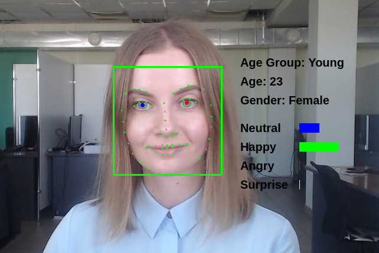
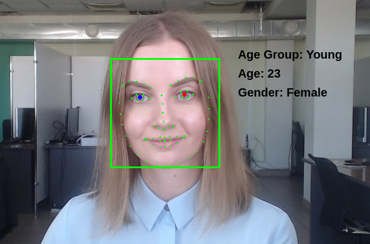

# Определение возраста, пола и эмоций

В этом туториале Вы узнаете, как определить возраст, пол и эмоции лица с использованием Face SDK. Результат будет отображаться рядом с задетектированным лицом. Предполагается, что у вас есть готовый проект с детекцией лиц на видеопотоке или на изображении. Пример детекции и получения информации о лице на видеопотоке см. в туториале [Детекция и трекинг лиц на видеопотоке](face_detection_and_tracking_in_a_video_stream.md). В данном туториале мы рассматриваем определение возраста, пола и эмоций лица на изображении.

Готовый демо-проект вы можете найти в дистрибутиве Face SDK: [examples/tutorials/age_gender_and_emotions](../../../examples/tutorials/age_gender_and_emotions)

Содержание туториала: 

* [Определяем пол и возраст](#определяем-пол-и-возраст)
* [Определяем эмоции](#определяем-эмоции)

<p align="center">
<br>
</p>

## Определяем пол и возраст

1. Укажем путь до изображения в поле `QImage image`. Зададим параметры надписей с информацией о поле, возрасте и эмоциях (размер 15, полужирный шрифт “Arial”).

**main.cpp**
```cpp
QImage image(image_path);
    QPainter painter(&image);
    QPen pen;
    pen.setWidth(2);
    painter.setPen(pen);
    painter.setFont(QFont("Arial", 15, QFont::DemiBold));
```

2. Зададим отступ `margin_from_rect` между ограничивающим прямоугольником лица и текстом с информацией о лице. Также зададим расстояние `text_element_position` между элементами “возрастная группа”, “возраст”, “пол”, “эмоция”. Указанные элементы отображаются справа от лица друг под другом.

**main.cpp**
```cpp
const int margin_from_rect = 32; // отступ от ограничивающего прямоугольника до текста с информацией
const int text_element_position = 32;

```
3. Используя метод `pbio::FacerecService::createAgeGenderEstimator` создаем объект `AgeGenderEstimator` для определения пола и возраста. При вызове этого метода необходимо указать конфигурационный файл `age_gender_estimator.xml`.

**main.cpp**
```cpp
// создаем age-gender estimator 
pbio::AgeGenderEstimator::Ptr age_gender_estimator = service->createAgeGenderEstimator("age_gender_estimator.xml");
```

4. Определяем начальную точку `base_point` для отображения информации о поле, возрасте и эмоции. Для этого получаем ограничивающий прямоугольник `rectangle` из объекта `RawSample`, который хранит данные о лице, и рассчитываем точку, учитывая отступ `margin_from_rect`.

**main.cpp**
```cpp
// вычисляем начальную точку для отображения информации о поле, возрасте и эмоциях
const pbio::RawSample::Rectangle rectangle = sample->getRectangle();
const QPoint base_point = QPoint(rectangle.x + rectangle.width + margin_from_rect, rectangle.y);
```

5. Определяем пол и возраст лица (`*sample`), используя метод `pbio::AgeGenderEstimator`. Отображаем возрастную группу лица, исходя из его возраста. На данный момент в Face SDK доступны четыре возрастные группы:

* Kid (до 18 лет),
* Young (18-37 лет),
* Adult (37-55 лет),
* Senior (55 лет и более).

Возрастная группа берется из перечисления `pbio::AgeGenderEstimator::Age`, результат записывается в переменную `age_group_text`. Используя метод `painter.drawText`, выводим надпись с возрастной группой. Надпись будет располагаться на первой строчке справа от начальной точки `base_point`.

**main.cpp**
```cpp
// определяем и отображаем возраст и пол
{
    const pbio::AgeGenderEstimator::AgeGender age_gender = age_gender_estimator->estimateAgeGender(*sample);
    painter.save();
    // отображаем возрастную группу
    const QMap<pbio::AgeGenderEstimator::Age, QString> age_map =     
    {
                    {pbio::AgeGenderEstimator::AGE_KID,    "Kid"},
                    {pbio::AgeGenderEstimator::AGE_YOUNG,  "Young"},
                    {pbio::AgeGenderEstimator::AGE_ADULT,  "Adult"},
                    {pbio::AgeGenderEstimator::AGE_SENIOR, "Senior"}
    };
    QString age_group_text = QString("Age Group: %1").arg(age_map[age_gender.age]);
    painter.drawText(base_point + QPoint(0, text_element_position * 0), age_group_text);
}
```

6. Отображаем возраст в годах на второй строчке (ниже возрастной группы).

**main.cpp**
```cpp
// определяем и отображаем возраст и пол 
{
     ...
    // отображаем возраст в годах
    QString age_in_years_text = QString("Age: %1").arg((int)age_gender.age_years);
    painter.drawText(base_point + QPoint(0, text_element_position * 1), age_in_years_text);
}
```

7. Отображаем пол на третьей строчке (ниже возраста).

**main.cpp**
```cpp
// определяем и отображаем возраст и пол
{
    ...
    // отображаем пол
    QString gender = age_gender.gender == pbio::AgeGenderEstimator::GENDER_MALE ? "Male" : "Female";
    QString gender_text = QString("Gender: %1").arg(gender);
    painter.drawText(base_point + QPoint(0, text_element_position * 2), gender_text);
    painter.restore();
}
```

8. Запускаем проект. На данном этапе справа от найденного лица будет отображаться информация о возрастной группе, возрасте и поле.

<p align="center">
<br>
</p>

## Определяем эмоции

1. Используя метод `pbio::FacerecService::createEmotionsEstimator`, создаем объект `EmotionsEstimator` для определения эмоций. При вызове этого метода необходимо указать конфигурационный файл `emotions_estimator.xml`.

**main.cpp**
```cpp
// создаем emotions estimator
pbio::EmotionsEstimator::Ptr emotions_estimator = service->createEmotionsEstimator("emotions_estimator.xml");
```

2. При помощи метода `pbio::EmotionsEstimator::estimateEmotions` определяем эмоцию найденного лица (`*sample`) и соответствующий коэффициент уверенности (от 0 до 1). В перечислении `pbio::EmotionsEstimator::Emotion` указаны все доступные эмоции. На данный момент Face SDK определяет четыре эмоции:

* Neutral (нейтральный),
* Happy (счастливый),
* Angry (злой),
* Surprise (удивленный).

Каждой эмоции присваивается индекс от 0 до 3. Отобразим эмоции в виде четырех столбиков разного цвета (синий, зеленый, красный, желтый) с соответствующими надписями (Neutral, Happy, Angry, Surprise). Чем больше коэффициент уверенности для эмоции, тем длиннее будет столбик в сравнении с тремя другими, что наглядно покажет, какая эмоция преобладает. Все параметры эмоций сохраняем в словарь `emotions_params`.

**main.cpp**
```cpp
// определяем и отображаем эмоции
{
    // определяем эмоции лица
    const std::vector<pbio::EmotionsEstimator::EmotionConfidence> emotions = emotions_estimator->estimateEmotions(*sample);
    // параметры эмоции для отрисовки: номер строки, цвет столбика, название эмоции 
    struct EmotionParams
    {
        int row;
        QColor color;
        QString label;
    };   
    const QMap<pbio::EmotionsEstimator::Emotion, EmotionParams> emotions_params = 
    {
            {pbio::EmotionsEstimator::EMOTION_NEUTRAL,  {0, Qt::blue, "Neutral"}},
            {pbio::EmotionsEstimator::EMOTION_HAPPY,    {1, Qt::green, "Happy"}},
            {pbio::EmotionsEstimator::EMOTION_ANGRY,    {2, Qt::red, "Angry"}},
            {pbio::EmotionsEstimator::EMOTION_SURPRISE, {3, Qt::yellow, "Surprise"}}
    };
}
```

3. Зададим начальную точку `emotions_base_point`, от которой будут рисоваться столбики с эмоциями (справа от ограничивающего прямоугольника лица под надписями с полом, возрастом и возрастной группой). Также укажем размер столбиков с эмоциями `bar_base_size` и отступ `bar_offset` от названий эмоций.

**main.cpp**
```cpp
// определяем и отображаем эмоции
{
    ...
    const QPoint emotions_base_point(base_point + QPoint(0, text_element_position * 3)); // начальная точка для отрисовки первой эмоции
    const QSizeF bar_base_size(100, 15); // базовый размер столбика
    const QPoint bar_offset(100, 0); // отступ от названия эмоции
}
```

4. Отображаем надписи и столбики с эмоциями. В цикле рассчитываем начальную точку `emotion_row_base_point` для отображения информации для каждой эмоции и начальную точку названия эмоции `text_base_point`. Затем получаем название эмоции из словаря и отображаем надпись `emotion_label`. Отображаем столбик для каждой эмоции: определяем начальную точку для отрисовки столбика `bar_base_point` и рассчитываем длину столбика `bar_size`, умножая значение `bar_base_size.width` на коэффициент уверенности. Окрашиваем столбики в соответствии с цветом каждой эмоции из словаря.

**main.cpp**
```cpp
// определяем и отображаем эмоции
{
    ...             
    // обрабатываем эмоции в цикле
    for (const auto &emotion_confidence: emotions) 
    {
        const auto &emotion_params = emotions_params[emotion_confidence.emotion];
        const int &emotion_row = emotion_params.row;
        const QPoint emotion_row_base_point = emotions_base_point + QPoint(0, text_element_position * emotion_row);
        const QPoint text_base_point = emotion_row_base_point + QPoint(0, bar_base_size.height());
        painter.save();
        // отображаем название эмоции
        const QString &emotion_label = emotion_params.label;
        painter.drawText(text_base_point, emotion_label);
        // отображаем столбик 
        const QPoint bar_base_point = emotion_row_base_point + bar_offset;
        QSizeF bar_size(bar_base_size.width() * emotion_confidence.confidence, bar_base_size.height());
        const QColor &emotion_color = emotion_params.color;
        pen.setColor(emotion_color);
        pen.setWidth(1);
        painter.setPen(pen);
        painter.setBrush(QBrush(emotion_color));
        painter.drawRect(QRectF(bar_base_point, bar_size));
        painter.restore();
    }
}
```

5. Запускаем проект. Справа от ограничивающего прямоугольника лица будет отображаться информация об эмоциях (длины столбиков визуализируют вероятностное распределение в пространстве описанных эмоций).

<p align="center">
<br>
</p>
