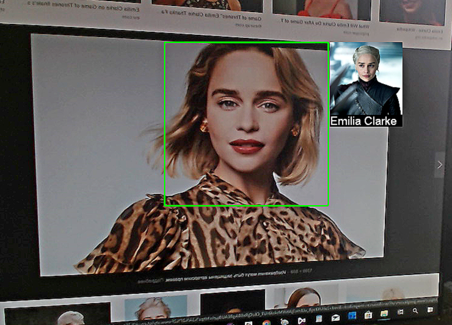
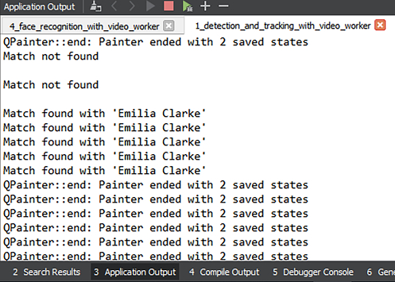

# Распознавание лиц на видеопотоке

В этом туториале Вы узнаете, как распознавать лица на видеопотоке. Для распознавания будет использоваться готовая база лиц из дистрибутива Face SDK (в базе находятся фотографии нескольких знаменитых людей). Распознанные на видеопотоке лица будут подсвечиваться зеленым прямоугольником, рядом с лицом будет отображаться фотография соответствующего человека из базы лиц и его имя. В основе данного туториала лежит туториал [Детекция и трекинг лиц на видеопотоке](face_detection_and_tracking_in_a_video_stream.md) и соответствующий проект, данный туториал является его продолжением и дополнением.

Готовый демо-проект вы можете найти в дистрибутиве Face SDK: [examples/tutorials/face_recognition_with_video_worker](../../../examples/tutorials/face_recognition_with_video_worker)

<p align="center">
<br>
</p>

## Подготовка проекта

1. Поскольку в туториале [Детекция и трекинг лиц на видеопотоке](face_detection_and_tracking_in_a_video_stream.md) мы указывали только два параметра Face SDK (путь до дистрибутива Face SDK и имя конфигурационного файла для объекта `VideoWorker`), а в данном проекте их будет несколько (добавляется путь до базы лиц, имя конфигурационного файла с методом распознавания, FAR), для удобства мы модифицируем несколько файлов. Укажем все параметры в структуре `FaceSdkParameters`. В заголовочном файле `facesdkparameters.h` указываем путь до конфигурационного файла `video_worker_lbf.xml`.

**facesdkparameters.h**
```cpp
struct FaceSdkParameters
{
    ...
    std::string videoworker_config = "video_worker_lbf.xml";
};
```

2. Передадим структуру `face_sdk_parameters` в конструктор объекта `Worker`.

**viewwindow.h**
```cpp
class ViewWindow : public QWidget
{
    Q_OBJECT
    public:
        explicit ViewWindow(
            QWidget *parent,
            pbio::FacerecService::Ptr service,
            FaceSdkParameters face_sdk_parameters);
    ...
    private:
    ...
        std::shared_ptr<Worker> _worker;
        pbio::FacerecService::Ptr _service;
};
```

**viewwindow.cpp**
```cpp
ViewWindow::ViewWindow(
    QWidget *parent,
    pbio::FacerecService::Ptr service,
    FaceSdkParameters face_sdk_parameters) :
QWidget(parent),
ui(new Ui::ViewWindow),
_service(service)
{
    ui->setupUi(this);
    ...
    _worker = std::make_shared<Worker>(
        _service,
        face_sdk_parameters);
    ...
};
```

**worker.h**
```cpp
#include "qcameracapture.h"
#include "facesdkparameters.h"
...
class Worker
{
    ...
    Worker(
        const pbio::FacerecService::Ptr service,
        const FaceSdkParameters face_sdk_parameters);
    ...
};
```

**worker.cpp**
```cpp
Worker::Worker(
    const pbio::FacerecService::Ptr service,
    const FaceSdkParameters face_sdk_parameters)
{
    pbio::FacerecService::Config vwconfig(face_sdk_parameters.videoworker_config);
    ...
}
```

3. В данном проекте нас интересует исключительно детекция лица на видеопотоке (создание ограничивающего прямоугольника) и последующее распознавание. Обратите внимание, что в первом проекте (*detection_and_tracking_with_video_worker*), который Вы можете использовать для создания данного проекта, помимо ограничивающего прямоугольника также отображаются антропометрические точки и углы. При необходимости Вы можете удалить ненужную визуализацию из первого проекта.

## Создание базы лиц

1. Прежде всего нам нужно создать базу лиц. Чтобы проверить распознавание лиц, вы можете использовать готовую базу из дистрибутива Face SDK. Она включает в себя фотографии трех знаменитостей (Илон Маск, Эмилия Кларк, Лионель Месси). Для проверки распознавания вы можете скопировать готовую базу в корневую папку проекта (рядом с .pro файлом), запустить проект, открыть фотографию из базы и направить камеру на монитор. Также вы можете добавить в базу свою фотографию для распознавания. Для этого вам нужно создать папку в базе, указать ваше имя в названии и поместить в эту папку ваше фото (по аналогии с другими папками).
2. Создаем новый класс `Database` для работы с базой лиц: **Add New > C++ > C++ Class > Choose… > Class name – Database > Next > Project Management** (настройки по умолчанию) **> Finish**. В заголовочном файле `database.h` подключаем заголовочные файлы `QImage`, `QString` для работы с изображениями и строками и `libfacerec.h` для интеграции Face SDK.

**database.h**
```cpp
#include <QImage>
#include <QString>
#include <facerec/libfacerec.h>
class Database
{
    public:
    Database();
}
```

3. В файле `database.cpp` подключаем заголовочные файлы `database.h` и `videoframe.h` (реализация интерфейса `IRawImage`, через который `VideoWorker` принимает кадры). Также добавляем необходимые заголовочные файлы для работы с файловой системой, отладки, обработки исключений и работы с файлами.

**database.cpp**
```cpp
#include "database.h"
#include "videoframe.h"
#include <QDir>
#include <QDebug>
#include <stdexcept>
#include <fstream>
```

4. В заголовочном файле `database.h` добавляем конструктор, где прописываем путь до базы лиц, а также указываем объект `Recognizer` для создания шаблонов, объект `Capturer` для детекции лиц и far (вероятность того, что один человек может быть принят за другого). Вектор `vw_elements` содержит в себе элементы базы данных `VideoWorker`. Векторы `thumbnails` и `names` содержат в себе превью фотографий и имена лиц из базы.

**database.h**
```cpp
class Database
{
    public:
    ...
    // Создаем базу
    Database(
        const std::string database_dir_path,
        pbio::Recognizer::Ptr recognizer,
        pbio::Capturer::Ptr capturer,
        const float fa_r);
    std::vector<pbio::VideoWorker::DatabaseElement> vw_elements;
    std::vector<QImage> thumbnails;
    std::vector<QString> names;
}
```

5. В файле `database.cpp` добавляем реализацию конструктора `Database`, объявленного в предыдущем пункте. Величина `distance_threshold` означает порог распознавания. Поскольку для разных методов этот порог разный, мы получаем его из значения FAR с помощью метода `getROCCurvePointByFAR`.

**database.cpp**
```cpp
Database::Database(
    const std::string database_dir_path,
    pbio::Recognizer::Ptr recognizer,
    pbio::Capturer::Ptr capturer,
    const float fa_r)
{
    const float distance_threshold = recognizer->getROCCurvePointByFAR(fa_r).distance;
}
```

6. В переменной `database_dir` указываем путь до директории с базой лиц. Если путь не существует, то будет выводиться ошибка *“database directory doesn’t exist”*. Создаем переменную `person_id` для хранения id человека из базы (соотносится с папкой *“person...”*) и переменную `element_id_counter` для хранения id элемента в базе (соотносится с фотографией человека из базы). В списке `dirs` формируем список всех поддиректорий из указанной директории с базой.

**database.cpp**
```cpp
Database::Database(
    const std::string database_dir_path,
    pbio::Recognizer::Ptr recognizer,
    pbio::Capturer::Ptr capturer,
    const float fa_r)
{
    ...
    QDir database_dir(QString::fromStdString(database_dir_path));
    if (!database_dir.exists())
    {
        throw std::runtime_error(database_dir_path + ": database directory doesn't exist");
    }
    int person_id = 0;
    int element_id_counter = 0;
    QFileInfoList dirs = database_dir.entryInfoList(
        QDir::AllDirs | QDir::NoDotAndDotDot,
        QDir::DirsFirst);
}
```

_**Примечание:** Более подробную информацию о значениях FAR и TAR для разных методов распознавания см. в пункте [Характеристики идентификации](../performance_parameters.md#характеристики-идентификации)._

7. В цикле `for(const auto &dir: dirs)` обрабатываем каждую поддиректорию – данные для отдельного человека. В качестве имени человека берем название директории. Формируем список изображений в `person_files`.

**database.cpp**
```cpp
Database::Database(...)
{
    ...
    for(const auto &dir: dirs)
    {
        QDir person_dir(dir.filePath());
        QString name = dir.baseName();
        QFileInfoList person_files = person_dir.entryInfoList(QDir::Files | QDir::NoDotAndDotDot);
    }
}
```

8. Во вложенном цикле `for(const auto &person_file: person_files)` обрабатываем каждое изображение. В случае, если фото не существует, выводится предупреждение *“Can’t read image”*.

**database.cpp**
```cpp
Database::Database(...)
{
    ...
    for(const auto &dir: dirs)
    {
        ...        
        QFileInfoList person_files = person_dir.entryInfoList(QDir::Files | QDir::NoDotAndDotDot);
        
        for(const auto &person_file: person_files)
        {
            QString path = person_file.filePath();
            qDebug() << "processing" << path << "name:" << name;
            QImage image(path);
            if(image.isNull())
            {
                qDebug() << "\n\nWARNING: cant read image" << path << "\n\n";
                continue;
            }
            if (image.format() != QImage::Format_RGB888)
            {
                image = image.convertToFormat(QImage::Format_RGB888);
            }
            VideoFrame frame;
            frame.frame() = QCameraCapture::FramePtr(new QImage(image));
        }
    }
}
```

9. Детектируем лицо на фото, используя объект `Capturer`. В случае, если фото невозможно прочитать, на фото не удалось найти лицо или найдено более одного лица, выводится предупреждение и фото игнорируется.

**database.cpp**
```cpp
Database::Database(...)
{
    ...
    for(const auto &dir: dirs)
    {
        ...        
        QFileInfoList person_files = person_dir.entryInfoList(QDir::Files | QDir::NoDotAndDotDot);
        
        for(const auto &person_file: person_files)
        {
            ...
            // Детектируем лица
            const std::vector<pbio::RawSample::Ptr> captured_samples = capturer->capture(frame);
            if(captured_samples.size() != 1)
            {
                qDebug() << "\n\nWARNING: detected" << captured_samples.size() <<
                    "faces on" << path << "image instead of one, image ignored\n\n";
                continue;
            }
            const pbio::RawSample::Ptr sample = captured_samples[0];
        }
    }
}
```

10. При помощи метода `recognizer->processing` создаем шаблон лица для распознавания.

**database.cpp**
```cpp
Database::Database(...)
{
    ...
    for(const auto &dir: dirs)
    {
        ...        
        QFileInfoList person_files = person_dir.entryInfoList(QDir::Files | QDir::NoDotAndDotDot);
        
        for(const auto &person_file: person_files)
        {
            ...
            // Создаем шаблон
            const pbio::Template::Ptr templ = recognizer->processing(*sample);
        }
    }
}
```

11. В структуре `pbio::VideoWorker::DatabaseElement vw_element` указываем всю информацию об элементе базы, которая в дальнейшем будет передана для обработки объекту `VideoWorker` (уникальный идентификатор элемента, уникальный идентификатор человека, шаблон лица, порог распознавания). Используя метод `push_back`, добавляем элемент в конец списка.

**database.cpp**
```cpp
Database::Database(...)
{
    ...
    for(const auto &dir: dirs)
    {
        ...        
        QFileInfoList person_files = person_dir.entryInfoList(QDir::Files | QDir::NoDotAndDotDot);
        
        for(const auto &person_file: person_files)
        {
            ...
            // Подготавливаем данные для VideoWorker
            pbio::VideoWorker::DatabaseElement vw_element;
            vw_element.element_id = element_id_counter++;
            vw_element.person_id = person_id;
            vw_element.face_template = templ;
            vw_element.distance_threshold = distance_threshold;
            vw_elements.push_back(vw_element);
            thumbnails.push_back(makeThumbnail(image));
            names.push_back(name);
        }
        ++person_id;
    }
}
```

12. В заголовочном файле `database.h` добавляем метод `makeThumbnail` для создания превью фотографии лица из базы.

**database.cpp**
```cpp
class Database
{
    public:
        // Создаем превью из сэмпла
        static
        QImage makeThumbnail(const QImage& image);
        ...
};
```

13. В файле `database.cpp` добавляем реализацию метода, используя метод `makeThumbnail` для создания превью фотографии из базы лиц, которое будет отображаться рядом с распознанным лицом. Задаем его размер (120 пикселей) и масштабируем (при уменьшении пропорции изображения будут сохраняться).

**database.cpp**
```cpp
#include <fstream>
...
QImage Database::makeThumbnail(const QImage& image)
{
    const float thumbnail_max_side_size = 120.f;
    const float scale = thumbnail_max_side_size / std::max<int>(image.width(), image.height());
    QImage result = image.scaled(
        image.width() * scale,
        image.height() * scale,
        Qt::KeepAspectRatio,
        Qt::SmoothTransformation);
    return result;
}
```

14. В pro-файле зададим путь до базы лиц.

**face_recognition_with_video_worker.pro**
```cpp
...
DEFINES += FACE_SDK_PATH=\\\"$$FACE_SDK_PATH\\\"
DEFINES += DATABASE_PATH=\\\"$${_PRO_FILE_PWD_}/base\\\"
INCLUDEPATH += $${FACE_SDK_PATH}/include
...
```

15. В заголовочном файле **facesdkparameters.h** указываем путь до базы лиц, а также значение FAR.

**facesdkparameters.h**
```cpp
struct FaceSdkParameters
{
    ...
    std::string videoworker_config = "video_worker_lbf.xml";
    std::string database_dir = DATABASE_PATH;
    const float fa_r = 1e-5;
};
```

## Поиск лица по базе и отображение результата в консоли

1. В заголовочном файле `facesdkparameters.h` указываем путь до конфигурационного файла с методом распознавания. В данном проекте мы используем метод 6.7, потому что он подходит для обработки видеопотока и обеспечивает оптимальную скорость распознавания и хорошее качество. Более подробную информацию о рекомендуемых методах распознавания см. в пункте [Идентификация лиц](../development/face_identification.md).

**facesdkparameters.h**
```cpp
struct FaceSdkParameters
{
    ...
    std::string videoworker_config = "video_worker_lbf.xml";
    std::string database_dir = DATABASE_PATH;
    const float fa_r = 1e-5;
    std::string method_config = "method6v7_recognizer.xml";
};
```

_**Примечание:** Если вы хотите распознавать лица на видеопотоке на низкопроизводительных устройствах, вы можете использовать метод 9.30. При этом скорость распознавания будет выше, чем с методом 6.7, но качество распознавания будет ниже._

2. В заголовочном файле `worker.h` в структуре `FaceData` добавляем переменную `match_database_index`, в которой в случае совпадения лица с человеком из базы будет записан номер элемента из базы или `"-1"` в случае несовпадения. Также подключаем базу лиц `Database` и добавляем коллбэк распознавания `MatchFoundCallback`.

**worker.h**
```cpp
#include "qcameracapture.h"
#include "facesdkparameters.h"
#include "database.h"
...
class Worker
{
public:
    struct FaceData
    {
        pbio::RawSample::Ptr sample;
            bool lost;
            int frame_id;
            int match_database_index;
            FaceData() :
                lost(true),
                match_database_index(-1)
            {
            }
    };
    ...
    pbio::VideoWorker::Ptr _video_worker;
    Database _database;
    ...
    static void TrackingLostCallback(
        const pbio::VideoWorker::TrackingLostCallbackData &data,
        void* const userdata);
    static void MatchFoundCallback(
        const pbio::VideoWorker::MatchFoundCallbackData &data,
        void* const userdata);
    int _tracking_callback_id;
    int _tracking_lost_callback_id;
    int _match_found_callback_id;
};
```

3. В файле `worker.cpp` переопределяем значение параметра в конфигурационном файле, чтобы коллбэк `MatchFoundCallback` приходил в том числе и для нераспознанных лиц. Укажем параметры объекта `VideoWorker`: в первом туториале распознавание лиц не производилось, поэтому мы указывали только значение `streams_count`. Поскольку в этом проекте мы распознаем лица на видеопотоке, нам нужно указать в конструкторе путь до конфигурационного файла с методом распознавания, а также значения `processing_threads_count` (количество потоков для создания шаблонов) и `matching_threads_count` (количество потоков для сравнения шаблонов). В данном проекте используется один видеопоток (подключенная камера). Подключаем базу лиц: передаем путь до базы, создаем объект `Capturer` для детекции лиц и объект `Recognizer` для построения шаблонов, а также указываем коэффициент FAR. Используя метод `setDatabase`, задаем базу лиц для объекта `VideoWorker`. Используя метод `addMatchFoundCallback`, добавляем обработчик события распознавания `MatchFound`.

**worker.cpp**
```cpp
Worker::Worker(
    const pbio::FacerecService::Ptr service,
    const FaceSdkParameters face_sdk_parameters)
{
    pbio::FacerecService::Config vwconfig(face_sdk_parameters.videoworker_config);
   
    vwconfig.overrideParameter("not_found_match_found_callback", 1);
    _video_worker = service->createVideoWorker(
        vwconfig,
        face_sdk_parameters.method_config,
        1,   // streams_count
        1,   // processing_threads_count
        1);  // matching_threads_count
    _database = Database(
        face_sdk_parameters.database_dir,
        service->createRecognizer(face_sdk_parameters.method_config, true, false),
        service->createCapturer("common_capturer4_lbf_singleface.xml"),
        face_sdk_parameters.fa_r);
    _video_worker->setDatabase(_database.vw_elements);
    ...
    _match_found_callback_id =
        _video_worker->addMatchFoundCallbackU(
            MatchFoundCallback,
            this);
}
```

4. В деструкторе `Worker::~Worker()` удаляем коллбэк `MatchFoundCallback`.

**worker.cpp**
```cpp
Worker::~Worker()
{
    _video_worker->removeTrackingCallback(_tracking_callback_id);
    _video_worker->removeTrackingLostCallback(_tracking_lost_callback_id);
    _video_worker->removeMatchFoundCallback(_match_found_callback_id);
}
...
```

5. В коллбэке `MatchFoundCallback` результат приходит в виде структуры `MatchFoundCallbackData`, которая хранит данные о распознанных и нераспознанных лицах.

**worker.cpp**
```cpp
// static
void Worker::TrackingLostCallback(
    const pbio::VideoWorker::TrackingLostCallbackData &data,
    void* const userdata)
{
    ...
}
// static
void Worker::MatchFoundCallback(
    const pbio::VideoWorker::MatchFoundCallbackData &data,
    void* const userdata)
{
    assert(userdata);
    const pbio::RawSample::Ptr &sample = data.sample;
    const pbio::Template::Ptr &templ = data.templ;
    const std::vector<pbio::VideoWorker::SearchResult> &search_results = data.search_results;
    // Информация о пользователе - указатель на Worker
    // Передаем указатель
    Worker &worker = *reinterpret_cast<Worker*>(userdata);
    assert(sample);
    assert(templ);
    assert(!search_results.empty());
}
```

6. Когда для отслеживаемого лица создается шаблон, он сравнивается с каждым шаблоном из базы, и если расстояние до ближайшего элемента оказывается меньше порога `distance_threshold`, указанного в этом элементе, то фиксируется совпадение. В случае, если лицо на видеопотоке не распознано, выводится сообщение *“Match not found”*. Если лицо распознано, то в консоли выводится сообщение *“Match found with...”* и имя человека, с которым найдено соответствие.

**worker.cpp**
```cpp
// static
void Worker::MatchFoundCallback(
    const pbio::VideoWorker::MatchFoundCallbackData &data,
    void* const userdata)
{
    ...    
    for(const auto &search_result: search_results)
    {
        const uint64_t element_id = search_result.element_id;
        if(element_id == pbio::VideoWorker::MATCH_NOT_FOUND_ID)
        {
            std::cout << "Match not found" << std::endl;
        }
        else
        {
            assert(element_id < worker._database.names.size());
            std::cout << "Match found with '"
                << worker._database.names[element_id].toStdString() << "'";
        }
    }
    std::cout << std::endl;
}
```

7. Сохраняем данные о распознанном лице для отрисовки превью.

**worker.cpp**
```cpp
// static
void Worker::MatchFoundCallback(
    const pbio::VideoWorker::MatchFoundCallbackData &data,
    void* const userdata)
{
    ...
    const uint64_t element_id = search_results[0].element_id;
    if(element_id != pbio::VideoWorker::MATCH_NOT_FOUND_ID)
    {
        assert(element_id < worker._database.thumbnails.size());
        // Сохраняем результат лучшего соответствия для последующей отрисовки
        const std::lock_guard<std::mutex> guard(worker._drawing_data_mutex);
        FaceData &face = worker._drawing_data.faces[sample->getID()];
        assert(!face.lost);
        face.match_database_index = element_id;
    }
}
```

8. Запускаем проект. В консоли будут отображаться результаты распознавания. Если лицо распознано, будет отображаться id лица и имя распознанного человека из базы. Если лицо не распознано, будет отображаться сообщение *“Match not found”*.

<p align="center">
<br>
</p>

## Отображение превью распознанного лица из базы

1. Для удобства восприятия добавим отображение фото и имени человека из базы рядом с лицом на видеопотоке. В файле `drawfunction.h` добавляем ссылку на базу лиц, поскольку она потребуется при отрисовке результатов распознавания.

**drawfunction.h**
```cpp
#include "database.h"
class DrawFunction
{
public:
    DrawFunction();
    static QImage Draw(
        const Worker::DrawingData &data,
        const Database &database);
};
```

2. В файле `drawfunction.cpp` модифицируем функцию `DrawFunction::Draw`, передав в нее базу лиц.

**drawfunction.cpp**
```cpp
// static
QImage DrawFunction::Draw(
    const Worker::DrawingData &data,
    const Database &database)
{
    ...
    const pbio::RawSample& sample = *face.sample;
    QPen pen;
}
```

3. Сохраняем ограничивающий прямоугольник лица в структуре `pbio::RawSample::Rectangle`. Передаем его параметры (x, y, ширина, высота) объекту `QRect rect`.

**drawfunction.cpp**
```cpp
QImage DrawFunction::Draw(...)
{
    ...
    // Сохраняем ограничивающий прямоугольник лица
    const pbio::RawSample::Rectangle bounding_box = sample.getRectangle();
    QRect rect(bounding_box.x, bounding_box.y, bounding_box.width, bounding_box.height);
}
```

4. Создаем булеву переменную `recognized`, которая будет обозначать, распознано лицо или не распознано. Если лицо распознано, ограничивающий прямоугольник будет зеленого цвета, если нет – красного.

**drawfunction.cpp**
```cpp
QImage DrawFunction::Draw(...)
{
    ...
    const bool recognized = face.match_database_index >= 0;
    const QColor color = recognized ?
        Qt::green :
        Qt::red;  // Красным выделяются нераспознанные лица
    // Отображаем ограничивающий прямоугольник лица
    {
        pen.setWidth(3);
        pen.setColor(color);
        painter.setPen(pen);
        painter.drawRect(rect);
    }
}
```

5. По номеру `face.match_database_index` получаем изображение из базы для превью. Рассчитываем положение превью в кадре.

**drawfunction.cpp**
```cpp
QImage DrawFunction::Draw(...)
{
    ...
        // Отображаем фото из базы
        if (recognized)
        {
            const QImage thumbnail = database.thumbnails[face.match_database_index];
            // Рассчитываем положение превью
            QPoint preview_pos(
                rect.x() + rect.width() + pen.width(),
                rect.top());
}
```

6. Рисуем на превью изображение из базы. Создаем объект `QImage face_preview`, который больше по высоте, чем `thumbnail` на `text_bar_height`. В позиции (0, 0) рисуется исходное изображение превью. В результате мы получаем превью с черным прямоугольником в нижней части, в котором выводится имя человека. Зададим параметры шрифта, рассчитаем положение надписи и отобразим текст на превью.

**drawfunction.cpp**
```cpp
QImage DrawFunction::Draw(...)
{
    ...
    // Отображаем фото из базы
    if (recognized)
    {
        ...
        const int text_bar_height = 20;
        QImage face_preview(
            QSize(thumbnail.width(), thumbnail.height() + text_bar_height),
            QImage::Format_RGB888);
        face_preview.fill(Qt::black);
        {
            const int font_size = 14;
            QPainter painter_preview(&face_preview);
            painter_preview.drawImage(QPoint(0, 0), thumbnail);
            painter_preview.setFont(QFont("Arial", font_size, QFont::Medium));
            pen.setColor(Qt::white);
            painter_preview.setPen(pen);
            painter_preview.drawText(
            QPoint(0, thumbnail.height() + text_bar_height - (text_bar_height - font_size) / 2),
            database.names[face.match_database_index]);
        }
    }
}
```

7. Отрисовываем превью `face_preview` на кадре, используя метод `drawPixmap`.

**drawfunction.cpp**
```cpp
// static
QImage DrawFunction::Draw(...)
{
    ...
 
    // Отображаем фото из базы
    if (recognized)
    {
        ...
        QPixmap pixmap;
        pixmap.convertFromImage(face_preview);
        painter.drawPixmap(preview_pos, pixmap);
    }
}
```

8. В файл `worker.h` добавляем метод, возвращающий ссылку на базу лиц.

**worker.h**
```cpp
class Worker
{
public:
    ...
    void getDataToDraw(DrawingData& data);
    const Database& getDatabase() const
    {
        return _database;
    }
};
```

9. Модифицируем вызов функции `DrawFunction::Draw`, передав в нее базу лиц.

**viewwindow.cpp**
```cpp
void ViewWindow::draw()
{
    ...
    const QImage image = DrawFunction::Draw(data, _worker->getDatabase());
    ui->frame->setPixmap(QPixmap::fromImage(image));
}
```

10. Запускаем проект. Если лицо распознано, оно будет выделяться зеленым прямоугольником, и справа от него будет отображаться уменьшенная копия фото из базы и имя. Нераспознанные лица будут выделяться красным прямоугольником.

<p align="center">
<br>
</p>
