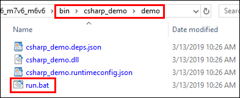
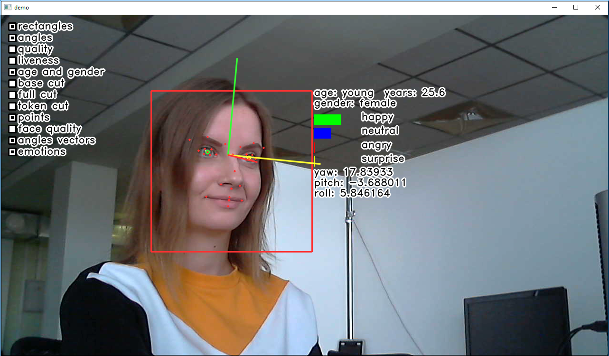

# demo

The program demonstrates tracking, detection and cropping of faces, detection of anthropometric points and angles, as well as estimation of face quality, age and gender, emotions, and liveness (by processing an RGB image from your camera).

To make a quick run of the demo with default parameters on Windows, go to the *bin/csharp_demo/demo* folder and double-left-click `run.bat`.

<p align="center">
<br>
<b>Location of C# demo</b>
</p>

Tracking results and information about each face are displayed in a window. In the upper left corner you can see the Face SDK components, which you can turn on and off by left mouse click. This demo program is similar to **C++ demo**, see the detailed description of the components in [C++ demo](../cpp/demo.md).

<p align="center">
<br>
<b>Running C# demo</b>
</p>

To run the application on Linux, go to the *bin/csharp_demos/video_recognition_demo* directory and execute the command `run.sh <path_to_opencv_csharp>`, where `<path_to_opencv_csharp>` is the path to the directory with the OpenCvCsharp library.

You can also run *C# demo* specifying some parameters (for example, the path to your online license).

To build the demo, run the following commands:
```
cd examples/csharp_demos/demo
dotnet publish -o publish
```

Startup parameters:
```[--config_dir=<config_dir>] [--license_dir=<license_dir>] [--capturer_config=<capturer_config>]```

Where:

* `config_dir` – path to the *conf/facerec* directory
* `capturer_conf` – path to the `Capturer` config file (learn more about types of config files in [Capturer Class Reference](../../development/face_capturing.md#capturer-class-reference))
* `license_dir` – path to the directory with a license; provide this parameter if you need to change a default directory *license*

**To run the demo on Windows:**  
Add the path to the directory that includes `facerec.dll` to the `PATH` environment variable.
```
set PATH=%PATH%; ..\...\..\bin
dotnet publish\csharp_demo.dll --config_dir=../../../conf/facerec --capturer_config=common_video_capturer_lbf.xml
```
**To run the demo on Linux:**  
Add the path to the directory that includes `libfacerec.so` and path to the directory with the OpenCVSharp library built for Linux to the `LD_LIBRARY_PATH` environment variable.  
```
LD_LIBRARY_PATH=${LD_LIBRARY_PATH}:../../../lib:/path/to/opencvsharp/native/libs dotnet publish/csharp_demo.dll --config_dir=../../../conf/facerec --capturer_config=common_video_capturer_lbf.xml
```

Error messages (if any) are printed in the console.

Source code: [demo.cs](../../../examples/csharp/demo/demo.cs)
