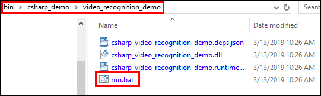
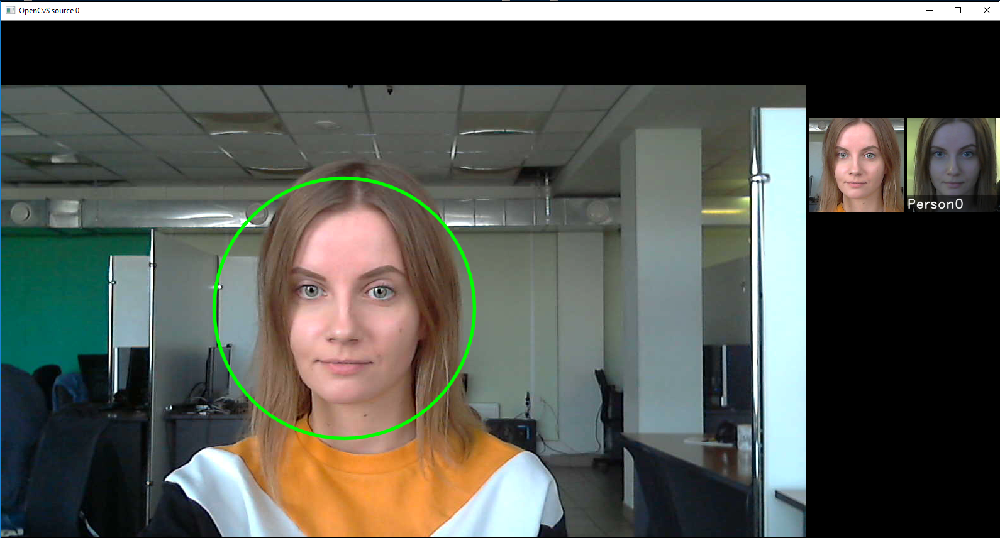

# video_recognition_demo

The program demonstrates tracking, detection and recognition of faces from the database.

To make a quick run of the demo with default parameters and check face recognition on Windows:

1. Create a database, which will be used for face recognition (see p.1 of [C++ Video Recognition Demo](../cpp/video_recognition_demo.md)).
2. To run the demo, go to *bin/csharp_demo/video_recognition_demo* and double-left-click `run.bat`.

<p align="center">
<br>
<b>Location of C# video_recognition_demo</b>
</p>

3. Tracking and identification results are displayed in a window (one window per one source). Tracked faces are highlighted with a green circle. In the upper right corner of the window you can see the recognition results: a tracked face on the left and a face from the database and the name on the right.

<p align="center">
<br>
<b>Running C# video_recognition_demo</b>
</p>

To run the application on Linux, go to the *bin/csharp_demos/video_recognition_demo* directory and execute the command `run.sh <path_to_opencv_csharp>`, where `<path_to_opencv_csharp>` is the path to the directory with the OpenCvCsharp library.

You can also run *C# video_recognition_demo* specifying some parameters.

To build the demo, run the following commands:
```
cd examples/csharp_demos/video_recognition_demo
dotnet publish -o publish
```

To run the demo, specify the path to the `csharp_video_recognition_demo.dll` library, startup options (optional) and a video source:
```
dotnet csharp_video_recognition_demo.dll [OPTIONS] <video_source>...
```

Startup examples:

* Webcam: `dotnet csharp_video_recognition_demo.dll –config_dir ../../../conf/facerec 0`
* RTSP stream: `dotnet csharp_video_recognition_demo.dll –config_dir ../../../conf/facerec rtsp://localhost:8554/`

Startup parameters:
```
[--config_dir=<config_dir>] [--license_dir=<license_dir>] [--database_dir=<database_dir>] [--method_config=<method_config>] [--recognition_distance_threshold=<recognition_distance_threshold>] [--frame_fps_limit=<frame_fps_limit>] (<camera_id> | <rtsp_url>)...
```

Where:

* `config_dir` – path to the *conf/facerec* directory
* `license_dir` – path to the directory with a license; provide this parameter if you need to change a default directory *license*
* `database_dir` – path to the directory with the database
* `method_config` – name of the `Recognizer` configuration file
* `recognition_distance_threshold` – recognition distance threshold (float number)
* `camera_id | rtsp_url` – one or several sources, each source is a number (webcam ID) or a string (video stream URL or path to the video file)
* `frame_fps_limit` – FPS limit

**To run the demo on Windows:**  
Add the path to the directory that includes `facerec.dll` to the `PATH` environment variable.
```
set PATH=%PATH%;..\...\..\bin
dotnet publish/csharp_video_recognition_demo.dll --config_dir=../../../conf/facerec --database_dir=../../../bin/base --method_config=method6v7_recognizer.xml --recognition_distance_threshold=7000 --frame_fps_limit=25 0
```

**To run the demo on Linux:**  
Add the path to the directory that includes `libfacerec.so` and path to the directory with the OpenCVSharp library built for Linux to the `LD_LIBRARY_PATH` environment variable.
```
LD_LIBRARY_PATH=${LD_LIBRARY_PATH}: ../../../lib:~/opencv/lib/x86_64-linux-gnu dotnet publish/csharp_demo.dll --config_dir=../../../conf/facerec --database_dir=../../../bin/base --method_config=method6v7_recognizer.xml --recognition_distance_threshold=7000 --frame_fps_limit=25 0
```
Tracking and identification results are displayed in windows (one window per one video source).

Source code: [examples/csharp/video_recognition_demo](../../../examples/csharp/video_recognition_demo)
