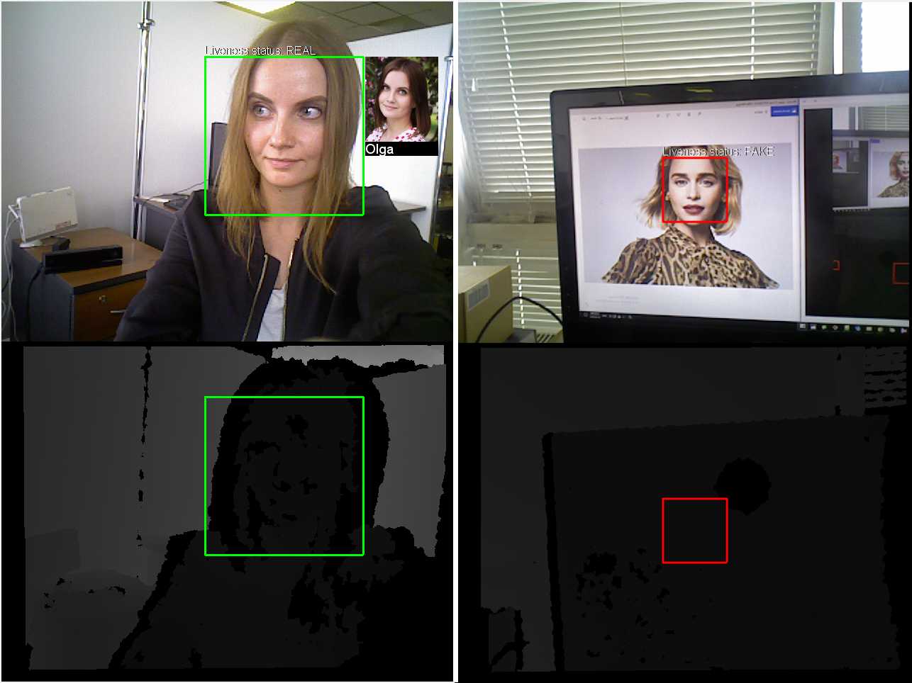

# Liveness Detection

In this tutorial, you'll learn how to perform liveness detection in a video stream with Face SDK and an RGBD sensor. As a rule, liveness detection is used to prevent spoofing attacks (when a person tries to subvert or attack a face recognition system by using a picture or a video and thereby gaining illegitimate access).

With Face SDK, you can perform liveness detection by analyzing a depth map or an RGB image from your sensor. The first method is more accurate, that's why we'll consider it in this tutorial. 

This tutorial is based on [Face Recognition in a Video Stream](face_recognition_in_a_video_stream.md) and the corresponding project. In this project, we'll also use a ready-made database of faces for recognition. After you run the project, you'll see RGB and depth maps, which you can use to correct your position relative to the sensor: to ensure the stable performance of a liveness detector, your face should be at a suitable distance from a sensor, and the quality of the depth map should be sufficient. 

A detected and recognized face will be highlighted with a green rectangle on an RGB image. Next to the detected face, there will be a picture and a name of a person from the database. Also, you'll see the liveness status `REAL`. If a person isn't recognized, the liveness status will be `REAL` but the bounding rectangle will be red. If a detected face is taken from a picture or a video, the bounding rectangle will be red and recognition won't be performed. In this case, the liveness status will be `FAKE`. 

Besides Face SDK and Qt, you'll need:

* An RGBD sensor with OpenNI2 or RealSense2 support (for example, ASUS Xtion or RealSense D415);
* [OpenNI2](https://structure.io/openni) or [RealSense2](https://github.com/IntelRealSense/librealsense/releases) distribution package.

You can find the tutorial project in Face SDK: *examples/tutorials/depth_liveness_in_face_recognition*

<p align="center">
<br>
</p>

## Importing OpenNI2 and RealSense2 Libraries

1. First of all, we have to import necessary libraries to work with the depth camera. You can use either an OpenNI2 sensor (for example, ASUS Xtion) or a RealSense2 sensor. Depending on the camera you're using, you have to specify the condition `WITH_OPENNI2=1` or `WITH_REALSENSE=1`.

**face_recognition_with_video_worker.pro**
```cpp
...
WITH_OPENNI2=1
#WITH_REALSENSE=1

isEmpty(WITH_OPENNI2): isEmpty(WITH_REALSENSE) {
    error("OpenNI2 or RealSense support should be enabled")
}

!isEmpty(WITH_OPENNI2): !isEmpty(WITH_REALSENSE) {
    error("OpenNI2 and RealSense support can't be enabled simultaneously")
}
...
```

2. [For OpenNI2 sensors] Specify the path to the OpenNI2 distribution package and also the paths to the necessary OpenNI2 libraries and headers.

_**Note:** For Windows, you have to install OpenNI2 and specify the path to the installation directory. For Linux, you just need to specify the path to the unpacked archive._

**face_recognition_with_video_worker.pro**
```cpp
...
!isEmpty(WITH_OPENNI2){

    OpenniDistr = 
    isEmpty(OpenniDistr) {
        error("Empty path to OpenNI2 directory")
    }

    LIBS += -L$$OpenniDistr/Redist/
    win32: LIBS += -L$$OpenniDistr/Lib/

    INCLUDEPATH += = $$OpenniDistr/Include/
    LIBS += -lOpenNI2

    DEFINES += WITH_OPENNI2
}
...
```

3. [For RealSense sensors] Specify the path to the RealSense2 distribution package and the paths to the necessary RealSense2 libraries and headers. In the `win32` block, we determine the platform bitness to set the correct paths to the RealSense libraries.

_**Note:** For Windows, you have to install RealSense2 and specify the path to the installation directory. For Linux, you have to install RealSense2 as described at the [Intel RealSense website](https://github.com/IntelRealSense/librealsense/)._

**face_recognition_with_video_worker.pro**
```cpp
...
!isEmpty(WITH_REALSENSE){

    win32 {
        RealSenseDistr = /home/stranger/depth_liveness/librealsense/install
        isEmpty(RealSenseDistr) {
            error("Empty path to RealSense directory")
    }

        contains(QMAKE_TARGET.arch, x86_64) {
            LIBS += -L$$RealSenseDistr/lib/x64
            LIBS += -L$$RealSenseDistr/bin/x64
        } else {
            LIBS += -L$$RealSenseDistr/lib/x86
            LIBS += -L$$RealSenseDistr/bin/x86
        }

        INCLUDEPATH += $$RealSenseDistr/include/
    }

    LIBS += -lrealsense2

    DEFINES += WITH_REALSENSE
}
...
```

## Retrieving a Depth Map using OpenNI2 API / RealSense2 API 

1. At this stage, we need to retrieve a depth frame from an RGBD sensor using OpenNI2 API or RealSense2 API, depending on the camera used. We won't elaborate on retrieving the depth frames. Instead, we'll use the headers from one of the Face SDK samples ([video_recognition_demo](../samples/cpp/video_recognition_demo.md)). In the profile of the project, specify the path to the folder *examples/cpp/video_recognition_demo/src* from Face SDK.

**face_recognition_with_video_worker.pro**
```cpp
...
INCLUDEPATH += $$FACE_SDK_PATH/examples/cpp/video_recognition_demo/src
...
```

2. Specify the necessary headers to work with OpenNI2 and RealSense2 cameras. You can find the detailed information about retreving the depth frames in the specified files (`OpenniSource.h` and `RealSenseSource.h`).

**face_recognition_with_video_worker.pro**
```cpp
...
!isEmpty(WITH_OPENNI2){
    HEADERS += OpenniSource.h
}
else {
    HEADERS += RealSenseSource.h
}
...
```

3. To use mathematical constants, define `_USE_MATH_DEFINES` (`cmath` is already imported in `OpenniSource.h` and `RealSenseSource.h`).

**face_recognition_with_video_worker.pro**
```cpp
...
unix: LIBS += -ldl
win32: DEFINES += _USE_MATH_DEFINES
...
```

## Connecting the Depth Sensor for Frame Processing 

1. In previous projects, we retrieved the image from a webcam using the `QCameraCapture` object. However, in this project we have to retrieve both RGB and depth frames. To do this, let's create a new class `DepthSensorCapture`: **Add New > C++ > C++ Class > Choose… > Class name – DepthSensorCapture > Base class – QObject > Next > Project Management (default settings) > Finish**. 
2. In `depthsensorcapture.h`, import the `ImageAndDepthSource` header. Also import `QSharedPointer` to handle pointers, `QThread` to process threads, `QByteArray` to work with byte arrays, `memory` and `atomic` to handle smart pointers and atomic types respectively. In `depthsensorcapture.cpp`, import the headers `OpenniSource` and `RealSenseSource` to retrieve the depth frames, and also import `worker.h` and `depthsensorcapture.h`. We use `assert.h` to handle errors and `QMessageBox` to display the error message.  

**depthsensorcapture.h**
```cpp
#include "ImageAndDepthSource.h"

#include <QSharedPointer>
#include <QThread>
#include <QByteArray>
#include <memory>
#include <atomic>
...
```

**depthsensorcapture.cpp**
```cpp
#if defined(WITH_OPENNI2)
#include "OpenniSource.h"
#elif defined(WITH_REALSENSE)
#include "RealSenseSource.h"
#endif

#include "worker.h"
#include "depthsensorcapture.h"

#include <assert.h>

#include <QMessageBox>
...
```

3. Define `RGBFramePtr`, which is a pointer to an RGB frame, and `DepthFramePtr`, which is a pointer to a depth frame. The `DepthSensorCapture` class constructor takes a parent widget and also a pointer to worker. The sensor data will be received in an endless loop. To prevent the main thread, where the interface is rendered, from waiting for completion of the cycle, we create another thread and move the `DepthSensorCapture` object into this new thread.  

**depthsensorcapture.h**
```cpp
...
class Worker;

class DepthSensorCapture : public QObject
{
    Q_OBJECT

public:
    typedef std::shared_ptr<QImage> FramePtr;
    typedef std::shared_ptr<QByteArray> DepthPtr;

    explicit DepthSensorCapture(
        QWidget* parent,
        std::shared_ptr<Worker> worker);
}
...
```

**depthsensorcapture.cpp**
```cpp
...
DepthSensorCapture::DepthSensorCapture(
    QWidget* parent,
    std::shared_ptr<Worker> worker) :
_parent(parent),
_worker(worker)
{
    #if defined(WITH_OPENNI2)
        depth_source.reset(new OpenniSource());
    #else
        depth_source.reset(new RealSenseSource());
    #endif

    thread.reset(new QThread());
    this->moveToThread(thread.data());

    connect(thread.data(), &QThread::started, this, &DepthSensorCapture::frameUpdatedThread);
}
...
```

4. In `DepthSensorCapture::start`, we start the thread, where the data is received, and stop it in `DepthSensorCapture::stop`. 

**depthsensorcapture.h**
```cpp
...
class DepthSensorCapture : public QObject
{
    ...
    void start();
    void stop();
}
...
```

**depthsensorcapture.cpp**
```cpp
...
void DepthSensorCapture::start()
{
    if (!thread->isRunning())
    {
        thread->start();
    }
}

void DepthSensorCapture::stop()
{
    if (thread->isRunning())
    {
        shutdown = true;

        thread->quit();
        thread->wait();
    }
}
...
```

5. In `DepthSensorCapture::frameUpdatedThread`, process a new frame from the sensor in an endless loop and pass it to `Worker` using `addFrame`. If an error occurs, an error message box will be displayed.  

**depthsensorcapture.h**
```cpp
...
class DepthSensorCapture : public QObject
{
    ...
    signals:
        void newFrameAvailable();

    private
        void frameUpdatedThread();

    private:
        QWidget* _parent;

        std::shared_ptr<Worker> _worker;

        QSharedPointer<QThread> thread;
        QSharedPointer<ImageAndDepthSource> depth_source;

        std::atomic<bool> shutdown = {false};
};
...
```

**depthsensorcapture.cpp**
```cpp
...
void DepthSensorCapture::frameUpdatedThread()
{
    while(!shutdown)
    {
        try
        {
            ImageAndDepth data;
            depth_source->get(data);

            _worker->addFrame(data);

            emit newFrameAvailable();
        }
        catch(std::exception& ex)
        {
            stop();

            QMessageBox::critical(
                _parent,
                tr("Face SDK error"),
                ex.what());

            break;
        }
    }
}
...
```

6. The `VideoFrame` object should contain an RGB frame from the sensor.

**depthsensorcapture.cpp**
```cpp
...
Database::Database(...)
{
    ...
    VideoFrame frame;
        frame.frame() = DepthSensorCapture::RGBFramePtr(new QImage(image));
    ...
}
...
```

7. In `videoframe.h`, import the `depthsensorcapture` header to work with the depth sensor. 

**videoframe.h**
```cpp
#include "depthsensorcapture.h"
...
```

8. The `IRawImage` interface allows to receive a pointer to the image data, its height and width. 

**videoframe.h**
```cpp
...
class VideoFrame : public pbio::IRawImage
{
    public:
        VideoFrame(){}
        ...
        DepthSensorCapture::RGBFramePtr& frame();

        const DepthSensorCapture::RGBFramePtr& frame() const;
 
    private:
        DepthSensorCapture::RGBFramePtr _frame;
}

...

inline
DepthSensorCapture::RGBFramePtr& VideoFrame::frame()
{
    return _frame;
}
 
inline
const DepthSensorCapture::RGBFramePtr& VideoFrame::frame() const
{
    return _frame;
}
...
```

9. In the `runProcessing` method, we start the camera, and in the `stopProcessing` method, we stop the camera.

**viewwindow.h**
```cpp
...
class ViewWindow : public QWidget
{
    ...
    private:
    Ui::ViewWindow *ui;

    QScopedPointer<DepthSensorCapture> _camera;
    ...
}
...
```

**viewwindow.cpp**
```cpp
#include "depthsensorcapture.h"

ViewWindow::ViewWindow(...)
{
    ...
    _camera.reset(new DepthSensorCapture(
    this,
    _worker));

    connect(_camera.data(), &DepthSensorCapture::newFrameAvailable, this, &ViewWindow::draw);
}

void ViewWindow::stopProcessing()
{
    if (!_running)
        return;

    _camera->stop();
    _running = false;
}

void ViewWindow::runProcessing()
{
    if (_running)
        return;

    _camera->start();

    _running = true;
}
...
```

10. In `worker.h`, we import the `depthsensorcapture` header. The `SharedImageAndDepth` structure contains the pointers to an RGB frame and a depth frame from the sensor, and also the `pbio::DepthMapRaw` structure with the information about depth map parameters (width, height, etc.). The pointers are used in `Worker`. Due to some delay in frame processing, a certain number of frames is queued for rendering. To save the memory space, we store the pointers to frames instead of the frames.

**worker.h**
```cpp
#include "depthsensorcapture.h"

    struct SharedImageAndDepth
    {
        DepthSensorCapture::RGBFramePtr color_image;
        DepthSensorCapture::DepthFramePtr depth_image;

        pbio::DepthMapRaw depth_options;
    };
...
```

11. Pass `SharedImageAndDepth` frame, which is RGB and depth frames for rendering, to the `DrawingData` structure. In `TrackingCallback`, we extract the image corresponding to the last received result from the frame queue.

**worker.h**
```cpp
...
class Worker
{
    ...
    struct DrawingData
    {
        ...       
        SharedImageAndDepth frame;
    }

    void addFrame(const ImageAndDepth& frame);

    private:
        DrawingData _drawing_data;
        std::mutex _drawing_data_mutex;

        std::queue<std::pair<int, SharedImageAndDepth> > _frames;
        ...
}
...
```

**worker.cpp**
```cpp
...
void Worker::TrackingCallback(
    const pbio::VideoWorker::TrackingCallbackData &data,
    void * const userdata)
{    
    ...
    // Get the frame with frame_id
    SharedImageAndDepth frame;
    {
        ...
    }
}

void Worker::addFrame(const ImageAndDepth& data)
{
    ...
}
...
```

## Processing the Depth Map with VideoWorker

1. In `Worker::Worker`, override the values of some parameters of the `VideoWorker` object to process the depth map, namely: 

* `depth_data_flag` ("1" turns on depth frame processing to confirm face liveness); 
* `weak_tracks_in_tracking_callback` ("1" means that all samples, even the ones flagged as `weak=true`, are passed to `TrackingCallback`). 

The `weak` flag becomes `true` if a sample doesn't pass certain tests, for example: 

* if there are too many shadows on a face (insufficient lighting)
* if an image is blurry
* if a face is turned at a great angle
* if a the size of a face in the frame is too small
* if a fase hasn't passed the liveness test (for example, if it's taken from a photo or a video)

You can find the detailed information about lighting conditions, camera positioning, etc. in [Guidelines for Cameras](../guidelines_for_cameras.md). As a rule, samples that haven't passed the tests, are not processed and not used for recognition. However, in this project we want to highlight all the faces, even if they're taken from the picture (haven't passed the liveness test). Therefore, we have to pass all samples to `TrackingCallback`, even if they're flagged as `weak=true`.

**worker.cpp**
```cpp
...
Worker::Worker(...)
{
    ...
    vwconfig.overrideParameter("depth_data_flag", 1);
    vwconfig.overrideParameter("weak_tracks_in_tracking_callback", 1);
    ...
}
...
```

2. In the `FaceData` structure in `worker.h`, specify the enumeration `pbio::DepthLivenessEstimator`, which is the result of liveness estimation. All in all, there are four liveness statuses:

* **NOT_ENOUGH_DATA** means that face information is insufficient. This situation may occur if the depth map quality is poor or the user is too close/too far from the sensor.
* **REAL** means that the face belongs to a real person.
* **FAKE** means that the face is taken from a picture or a video.
* **NOT_COMPUTED** means that the face wasn't checked. This situation may occur, for example, if the frames from the sensor are not synchronized (an RGB frame is received but a corresponding depth frame wasn't found in a certain time range).

The liveness test result is stored in the `face.liveness_status` variable for further rendering.

**worker.h**
```cpp
...
class Worker
{
public:
    // Face data
    struct FaceData
    {
        ...
        pbio::DepthLivenessEstimator::Liveness liveness_status;
    }
    ...
}
...
```

**worker.cpp**
```cpp
...
void Worker::TrackingCallback(...)
{
    ...
    {
        ...
        // Update the information
        {
            const std::lock_guard<std::mutex> guard(worker._drawing_data_mutex);
            ...
            // Samples
            for(size_t i = 0; i < samples.size(); ++i)
            {
                ...
                face.liveness_status = data.samples_depth_liveness_confirmed[i];
            }
        }
    }
    ...
}
...
```

3. In `Worker::addFrame`, pass the last depth frame to Face SDK using the `VideoWorker::addDepthFrame` method and store it for further processing.  

**worker.h**
```cpp
...
class Worker
{
    ...
    private:
        ...
        DepthSensorCapture::DepthFramePtr _last_depth_image;
        pbio::DepthMapRaw _last_depth_options;
        ...
}
...
```

**worker.cpp**
```cpp
...
void Worker::addFrame(const ImageAndDepth& data)
{
    ...
    const int stream_id = 0;
 
    SharedImageAndDepth frame;
 
    if (!data.depth_image.empty())
    {
        const pbio::DepthMapRaw& depth_options = data.make_dmr();
 
        _video_worker->addDepthFrame(
            depth_options,
            stream_id,
            data.depth_timestamp_microsec);

        _last_depth_image = std::make_shared<QByteArray>(
            (const char*)data.depth_image.data(),
            depth_options.depth_data_stride_in_bytes * depth_options.depth_map_rows);
        _last_depth_options = depth_options;
 
        frame.depth_image = _last_depth_image;
        frame.depth_options = depth_options;
    }
}
...
```

4. Prepare and pass the RGB image to Face SDK using `VideoWorker::addVideoFrame`. If the format of the received RGB image is BGR instead of RGB, the byte order is changed so that the image colors are displayed correctly.  If a depth frame wasn't received together with an RGB frame, the last received depth frame is used.  A pair of the depth and RGB frames is queued in `_frames` in order to find the data corresponding to the processing result in `TrackingCallback`.

**worker.cpp**
```cpp
...
void Worker::addFrame(const ImageAndDepth& data)
{
    ...
    if (!data.color_image.empty())
    {
        QImage image(
            (const uchar*)data.color_image.data(),
            data.color_width,
            data.color_height,
            data.color_stride_in_bytes,
            QImage::Format_RGB888);

        if (data.color_format != pbio::IRawImage::FORMAT_RGB)
        {
            image = image.rgbSwapped();
        }
 
        frame.color_image = std::make_shared<QImage>(image);

        VideoFrame video_frame;
        video_frame.frame() = frame.color_image;

        const std::lock_guard<std::mutex> guard(_frames_mutex);

        const int frame_id = _video_worker->addVideoFrame(
            video_frame,
            stream_id,
            data.image_timestamp_microsec);

        if (data.depth_image.empty())
        {
            frame.depth_image = _last_depth_image;
            frame.depth_options = _last_depth_options;
        }

        _frames.push(std::make_pair(frame_id, frame));
    }

    _video_worker->checkExceptions();
}
...
```

## Visualizing RGB and Depth Maps. Displaying 3D Liveness Information

1. Let's modify `DrawFunction::Draw` in `drawfunction.cpp`. The `frame` field of the `Worker::DrawingData` structure contains the pointers to RGB frame data and depth frame data, as well as depth frame parameters (width, height, etc.). For convenience, we'll create the references `const QImage& color_image`, `const QByteArray& depth_array`, and `const pbio::DepthMapRaw& depth_options` to refer to these data. The RGB image and depth map will be displayed in `QImage result`, which can be considered as a sort of a "background" and contains both images (an RGB image at the top and a depth map at the bottom). Before that, we have to convert 16-bit depth values to 8-bit depth values to correctly display the depth map (in grayscale). In the `max_depth_mm` value, specify the maximum distance from the sensor to the user (usually, it's 10 meters).  

**drawfunction.cpp**
```cpp
...
// static
QImage DrawFunction::Draw(
    const Worker::DrawingData &data,
    const Database &database)
{
    const QImage& color_image = *data.frame.color_image;
    const QByteArray& depth_array = *data.frame.depth_image;
    const pbio::DepthMapRaw& depth_options = data.frame.depth_options;

    QByteArray depth8_array;
    const uint16_t* depth_ptr = (const uint16_t*)depth_array.constData();
    const size_t elements_count_in_row = depth_options.depth_data_stride_in_bytes / sizeof(uint16_t);
    const size_t elements_count = depth_options.depth_map_rows * elements_count_in_row;
    const float max_depth_mm = 10000.f;
    for(size_t i = 0; i < elements_count; ++i)
    {
        const uint16_t depth_mm = depth_ptr[i] * depth_options.depth_unit_in_millimeters;
        const uint8_t depth_8bit = std::min<int>(255, depth_mm / max_depth_mm * 255 + 0.5);

        depth8_array += depth_8bit;
    }
    ...
}
...
```

2. Form the depth image from the converted values. Create the `result` object, which will be used to display an RGB image (at the top) and a depth map (at the bottom). Render these images.  

**drawfunction.cpp**
```cpp
...
QImage DrawFunction::Draw(...)
{
    ...
    QImage depth_image(
        (const uchar*)depth8_array.constData(),
        depth_options.depth_map_cols,
        depth_options.depth_map_rows,
        elements_count_in_row,
        QImage::Format_Grayscale8);

    QImage result(
        QSize(std::max<int>(color_image.width(), depth_image.width()),
            color_image.height() + depth_image.height()),
        QImage::Format_RGB888);

    QPainter painter(&result);

    painter.drawImage(QPoint(0, 0), color_image);
    painter.drawImage(QPoint(0, color_image.height()), depth_image);
    ...
}
...
```

3. Display the liveness status next to the face depending on the information received from the liveness detector. Specify the label parameters (color, line, size). You'll see a bounding rectangle in the depth map so that you can make sure that the RGB frame and depth frame are aligned.  

**drawfunction.cpp**
```cpp
...
QImage DrawFunction::Draw(...)
{
    ...
    for(const auto &face_data : faces_data)
    {
        ...
        if(face.frame_id == data.frame_id && !face.lost)
        {
            ...
            // Draw the bounding box
            pen.setWidth(3);
            pen.setColor(color);
            painter.setPen(pen);
            painter.drawRect(rect);

            if (!depth_image.size().isEmpty())
            {
                const QRect rect_on_depth(
                bounding_box.x, bounding_box.y + color_image.height(),
bounding_box.width, bounding_box.height);

                painter.drawRect(rect_on_depth);

                QString liveness_str = "Liveness status: ";
                switch(face.liveness_status)
                {
                    case pbio::DepthLivenessEstimator::NOT_ENOUGH_DATA:
                        liveness_str += "NOT ENOUGH DATA";
                        break;
                    case pbio::DepthLivenessEstimator::REAL:
                        liveness_str += "REAL";
                        break;
                    case pbio::DepthLivenessEstimator::FAKE:
                        liveness_str += "FAKE";
                        break;
                    default:
                        liveness_str += "NOT COMPUTED";
                }

                const int font_size = 12;

                painter.setFont(QFont("Arial", font_size, QFont::Medium));
                pen.setColor(Qt::black);
                painter.setPen(pen);
                painter.drawText(rect.topLeft() + QPoint(1, -pen.width()), liveness_str);

                pen.setColor(Qt::white);
                painter.setPen(pen);
                painter.drawText(rect.topLeft() + QPoint(0, -pen.width()), liveness_str);
            }
            ...
        }
        ...
    }
    ...
}
...
```

4. Run the project. You should see an RGB image and a depth map from the sensor. You should see the information about the detected face:  
* **detection and recognition status** (which is indicated by the color of the bounding rectangle: *green* means that a person is detected and found in the database, *red* means that a person is not recognized or the face is taken from an image or a video).
* **information about the recognized person** (his/her image and name from the database).
* **liveness status**; *real* means that a person is real, *fake* means that a face is taken from an image or a video, *not_enough_data* means that the depth map quality is poor or a person is too close/too far away from the sensor, *not_computed* means that RGB and depth frames are not synchronized.

<p align="center">
<br>
</p>
