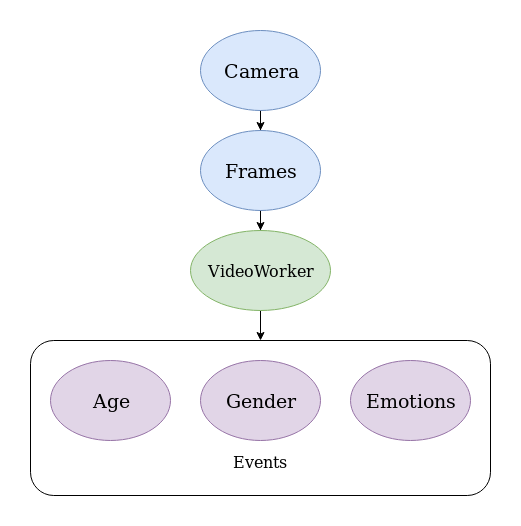
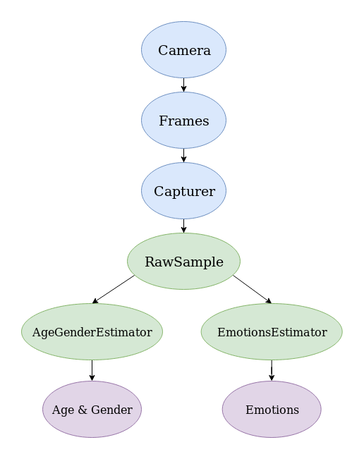
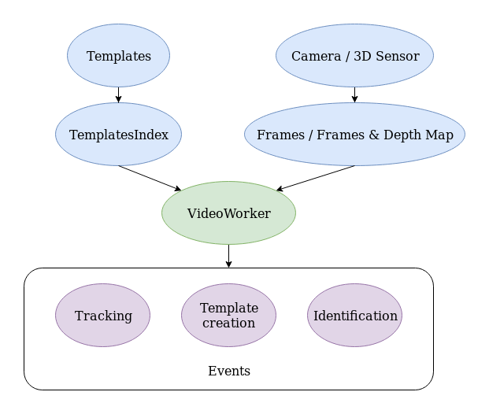
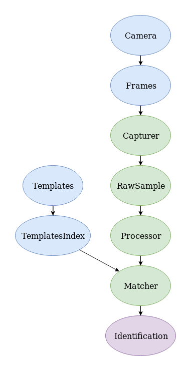
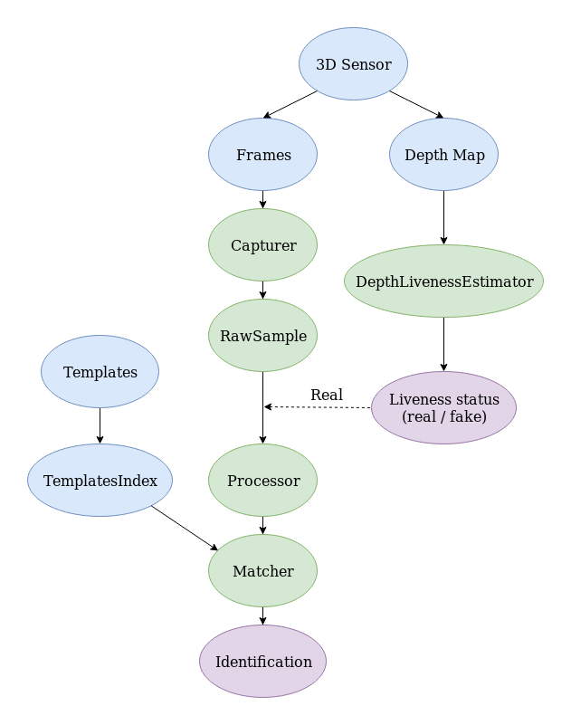

# Use Cases

The diagrams in this section demonstrate possible use cases and connection between the Face SDK components. Data sources are indicated in blue, data processors are indicated in green, and output objects are indicated in purple. 

## Face Estimation (with VideoWorker)

 

The standard option to estimate age, gender, and emotions on a video stream is to use the `VideoWorker` object. The Frames received from the Camera are passed to `VideoWorker`. As a result, the information about age, gender, and emotions is returned in `VideoWorker::TrackingCallbackU`. See more information about face estimation on a video stream in [Estimation of age, gender, and emotions](development/video_stream_processing.md#estimation-of-age-gender-and-emotions).

## Face Estimation (Custom)

 

If face estimation with `VideoWorker` is not suitable for your case (for example, if you need to estimate faces in the pictures), you can use this option. The Frames received from the Camera are passed to the `Capturer` object, which is used to capture faces. Detected faces and information about them (`RawSample`) are passed for further processing to the objects `AgeGenderEstimator` and `EmotionsEstimator`, which return age&gender and emotions respectively. See more information about face estimation in [Face Estimation](development/face_estimation.md).

## Database Creation  

 

To recognize faces, you have to create a database (only once). Photos are passed to the `Capturer` object, which is used to capture faces. Detected faces and information about them (`RawSample`) are passed to the Processor component, which returns templates for recognition (`Template`). The operation of receiving the templates is time-consuming, therefore, there's a special tool, which allows you to save a template to long-term memory (see the methods `Template::save`, `Recognizer::loadTemplate`).

## Face Recognition (with VideoWorker) 

 

The standard option to recognize faces on a video stream is to use the `VideoWorker` object. The Frames received from the Camera are passed to `VideoWorker`. If you're using a 3D sensor, a Depth Map is also passed to `VideoWorker`. The information about detected and recognized faces and created templates are returned in callbacks. See more information about detection, template creation, and recognition on a video stream in [Video Stream Processing](development/video_stream_processing.md). 

## Face Recognition (Custom, RGB Camera)

 

If recognition with VideWorker is not suitable for your case, you can use this option. The Frames received from the Camera are passed to the `Capturer` object, which is used to capture faces. Detected faces and information about them (`RawSample`) are passed to the Processor component. The Matcher component is used to match detected faces with the faces from the database. It takes the database (`TemplatesIndex`, see [Database Creation](#database-creation)) and templates from Processor. Then, Matcher returns the matching result of two templates. See more information in [Face Capturing](development/face_capturing.md) and [Face Identification](development/face_identification.md).

## Face Recognition (Custom, Depth Liveness)

 

This diagram is similar to the previous one, the only difference is a Depth Map received from a 3D Sensor. The depth map is passed to the `DepthLivenessEstimator` object for liveness estimation. Depending on the result (`REAL` or `FAKE` state), detected faces and information about them are either passed or not passed for further processing to Processor. See more information about liveness estimation in [Liveness](development/face_estimation.md#liveness).
